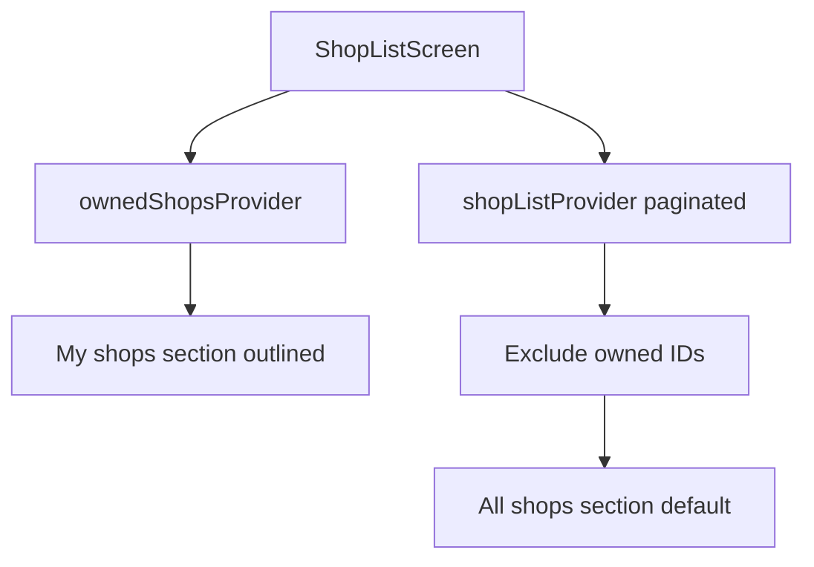

# Owned Shops First with Visual Distinction

## Current behavior

- Heart is **already hidden** on shops you manage via `onFavouriteToggle: canManage ? null : ...` in [`shop_list_screen.dart`](coffeeshop-mobile/lib/features/shops/shop_list_screen.dart) (lines 205–207).
- All shops render in one flat paginated grid — owned and others are mixed with no visual difference.
- `canManageShopInList` uses [`ownedShopsProvider`](coffeeshop-mobile/lib/features/shop_details/shop_manage_permission.dart) for shop owners; admins get manage on all shops but typically have an empty owned list.

## Goal

| Section | Shops | Heart | Style |
|---------|-------|-------|-------|
| **My shops** | From `GET /shop/mine` | Hidden | Outlined / emphasized border |
| **All shops** | Paginated list minus owned IDs | Shown when `!canManage` | Default card |



## Implementation

### 1. Add `isOwnedShopInList` helper

In [`shop_manage_permission.dart`](coffeeshop-mobile/lib/features/shop_details/shop_manage_permission.dart):

```dart
bool isOwnedShopInList(WidgetRef ref, String shopId) {
  final owned = ref.watch(ownedShopsProvider).valueOrNull ?? [];
  return owned.any((shop) => shop.id == shopId);
}
```

Use this for **visual styling** (outline). Keep `canManageShopInList` for **actions** (Employees/Delete/heart gate).

### 2. Outlined owned cards in `ShopCard`

In [`shop_card.dart`](coffeeshop-mobile/lib/shared/widgets/shop_card.dart):

- Add `bool isOwned = false`
- When `isOwned`, use `Card.outlined` (or `Card` with `shape: RoundedRectangleBorder(side: BorderSide(color: colorScheme.primary, width: 2))`) instead of default `Card`
- Subtle optional badge: small "Mine" chip on image corner (optional — outline alone may suffice; prefer outline only to minimize scope)

### 3. Two-section layout in `ShopListScreen`

Refactor the grid in [`shop_list_screen.dart`](coffeeshop-mobile/lib/features/shops/shop_list_screen.dart):

**Data split** (inside `data:` callback):

```dart
final owned = ref.watch(ownedShopsProvider).valueOrNull ?? [];
final params = ref.watch(shopListParamsProvider);
final ownedIds = owned.map((s) => s.id).toSet();

// Client-side filter owned shops by search query + city chip
final myShops = owned.where((s) => _matchesFilters(s, params)).toList();

// Paginated shops excluding owned (avoid duplicates)
final otherShops = result.shops.where((s) => !ownedIds.contains(s.id)).toList();
```

Extract `_matchesFilters(ShopResponseDto shop, ShopListParams params)` — match `q` against name/city (case-insensitive), match `city` chip if set.

**UI structure** — replace single `GridView` with `CustomScrollView` + slivers:

1. If `myShops.isNotEmpty`: section title **"My shops"** + `SliverGrid` of owned cards (`isOwned: true`, management actions, no heart)
2. If `otherShops.isNotEmpty`: section title **"All shops"** (or **"Other shops"** when my section exists) + `SliverGrid` of other cards (`isOwned: false`, heart when `!canManage`)
3. `PaginationControls` unchanged at bottom (applies to paginated "all shops" API only)

**Shared card builder** — extract `_buildShopCard(ShopResponseDto shop)` to avoid duplicating `ShopCard` wiring.

### 4. Heart on owned shops — double-check

Owned section cards: always pass `onFavouriteToggle: null` (never show heart), even if `canManage` logic ever diverges.

Other section: keep existing `canManage ? null : _toggleFavourite`.

### 5. Tests

In [`shop_card_test.dart`](coffeeshop-mobile/test/shared/widgets/shop_card_test.dart):

- Add test: `isOwned: true` renders outlined card (find `Card` with non-default shape, or verify `Card.outlined` ancestor)

## Files to change

| File | Change |
|------|--------|
| [`shop_manage_permission.dart`](coffeeshop-mobile/lib/features/shop_details/shop_manage_permission.dart) | `isOwnedShopInList` helper |
| [`shop_card.dart`](coffeeshop-mobile/lib/shared/widgets/shop_card.dart) | `isOwned` → outlined card |
| [`shop_list_screen.dart`](coffeeshop-mobile/lib/features/shops/shop_list_screen.dart) | Two sections, filter/split logic, shared card builder |
| [`shop_card_test.dart`](coffeeshop-mobile/test/shared/widgets/shop_card_test.dart) | Outlined owned card test |

## Out of scope

- Backend sort (client-side sections are sufficient)
- "Joined communities" favourites section (web has this separately; user asked for owned shops, not favourites)
- City filter on API (city chip exists in UI but is not passed to `getShops` today — pre-existing)

## Test plan

1. **Shop owner** — "My shops" section at top with outlined cards, Employees/Delete, no heart; other shops below with heart
2. **Customer** — no "My shops" section; all shops in "All shops" with hearts
3. **Search** — typing filters both sections client-side for owned; paginated section still uses API
4. **After delete** — shop removed from "My shops", list refreshes
5. `flutter test test/shared/widgets/shop_card_test.dart` + `dart analyze`
