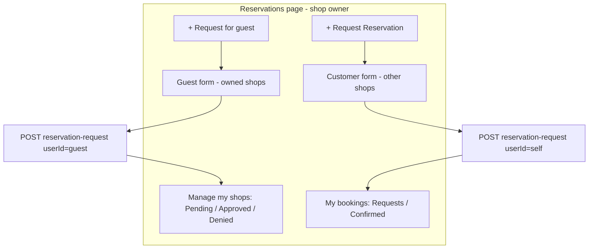

# Shop owner: guest requests + customer self-booking

## Correct requirement

A shop owner needs **both**:

| Mode | Shops | Form | API userId | After submit |
|------|-------|------|------------|--------------|
| **Request for guest** | Only shops they own | Guest + Shop + Event + Party size | Selected guest | Appears in **Pending** (manage) |
| **Request reservation** (like customer) | Shops they do **not** own | Shop + Event + Party size (no guest) | Current user | Appears in **My reservation requests** (personal) |

The previous implementation wrongly assumed one form for owners (always guest + owned shops only). It also removed direct create, which is fine — you did **not** ask to bring back instant `POST /reservation` with table pick.

## Root cause (backend)

[`assertCanCreateRequest`](coffeeshop/src/main/java/com/coffeeshop/coffeeshop/service/impl/ReservationRequestServiceImpl.java) treats anyone who owns **any** shop as “owner-only”:

```java
if (isOwner) {
    if (!userShopService.isOwner(currentUser, shop)) {
        throw FORBIDDEN "You do not own this shop";
    }
    return;
}
```

So an owner booking **themselves** at another café gets **403** (covered by [`ownerCreateRequest_forShopNotOwned_returnsForbidden`](coffeeshop/src/test/java/com/coffeeshop/coffeeshop/ReservationRequestIntegrationTest.java) for guest-at-other-shop, but self-at-other-shop fails the same way).

**Listing gap:** `findForCurrentUser` for owners returns only requests for shops they manage ([`findReservationRequestsByOwnerId`](coffeeshop/src/main/java/com/coffeeshop/coffeeshop/service/impl/ReservationRequestServiceImpl.java)), not their own outgoing requests at other shops.

## Target architecture



---

## Phase 1 — Backend (`java-agent`)

**File:** [`ReservationRequestServiceImpl.java`](coffeeshop/src/main/java/com/coffeeshop/coffeeshop/service/impl/ReservationRequestServiceImpl.java)

### 1a. `assertCanCreateRequest`

When `isOwner` and shop is **not** owned:

- Allow if `userId.equals(currentUser.getId())` (self-booking at another shop, same rules as customer).
- Otherwise keep **403** (cannot create on behalf of guest at someone else’s shop).

When `isOwner` and shop **is** owned: keep current behavior (any guest `userId`).

### 1b. `findForCurrentUser` (no `shopId`)

For owners, return **union** (dedupe by id):

- Managed: `userShopRepository.findReservationRequestsByOwnerId(...)`
- Personal: `reservationRequestRepository.findByUserId(currentUser.getId())`

Scoped `shopId` query stays shop-scoped for owned shop only.

### 1c. Tests

Add in [`ReservationRequestIntegrationTest.java`](coffeeshop/src/test/java/com/coffeeshop/coffeeshop/ReservationRequestIntegrationTest.java):

- `ownerCreateRequest_forSelf_atShopNotOwned_returnsCreated`
- `ownerListRequests_includesOwnRequestAtOtherShop`

---

## Phase 2 — Frontend (`frontend-agent`)

**File:** [`reservations.component.ts`](coffeeshop-frontend/src/app/features/reservations/reservations.component.ts)

### 2a. Form mode signal

```typescript
readonly requestFormMode = signal<'guest' | 'self' | null>(null);
```

- **Customer:** only `'self'` (unchanged UX, one button).
- **Owner:** two buttons:
  - `+ Request for guest` → `requestFormMode.set('guest')`, open form
  - `+ Request Reservation` → `requestFormMode.set('self')`, open form

### 2b. Shop lists

```typescript
readonly ownedShopIds = computed(() => /* shops where createdBy.id === profile.id */);

readonly shopsForGuestRequest = computed(() =>
  this.shops().filter(s => this.ownedShopIds().has(s.id)));

readonly shopsForSelfRequest = computed(() =>
  this.shops().filter(s => !this.ownedShopIds().has(s.id)));
```

`shopSelectOptions()` switches on `requestFormMode()`.

### 2c. Guest field and target user

- Show guest `<app-form-select>` only when `requestFormMode() === 'guest'`.
- `requestTargetUserId`:
  - `guest` → `guestUserId`
  - `self` → `profile.id`
- `onSubmitRequest`: same split (not `isShopOwner()` alone).

### 2d. Split data for tables

| Computed | Filter |
|----------|--------|
| `managedPendingRequests` | `PENDING` + `shop.id` in `ownedShopIds` |
| `managedDeniedRequests` | `DENIED` + owned shop |
| `managedReservations` | confirmed at owned shops (current owner `myReservations`) |
| `myPersonalRequests` | `user.id === profile.id` |
| `myPersonalReservations` | `user.id === profile.id` && shop **not** owned |

Use these in templates so owner sees **both** management tables and personal customer-style tabs.

Suggested layout on owner page:

1. Header: two create buttons  
2. Optional open form (mode-dependent fields)  
3. **Manage my shops** — existing Pending / Approved / Denied (managed filters)  
4. **My reservations** — customer-style “Reservation Requests” / “Confirmed Reservations” (personal filters)

### 2e. Query-param prefill (Events → Reservations)

In `openRequestFormWithEvent(shopId, eventId)`:

- If `ownedShopIds.has(shopId)` → `guest` mode + guest validators  
- Else → `self` mode, no guest validators

### 2f. Post-submit navigation

- `guest` submit → `ownerSubTab.set('pending')`  
- `self` submit → focus personal requests tab (new `personalActiveTab` or reuse `activeTab` under personal section)

Keep **`canReserveForEvent`** filtering from the last change.

---

## What we are **not** doing

- Restoring **direct** `POST /reservation` create with table picker (that was the old “Create reservation” shortcut, not customer-like).
- Changing shop-details customer reserve flow.

---

## Manual test plan

1. **Owner → Request for guest** at own shop: guest required, submit → row in **Pending** (manage).
2. **Owner → Request Reservation** at another shop: no guest field, only non-owned shops in dropdown, submit → row under **My reservation requests** (not in your Pending manage list).
3. **Owner** cannot use guest form for another owner’s shop (shop list excludes it).
4. **Events** reserve icon on own shop → guest form pre-filled; on other shop → self form pre-filled.
5. **Customer** unchanged: one button, all shops, self only.
6. Integration tests for backend self-booking pass.
