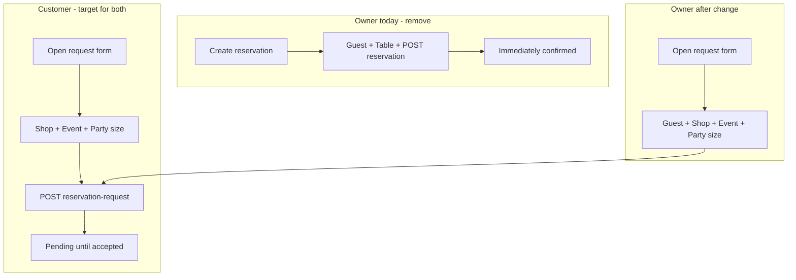

# Unify shop-owner reservation creation with customer flow

## Problem

On [`reservations.component.ts`](coffeeshop-frontend/src/app/features/reservations/reservations.component.ts), **customers** and **shop owners** use different creation UX:

| | Customer | Shop owner (today) |
|---|----------|-------------------|
| Primary action | One button: `+ Request Reservation` | Two buttons: `+ Request for guest` and `+ Create reservation` |
| API | `POST /api/v1/reservation-request` | Request form **or** `POST /api/v1/reservation` (direct, table required) |
| Form fields | Shop, Event, Party size | Request: + Guest; Direct: Guest, Shop, Event, **Table**, Party size |
| Confirmed booking | After owner accepts (pending → table) | Direct path skips pending entirely |

Customers never pick a table or create a confirmed reservation themselves. The owner **direct** form is the main mismatch.



Backend already supports owner-on-behalf requests ([`ReservationRequestServiceImpl.createRequest`](coffeeshop/src/main/java/com/coffeeshop/coffeeshop/service/impl/ReservationRequestServiceImpl.java) — owners may create for any `userId` on shops they own). No backend changes required.

## Target behavior

**Shop owner creating a booking on the Reservations tab = customer flow + guest picker:**

1. Single header toggle (same label as customer): `+ Request Reservation` / `Cancel`.
2. One inline form: **Guest** (owner-only), Shop, Event, Party size → **Submit Request**.
3. New request lands in **Pending**; owner assigns table and **Accept** there (existing pending-table UI unchanged).
4. Remove `+ Create reservation`, `directForm`, `ownerFormMode`, and `onSubmitDirectReservation()`.

**Event eligibility** should match customer-facing surfaces ([`shop-details`](coffeeshop-frontend/src/app/features/shop-details/shop-details.component.ts), [`events`](coffeeshop-frontend/src/app/features/events/events.component.ts)):

- Today `selectableEventsForRequest` only excludes blocked events and `isEventFull`.
- Add `canReserveForEvent` from [`reservation-event.utils.ts`](coffeeshop-frontend/src/app/utils/reservation-event.utils.ts) so past events are not selectable (same rule as Events page reserve icon).

## Implementation (frontend only)

**File:** [`coffeeshop-frontend/src/app/features/reservations/reservations.component.ts`](coffeeshop-frontend/src/app/features/reservations/reservations.component.ts)

### 1. Simplify header and form visibility

Replace owner dual-button block (lines 38–46) with the same pattern as customer:

```html
<button class="btn btn-primary" (click)="toggleRequestForm()">
  {{ showRequestForm() ? 'Cancel' : '+ Request Reservation' }}
</button>
```

- Use `showRequestForm` for **both** roles (remove `ownerFormMode`).
- Show form when `showRequestForm()` (drop `ownerFormMode() === 'request'` condition).
- Delete the entire `@if (ownerFormMode() === 'direct')` form block (lines 110–172).

### 2. Guest field when owner

Keep the existing `@if (isShopOwner())` guest `<app-form-select>` inside the request form.

On open/close:

- When `isShopOwner()` and form opens: `guestUserId` gets `Validators.required` (today done in `toggleOwnerForm('request')` / `openRequestFormWithEvent`).
- When form closes: clear validators and reset form (fold into one `toggleRequestForm()` / `closeRequestForm()`).

### 3. Remove direct-reservation code

Delete:

- `ownerFormMode` signal, `toggleOwnerForm`, `directForm` and related `toSignal`/`computed` (`directTargetUserId`, `selectableEventsForDirect`, `canSubmitDirectReservation`, `directShop*`, `eventSelectOptionsForDirect`, `tableSelectOptionsForDirect`, `eventsForDirectShop`, `onDirectShopChange`, `tablesForDirectShop`, `onSubmitDirectReservation`).
- `reservationService.create` usage for owner create (keep `reservationService` for loading confirmed list).

`tableService` / table pickers on **pending accept** stay as-is.

### 4. Align event filtering

Import `canReserveForEvent` and tighten `selectableEventsForRequest`:

```typescript
return this.eventsForShop().filter(
  e => !blocked.has(e.eventId) && canReserveForEvent(e),
);
```

Adjust `requestShopHasOnlyFullEvents` / blocked hints if needed so “all events filtered” still shows a sensible message (past-only shops may need a distinct hint — optional: treat non-reservable past events separately from “full”; v1 can rely on empty dropdown + existing hints).

### 5. Query-param prefill (Events → Reservations)

Update [`openRequestFormWithEvent`](coffeeshop-frontend/src/app/features/reservations/reservations.component.ts) (lines 670–691):

- Always `showRequestForm.set(true)` (remove `ownerFormMode.set('request')`).
- Apply guest validators when `isShopOwner()`.

Event reserve shortcut from [`events.component.ts`](coffeeshop-frontend/src/app/features/events/events.component.ts) continues to work unchanged.

### 6. Post-submit UX (small polish)

After successful `onSubmitRequest()`:

- `showRequestForm.set(false)` + reset form.
- If `isShopOwner()`, set `ownerSubTab.set('pending')` so the new guest request is visible immediately (mirrors customer switching to requests view).

## What stays the same

- Owner **Pending / Approved / Denied** sub-tabs and accept/deny + table assignment on pending rows.
- Owner shop list still scoped to owned shops (`shopsForRequest`).
- Customer **Reservation Requests / Confirmed** tabs unchanged.
- Shop-details customer inline reserve flow (separate page) — no change unless you want copy-paste of labels later.

## Manual test plan

1. **Customer** on `/reservations`: single `+ Request Reservation`; shop → event → party size → submit → appears under Reservation Requests (pending).
2. **Shop owner** on `/reservations`: same single button and fields, plus required Guest; submit → row in **Pending** with that guest; Accept with table → **Approved**.
3. Confirm **no** `+ Create reservation` button or table field on create form.
4. Events page reserve icon → pre-filled request form for owner (guest empty) and customer (no guest field).
5. Past event: not in event dropdown; reserve icon disabled on Events page.
6. Blocked event (guest already has pending/accepted for event): submit disabled / hint shown.

## Scope note

If you still need walk-in **instant** confirmed bookings without a request, that would be a separate explicit feature (e.g. only from shop-details management UI), not the Reservations tab create flow.
