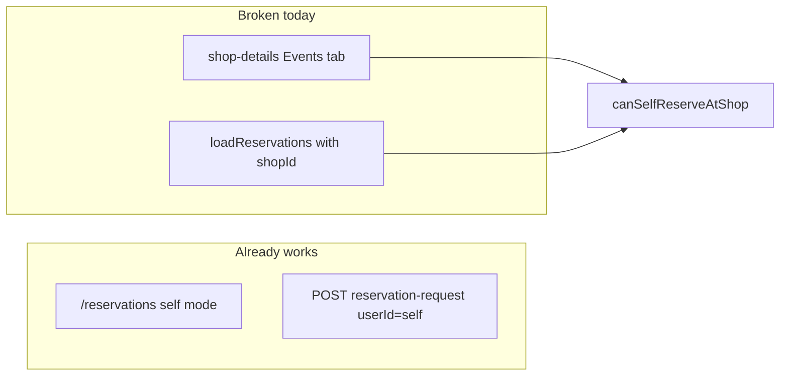

# Owner self-booking at other shops’ events

## Problem

Shop owners browsing **another** café (Shops → shop they do not own → **Events**) cannot reserve the way customers do. The UI gates customer flows on `isCustomer`, which requires `userType === 'CUSTOMER'`:

```829:832:coffeeshop-frontend/src/app/features/shop-details/shop-details.component.ts
  readonly isCustomer = computed(() => {
    const profile = this.profileService.currentUser();
    return !!profile && profile.userType === 'CUSTOMER' && !this.canManageShop();
  });
```

So a `SHOP_OWNER` on a non-owned shop is neither `canManageShop()` nor `isCustomer()` — no **Reserve** button, no inline request form, wrong **Reservations** tab layout, and broken data loading.

## Backend (no changes)

[`assertCanCreateRequest`](coffeeshop/src/main/java/com/coffeeshop/coffeeshop/service/impl/ReservationRequestServiceImpl.java) already allows owner + `userId === currentUser` at a non-owned shop. Covered by [`ownerCreateRequest_forSelf_atShopNotOwned_returnsCreated`](coffeeshop/src/test/java/com/coffeeshop/coffeeshop/ReservationRequestIntegrationTest.java).

The **My Reservations** page already supports owner self-booking via **+ Request Reservation** ([`shopsForSelfRequest`](coffeeshop-frontend/src/app/features/reservations/reservations.component.ts) = non-owned shops) and query-param prefill (`openRequestFormWithEvent` uses `self` when shop is not owned).



## Frontend changes

### 1. Introduce `canSelfReserveAtShop` in shop-details

**File:** [`shop-details.component.ts`](coffeeshop-frontend/src/app/features/shop-details/shop-details.component.ts)

Add computed:

```ts
readonly canSelfReserveAtShop = computed(() => !this.canManageShop());
```

Semantics: anyone viewing a shop they **do not** manage (customers and owners visiting other cafés) gets customer-style booking. Owners on **their** shop keep manage UI only.

Keep `isCustomer` for flows that are truly customer-only (favourites, reviews, hide Tables tab).

### 2. Events tab — mirror customer UX for owners at other shops

Replace `isCustomer()` with `canSelfReserveAtShop()` for:

- Actions column header / **Reserve** button (lines ~599–621)
- Inline “Request reservation” panel (`selectedEventForRequest` form, ~637+)

`canShowReserveButton` / `blockedEventIdsForCurrentUser` already work once personal request data is loaded (step 3).

### 3. Fix `loadReservations()` for non-managed shops

Today, only `isCustomer()` loads personal lists; owners call `requestService.getAll(this.shopId)`, which **403s** when they do not own the shop ([`assertShopOwnedBy`](coffeeshop/src/main/java/com/coffeeshop/coffeeshop/service/impl/ReservationRequestServiceImpl.java)).

Change branch condition from `isCustomer()` to `!canManageShop() && profile`:

- `reservationService.getAll()` → filter to current user + current `shopId` into `reservations` and `allUserReservations`
- `requestService.getAll()` (no `shopId`) → `allUserRequests` + `allShopRequests` filtered to current user + current `shopId`

Keep the existing `canManageShop()` branch (shop-scoped manage lists + accept/deny).

### 4. Reservations tab on shop-details

Use `canSelfReserveAtShop()` instead of `isCustomer()` where the template shows **personal** pending/approved/denied tables (no Guest column, ~458–516). Management UI (`canManageShop()` with accept/deny) stays unchanged.

### 5. Global Events page — align owner reserve rules (small)

**File:** [`events.component.ts`](coffeeshop-frontend/src/app/features/events/events.component.ts)

Today every row shows a reserve icon; prefill uses **guest** mode for owned shops ([`openRequestFormWithEvent`](coffeeshop-frontend/src/app/features/reservations/reservations.component.ts) line 646).

For shop owners:

- Show/enable reserve only when `!ownedShopIds.has(event.shopId)` (same rule as self-request shop list)
- Optionally load `requestService.getAll()` + `reservationService.getAll()` and disable reserve when `eventIdsBlockedForUser` blocks the event (parity with shop-details)

`onReserve` already navigates to `/reservations?shopId=&eventId=` with correct `self` prefill for non-owned shops.

## Verification

| Scenario | Expected |
|----------|----------|
| Owner opens **another** shop → Events | **Reserve** on reservable events; inline party-size form submits successfully |
| Owner opens **own** shop → Events | Manage (Edit/Delete) only; no self-reserve |
| Owner submits request at other shop → Reservations tab | Personal pending/approved rows (no guest column) |
| Customer flows | Unchanged |
| `/reservations` → **+ Request Reservation** | Still works (regression) |
| Global Events → reserve on other shop’s event | Opens self form with prefill |

No backend or new API work required.
