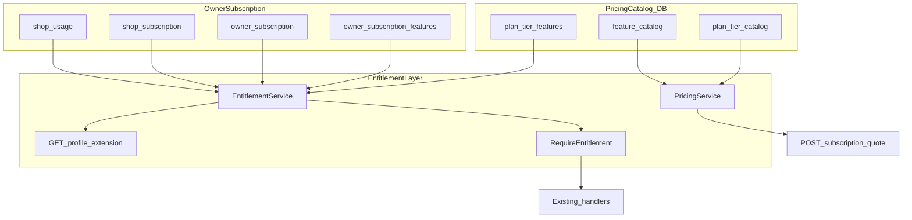

# Owner Subscription Implementation Plan

## Decisions (confirmed)

| Topic | Choice |
|---|---|
| Preset tiers | Starter (free) / Growth / Pro per spec |
| Custom plan | Owner picks features; price = sum of `feature_catalog.monthly_price_cents` |
| Adjustable pricing | Postgres catalog tables; admin UI edits prices (no deploy) |
| Extra shops (Custom) | `max(0, shopCount - 1) × extra_shop_price_cents` from catalog default |
| Annual pricing | Supported in quote/catalog (`annual = monthly × annual_months_charged`); no checkout yet |
| Payments | **Deferred** — no Stripe/WSPay in this rollout |
| Grandfathering | Existing `SHOP_OWNER` → Growth (active); new owners → Starter |
| Admin bypass | Admins skip all entitlement gates |
| Tests | Required in every phase (unit + integration where applicable) |

## Current state

- **No subscription code exists** — only [subscription-plan.md](coffeeshop/docs/subscription-plan.md) and one migration ([`000001_initial_schema.up.sql`](coffeeshop-go/migrations/000001_initial_schema.up.sql))
- Auth is RBAC-only via [`ShopAuthorizer`](coffeeshop-go/internal/auth/shop_authorizer.go)
- [`apperror`](coffeeshop-go/internal/apperror/errors.go) has no `402` helper yet
- Mobile [`user_permissions.dart`](coffeeshop-mobile/lib/core/auth/user_permissions.dart) has role checks only; generated DTOs are out of sync with source
- Test harness: [`integration_test.go`](coffeeshop-go/cmd/api/integration_test.go) + [`testutil.SetupTestDB`](coffeeshop-go/internal/testutil/testutil.go)

## Architecture



**Entitlement resolution order** (preset and custom):

1. Admin bypass → allow all
2. Resolve paying owner via `user_shop.relationship_type = OWNER` (not employee)
3. Load `owner_subscription` for owner
4. **PRESET:** features from `plan_tier_features`
5. **CUSTOM:** features from `owner_subscription_features`
6. Apply numeric limits from feature/tier metadata
7. Deny with **402** + structured upgrade hint

**Custom price formula:**

```
monthlyCents =
  (planMode == PRESET ? tier.base_price_monthly_cents : Σ selectedFeature.monthly_price_cents)
  + max(0, shopCount - 1) × catalog.extra_shop_price_cents

annualCents = monthlyCents × tier.annual_months_charged   // default 10 (= 2 months free)
```

Starter preset: `base_price = 0`, max 1 shop (limit, not add-on price).

**Price lock behavior (no payments yet):** store `locked_monthly_amount_cents` on subscription row when admin assigns a paid plan; quote API always uses current catalog for previews.

---

## Database schema — migration `000002_owner_subscriptions`

New file: [`coffeeshop-go/migrations/000002_owner_subscriptions.up.sql`](coffeeshop-go/migrations/000002_owner_subscriptions.up.sql)

### Pricing catalog (adjustable)

```sql
plan_tier_catalog (tier, display_name, base_price_monthly_cents, extra_shop_price_cents,
                    annual_months_charged, is_active, updated_at)

feature_catalog (feature_key, display_name, description, monthly_price_cents,
                 limit_type, limit_value, is_selectable_custom, sort_order, is_active)

plan_tier_features (tier, feature_key, included)
```

**Seed defaults** from spec (€29 Growth, €15 extra shop, €79 Pro, €10 extra shop, Starter free). Suggested custom feature prices (all admin-editable):

| feature_key | Custom price | Limit |
|---|---|---|
| `reservation_manage` | €8/mo | — |
| `event_create` | €10/mo | 5/mo Growth; unlimited Pro |
| `employee_assign` | €6/mo | 3 Growth; unlimited Pro |
| `community_post` | €5/mo | — |
| `loyalty_basic` | €12/mo | BASIC only |
| `loyalty_premium` | €20/mo | PREMIUM/VIP |
| `review_moderate` | €4/mo | — |
| `dashboard_notifications` | €3/mo | — |
| `analytics` | €15/mo | — |
| `unlimited_tables` | €5/mo | else Starter cap 15 |
| `unlimited_menus` | €5/mo | else Starter cap 1 |

### Subscription tables

```sql
owner_subscription (user_id PK, plan_mode PRESET|CUSTOM, plan_tier, status,
  billing_interval monthly|annual, locked_monthly_amount_cents,
  current_period_start, current_period_end, canceled_at)

owner_subscription_features (user_id, feature_key)  -- CUSTOM only

shop_subscription (shop_id, owner_user_id, is_base_shop)

shop_usage (shop_id, period_start, events_created)
```

**Grandfather migration** (end of up migration):

```sql
INSERT INTO owner_subscription ... SELECT id, 'PRESET', 'GROWTH', 'active' FROM users WHERE user_type = 'SHOP_OWNER';
INSERT INTO shop_subscription ... first shop per owner is_base_shop = true;
```

Payment columns (`pan_token`, `stripe_*`, WSPay fields) **omitted until payment phase**.

---

## Backend packages (new)

| Component | Path | Responsibility |
|---|---|---|
| Models | `internal/model/subscription.go` | Enums + GORM entities |
| Repository | `internal/repository/subscription.go` | Catalog, owner sub, usage CRUD |
| EntitlementService | `internal/subscription/entitlement.go` | `CanUse`, `CheckLimit`, `ResolveEntitlements` |
| PricingService | `internal/subscription/pricing.go` | Preset/custom quote, annual math |
| Middleware | `internal/middleware/entitlement.go` | `RequireEntitlement(feature)` helper |
| Handlers | `internal/handler/subscription.go`, `subscription_admin.go` | Owner + admin APIs |

Wire in [`cmd/api/main.go`](coffeeshop-go/cmd/api/main.go).

### Key APIs (no payment endpoints in this rollout)

| Endpoint | Purpose |
|---|---|
| `GET /subscription/catalog` | Tiers, features, current prices |
| `POST /subscription/quote` | `{ planMode, planTier?, features?, shopCount, billingInterval }` → breakdown |
| `GET /subscription/me` | Current plan, usage, quoted renewal amount |
| `PUT /subscription/plan` | Change plan without payment (admin/owner self-serve for now) |
| `GET/PUT /admin/subscription/tiers` | Edit preset prices |
| `GET/PUT /admin/subscription/features` | Edit feature prices, limits, custom-selectable |
| `GET /admin/subscription/owners` | Paginated owner list |
| `PUT /admin/subscription/owners/{userId}` | Manual override |

### Profile extension

Extend [`profile.go`](coffeeshop-go/internal/handler/profile.go) for `SHOP_OWNER`:

```json
{
  "subscription": { "planMode", "planTier", "status", "shopsIncluded", "shopsUsed", "periodEnd", "monthlyAmountCents" },
  "entitlements": { "reservation_manage": true, ... },
  "limits": { "tables": { "used": 12, "max": 15 }, "events": { "used": 2, "max": 5 } }
}
```

### Handler gates

| Handler | Gate |
|---|---|
| [`reservation_request.go`](coffeeshop-go/internal/handler/reservation_request.go) accept/deny | `reservation_manage` |
| [`event.go`](coffeeshop-go/internal/handler/event.go) create | `event_create` + monthly quota |
| [`shop_employee.go`](coffeeshop-go/internal/handler/shop_employee.go) assign | `employee_assign` + seat limit |
| [`community.go`](coffeeshop-go/internal/handler/community.go) announcements | `community_post` |
| [`loyalty_plan.go`](coffeeshop-go/internal/handler/loyalty_plan.go) create | `loyalty_basic` or `loyalty_premium` by type |
| [`table.go`](coffeeshop-go/internal/handler/table.go) create | table count limit |
| [`menu.go`](coffeeshop-go/internal/handler/menu.go) create | menu count limit |
| [`review.go`](coffeeshop-go/internal/handler/review.go) delete | `review_moderate` |
| [`shop.go`](coffeeshop-go/internal/handler/shop.go) create | shop count vs plan |

**402 response** — extend [`apperror`](coffeeshop-go/internal/apperror/errors.go) + [`handler.go`](coffeeshop-go/internal/apperror/handler.go):

```json
{ "message": "...", "requiredPlan": "GROWTH", "requiredFeatures": ["event_create"], "limit": "tables", "used": 15, "max": 15 }
```

---

## Client architecture

### Shared pattern

```
Profile.subscription + entitlements + limits
        ↓
SubscriptionService (web) / UserPermissions (mobile)
        ↓
canUseFeature(feature) → bool
        ↓
UI: enabled action OR disabled + "Upgrade" CTA → /profile/billing
```

### Frontend ([`coffeeshop-frontend`](coffeeshop-frontend))

- New: `subscription.model.ts`, `subscription.service.ts`, `subscription-admin.service.ts`
- Centralize gates in [`shop-details.component.ts`](coffeeshop-frontend/src/app/features/shop-details/shop-details.component.ts), [`shops.component.ts`](coffeeshop-frontend/src/app/features/shops/shops.component.ts), reservations/events components
- Routes: `/profile/billing`, `/profile/billing/custom`, `/admin/subscription-pricing`, `/admin/subscriptions`

### Mobile ([`coffeeshop-mobile`](coffeeshop-mobile))

- Extend [`user_permissions.dart`](coffeeshop-mobile/lib/core/auth/user_permissions.dart) with `SubscriptionFeature` enum + `canUseFeature()`
- Sync [`user_profile_response_dto.dart`](coffeeshop-mobile/lib/data/models/user_profile_response_dto.dart) with profile API; run `build_runner`
- Gate same tabs; billing screen with preset + custom picker (no payment redirect)

---

## Implementation phases

Each phase = **one session**. Mark `status: completed` in plan todos when done.

### Phase 1 — Pricing catalog migration + seed
- Create `000002` up/down: `plan_tier_catalog`, `feature_catalog`, `plan_tier_features`
- Seed Starter/Growth/Pro prices + feature matrix from spec
- **Tests:** migration applies cleanly; seed row counts; tier-feature bundle matches spec matrix

### Phase 2 — Subscription tables + grandfather migration
- Add `owner_subscription`, `owner_subscription_features`, `shop_subscription`, `shop_usage`
- Grandfather `SHOP_OWNER` → Growth; populate `shop_subscription`
- Default new owners to Starter on first shop-owner action (or signup hook)
- **Tests:** SQL integration test — existing owners get Growth; shop base flags correct

### Phase 3 — Go models + repository
- `internal/model/subscription.go` entities/enums
- `internal/repository/subscription.go` — catalog load, owner sub CRUD, usage counters
- Extend [`testutil.SetupTestDB`](coffeeshop-go/internal/testutil/testutil.go) AutoMigrate for new models
- **Tests:** repository CRUD round-trips against SQLite

### Phase 4 — EntitlementService: feature resolution
- `CanUse`, `ResolveEntitlements` for PRESET + CUSTOM + admin bypass
- Resolve owner via `user_shop.OWNER` (employee inherits owner's plan)
- **Tests:** table-driven unit tests per tier + custom combos + admin bypass

### Phase 5 — EntitlementService: numeric limits
- `CheckLimit` for tables (15 Starter), menus (1 Starter), events/month, employees/shop, shop count
- Live counts from DB (employees from `shop_employees`; events from `shop_usage`)
- **Tests:** at-cap, over-cap, unlimited (Pro `-1` sentinel) edge cases

### Phase 6 — PricingService + quote logic
- Preset quote, custom feature sum, extra-shop add-on, annual discount
- `locked_monthly_amount_cents` snapshot on plan assignment
- **Tests:** unit tests for all formulas; €29 + 2×€15 = €59 Growth example; custom 3-feature sum

### Phase 7 — 402 apperror + entitlement helper
- `PaymentRequired(...)` with structured JSON body
- `RequireEntitlement` helper used by handlers
- **Tests:** `WriteError` encodes 402 payload correctly

### Phase 8 — Profile API extension
- Add `subscription`, `entitlements`, `limits` to [`profile.go`](coffeeshop-go/internal/handler/profile.go)
- **Tests:** integration test — Growth owner gets correct entitlements; Starter gets caps

### Phase 9 — Catalog + quote + me APIs
- `GET /subscription/catalog`, `POST /subscription/quote`, `GET /subscription/me`
- `PUT /subscription/plan` (no payment — updates entitlements immediately)
- **Tests:** quote API integration tests (preset, custom, annual, extra shops); catalog reflects DB prices

### Phase 10 — Gate: reservations
- Inject `EntitlementService` into [`reservation_request.go`](coffeeshop-go/internal/handler/reservation_request.go)
- Gate accept/deny with `reservation_manage`
- **Tests:** Starter owner gets 402; Growth owner succeeds

### Phase 11 — Gate: events + usage metering
- Gate `POST /event` with `event_create` + monthly limit
- Increment `shop_usage.events_created` on create
- **Tests:** Growth at 5 events → 402; Pro unlimited

### Phase 12 — Gate: employees + community
- [`shop_employee.go`](coffeeshop-go/internal/handler/shop_employee.go), [`community.go`](coffeeshop-go/internal/handler/community.go)
- **Tests:** Starter 0 employees; Growth 4th employee → 402

### Phase 13 — Gate: loyalty, tables, menus
- [`loyalty_plan.go`](coffeeshop-go/internal/handler/loyalty_plan.go), [`table.go`](coffeeshop-go/internal/handler/table.go), [`menu.go`](coffeeshop-go/internal/handler/menu.go)
- **Tests:** loyalty type vs entitlement; table 16th → 402 on Starter

### Phase 14 — Gate: shops + reviews
- [`shop.go`](coffeeshop-go/internal/handler/shop.go) shop count; [`review.go`](coffeeshop-go/internal/handler/review.go) delete
- **Tests:** Starter 2nd shop → 402; review delete read-only Starter → 402

### Phase 15 — Full gate integration test suite
- Consolidate `TestSubscriptionGates_*` in [`integration_test.go`](coffeeshop-go/cmd/api/integration_test.go)
- Matrix: Starter / Growth / Custom / admin bypass for every gated endpoint
- **Tests:** this phase is tests-only consolidation + any gaps

### Phase 16 — Admin subscription APIs
- Tier + feature pricing CRUD; owner list + override
- Guard with admin check (same pattern as [`user.go`](coffeeshop-go/internal/handler/user.go))
- **Tests:** non-admin 403; price change reflected in next quote

### Phase 17 — Angular models + SubscriptionService
- `subscription.model.ts`, `subscription.service.ts` — `canUseFeature`, `getLimit`, `getCatalog`, `quote`
- Extend profile model in [`user.model.ts`](coffeeshop-frontend/src/app/models/user.model.ts)
- **Tests:** service unit tests with HttpClientTestingModule

### Phase 18 — Frontend billing page (display + plan picker)
- `/profile/billing` — current plan, usage bars, preset tier cards with prices from catalog
- Plan change calls `PUT /subscription/plan` (no checkout)
- **Tests:** component tests for plan display and usage bars

### Phase 19 — Frontend custom plan builder
- `/profile/billing/custom` — feature checklist, live quote via `POST /subscription/quote`, annual toggle
- **Tests:** quote updates when features/shop count change

### Phase 20 — Frontend upgrade CTAs (reservations + events)
- Disabled accept/deny + upgrade link on Starter
- Event create guard + monthly quota display
- **Tests:** component tests mock SubscriptionService

### Phase 21 — Frontend upgrade CTAs (shop-details tabs)
- Tables, menus, employees, community, reviews, loyalty tabs
- Usage indicators (`12 / 15 tables`)
- **Tests:** tab visibility/disabled state per entitlement

### Phase 22 — Frontend admin pricing UI
- `/admin/subscription-pricing` — edit tier + feature prices
- `/admin/subscriptions` — owner list + override
- **Tests:** admin-only route guard; form saves call admin API

### Phase 23 — Mobile profile DTO + UserPermissions
- Add subscription fields to [`user_profile_response_dto.dart`](coffeeshop-mobile/lib/data/models/user_profile_response_dto.dart); run `dart run build_runner build`
- Extend [`user_permissions.dart`](coffeeshop-mobile/lib/core/auth/user_permissions.dart)
- **Tests:** `UserPermissions` unit tests for `canUseFeature` matrix

### Phase 24 — Mobile gated UI + upgrade CTAs
- Reservations, events, employees, tables, menus, community, loyalty screens
- **Tests:** widget tests for disabled buttons + upgrade snackbar/dialog

### Phase 25 — Mobile billing screens
- Plan picker + custom feature builder with live quote (no payment)
- **Tests:** widget test for quote recalculation

### Phase 26 — Loyalty management UI (web)
- Shop detail → Settings → Loyalty: enable BASIC (Growth/custom) or PREMIUM/VIP (Pro/custom)
- Wire [`loyalty-plan.service.ts`](coffeeshop-frontend/src/app/services/loyalty-plan.service.ts)
- **Tests:** gated by `loyalty_basic` / `loyalty_premium`

### Phase 27 — Loyalty management UI (mobile) + customer badge
- Owner loyalty tab; customer-facing badge on shop card/detail
- **Tests:** widget tests for badge visibility by plan

### Phase 28 — Pro analytics backend
- `GET /dashboard/analytics` gated by `analytics` entitlement
- **Tests:** integration — Starter/Growth 402; Pro/admin 200

### Phase 29 — Pro analytics UI (web + mobile)
- Gated dashboard section in [`dashboard.component.ts`](coffeeshop-frontend/src/app/features/dashboard/dashboard.component.ts) + mobile equivalent
- **Tests:** component/widget tests for gate

### Phase 30 (DEFERRED) — Payment integration
- Stripe or Monri WSPay checkout, webhooks, token storage, renewal cron, `subscription_payment` ledger
- Out of scope until explicitly requested

---

## Testing strategy summary

| Layer | Tooling | Coverage |
|---|---|---|
| Entitlement/Pricing | Go unit tests (`internal/subscription/*_test.go`) | Tier matrix, custom combos, limits, annual math |
| APIs | [`integration_test.go`](coffeeshop-go/cmd/api/integration_test.go) | Catalog, quote, profile, 402 gates |
| Admin | Integration tests | Authz + price change → quote |
| Angular | Jasmine/Karma + `HttpClientTestingModule` | SubscriptionService, billing components, CTAs |
| Flutter | `flutter test` | UserPermissions, gated widgets, billing quote UI |
| E2E (manual) | Web + mobile together | Grandfathered Growth works; Starter limits; custom plan quote; admin price edit |

---

## Risks

| Risk | Mitigation |
|---|---|
| Employee vs owner entitlements | Always resolve paying owner via `user_shop.OWNER` |
| Custom plan complexity | v1: flat per-feature; limits bundled in `feature_catalog.limit_value` |
| No payment but annual pricing shown | Label UI "pricing preview"; `PUT /subscription/plan` assigns without charge |
| Mobile DTO drift | Phase 23 explicitly regenerates freezed/json_serializable |
| Price changes | Catalog is source of truth for quotes; `locked_monthly_amount_cents` on assigned plans |

---

## Session workflow

1. Pick next phase with `status: pending`
2. Implement scope + tests for that phase only
3. Run `go test ./...` and client test suites for touched packages
4. Mark phase `completed` in plan todos before ending session
