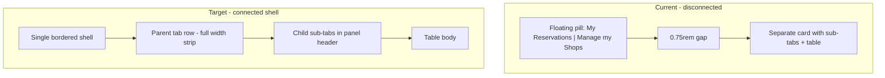

# Connect parent and child reservation tabs

## Problem

Primary tabs (`.tabs--primary`) and the child panel (`.tabs-nav__panel`) are **sibling blocks** with separate borders and `margin-top: 0.75rem` on the panel ([`styles.css`](coffeeshop-frontend/src/styles.css) line 627). That reads as two unrelated UI pieces, not parent → child.



## Approach: folder-tab shell

Wrap primary tabs and the active panel in one container so the **active parent tab opens into** the panel below (browser-tab / folder-tab pattern).

### 1. Template — add shell wrapper

**File:** [`reservations.component.ts`](coffeeshop-frontend/src/app/features/reservations/reservations.component.ts) (~lines 116–390)

Change structure from:

```html
<div class="tabs-nav">
  <div class="tabs tabs--primary">...</div>
  @if (personal) { <div class="tabs-nav__panel">...</div> }
  @if (manage) { <div class="tabs-nav__panel">...</div> }
</div>
```

To:

```html
<div class="tabs-nav">
  <div class="tabs-nav__shell">
    <div class="tabs tabs--primary">...</div>
    @if (ownerMainTab() === 'personal') {
      <div class="tabs-nav__panel">...</div>
    }
    @if (ownerMainTab() === 'manage') {
      <div class="tabs-nav__panel">...</div>
    }
  </div>
</div>
```

No logic changes — only nesting.

### 2. CSS — connected hierarchy

**File:** [`styles.css`](coffeeshop-frontend/src/styles.css)

**Shell** (new):

```css
.tabs-nav__shell {
  width: 100%;
  border: 1px solid #2a2a3e;
  border-radius: 12px;
  overflow: hidden;
  background: #1a1a2e;
}
```

**Primary row** (inside shell — no separate pill box):

- Remove standalone border/radius from `.tabs--primary` when inside shell (use `.tabs-nav__shell > .tabs--primary`)
- Full-width **track** strip: `background: #121212`, `border-bottom: 1px solid #2a2a3e`, `padding: 0.375rem 0.375rem 0`
- Tab buttons stay `flex: none` / content-sized (preserves your “don’t stretch labels” preference)
- **Active parent tab** (folder tab):
  - `background: #1a1a2e` (matches panel)
  - `border-radius: 8px 8px 0 0`
  - `border: 1px solid #2a2a3e; border-bottom-color: #1a1a2e` (hides seam into panel)
  - `margin-bottom: -1px` so it overlaps the primary/sub divider

**Panel** (child area):

- `margin-top: 0` (removes the gap)
- `border: none; border-radius: 0` (shell owns the outer frame)
- Keep existing sub-header strip (`#16213e`) and flush table body rules from the last polish

**Inactive parent tabs:** muted on `#121212` track; hover slightly lighter — clearly “siblings” above the active section.

### 3. Visual result

| Layer | Role | Look |
|-------|------|------|
| Shell border | Outer frame | One card around everything |
| Primary row | Parent | Dark strip; active tab “attached” to content |
| Sub-tab header | Child | Lighter strip inside same card |
| Panel body | Content | Table flush under sub-tabs (unchanged) |

Primary labels remain left-aligned and only as wide as their text; the **track** spans full width so the child panel aligns cleanly below.

## Files touched

- [`coffeeshop-frontend/src/styles.css`](coffeeshop-frontend/src/styles.css)
- [`coffeeshop-frontend/src/app/features/reservations/reservations.component.ts`](coffeeshop-frontend/src/app/features/reservations/reservations.component.ts)

## Verification

1. No visible gap between “My Reservations” / “Manage my Shops” and sub-tabs
2. Active parent tab visually continues into the panel (shared background, no double border between levels)
3. Switching parent tab swaps panel; inactive parent stays on dark track
4. Table still flush under sub-tabs; Pending dropdown not clipped
5. `npm run build` in `coffeeshop-frontend`
