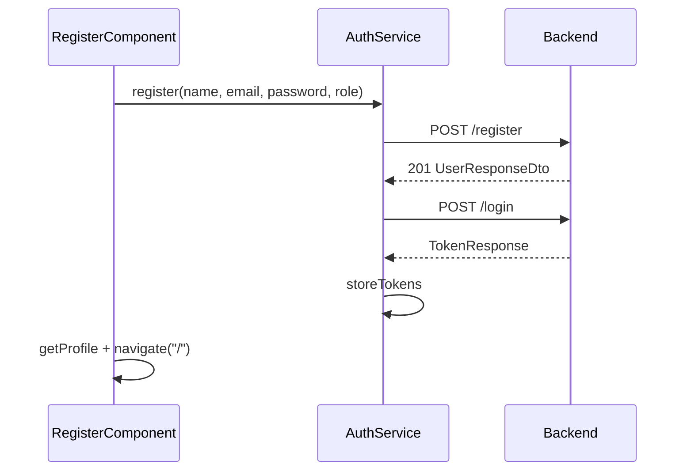

# Post-registration auto login

## Current behavior

Registration and login are separate:

- [`register.component.ts`](coffeeshop-frontend/src/app/features/auth/register.component.ts) calls `AuthService.register()` and on success shows *"Account created successfully! You can now sign in."* with no navigation.
- [`login.component.ts`](coffeeshop-frontend/src/app/features/auth/login.component.ts) calls `AuthService.login()`, which stores JWTs via `storeTokens()`, loads profile, and navigates to `/`.

The backend [`POST /register`](coffeeshop/src/main/java/com/coffeeshop/coffeeshop/auth/AuthController.java) returns `201` + `UserResponseDto` only — no tokens. [`POST /login`](coffeeshop/src/main/java/com/coffeeshop/coffeeshop/auth/AuthController.java) returns `TokenResponse`.

Registration creates a Keycloak user that is **enabled** and **emailVerified** before the API responds ([`KeycloakAdminClient.createUserWithRealmRole`](coffeeshop/src/main/java/com/coffeeshop/coffeeshop/auth/KeycloakAdminClient.java)), so an immediate login with the same credentials should succeed in normal conditions.



## Recommended approach: frontend-only chained login

Avoid backend changes. Reuse the existing login endpoint and token storage — same security model as manual sign-in.

### 1. Add `registerAndLogin` to `AuthService` (optional but clean)

In [`auth.service.ts`](coffeeshop-frontend/src/app/services/auth.service.ts):

- Import `switchMap` from `rxjs`.
- Add a method that composes register → login:

```typescript
registerAndLogin(
  name: string,
  email: string,
  password: string,
  role: 'customer' | 'shop_owner',
): Observable<TokenResponse> {
  return this.register(name, email, password, role).pipe(
    switchMap(() => this.login(email, password)),
  );
}
```

`login()` already calls `storeTokens()` via `tap`, so callers only need to handle post-auth steps.

Alternatively, chain two calls directly in the component — slightly more duplication but fewer file touches. Prefer the service method if you want a single place for the flow.

### 2. Update `RegisterComponent` success path

In [`register.component.ts`](coffeeshop-frontend/src/app/features/auth/register.component.ts):

- Inject `Router` and `ProfileService` (same as login).
- Replace `authService.register(...)` with `authService.registerAndLogin(...)` (or nested subscribe).
- On success, mirror login:

```typescript
this.profileService.getProfile().subscribe();
void this.router.navigate(['/'], { replaceUrl: true });
```

- Remove or shorten the success banner (user will leave the page; no need to reset the form on success).
- Update loading button copy, e.g. *"Creating account..."* → keep one label or use *"Signing you in..."* after register returns (minor UX).

### 3. Error handling

| Scenario | UX |
|----------|-----|
| Register fails (409, 403, etc.) | Keep existing error messages |
| Register succeeds, login fails | Show: *"Account created, but automatic sign-in failed. Please sign in manually."* and `router.navigate(['/login'])` (optional: pass email via query param if you want prefill later — out of scope unless requested) |
| Login succeeds | Redirect to dashboard; `guestGuard` already blocks authenticated users from `/register` |

Use a single `subscribe` with `error` handler that checks whether registration already completed (e.g. track a local flag, or inspect error context) if you split calls; with `switchMap`, a login error after successful register is a single error path — handle with the partial-success message above.

### 4. What we are **not** changing

- **Backend** — no new tokens on `/register`; avoids duplicating auth logic and keeps register idempotent from a session perspective.
- **Guards / interceptor** — already work once tokens are stored.
- **Tests** — no existing register component specs found; adding a minimal unit test for `registerAndLogin` is optional follow-up.

## Files to touch

| File | Change |
|------|--------|
| [`coffeeshop-frontend/src/app/services/auth.service.ts`](coffeeshop-frontend/src/app/services/auth.service.ts) | Add `registerAndLogin` with `switchMap` |
| [`coffeeshop-frontend/src/app/features/auth/register.component.ts`](coffeeshop-frontend/src/app/features/auth/register.component.ts) | Use new method; inject `Router` + `ProfileService`; post-auth redirect |

## Verification

1. Register a new customer → should land on dashboard without visiting `/login`.
2. Register with duplicate email → still shows 409, no login attempt.
3. Simulate login failure after register (e.g. wrong Keycloak config) → account exists, user sees fallback message and can sign in manually.
4. Refresh after auto-login → session persists via `localStorage` (unchanged).
