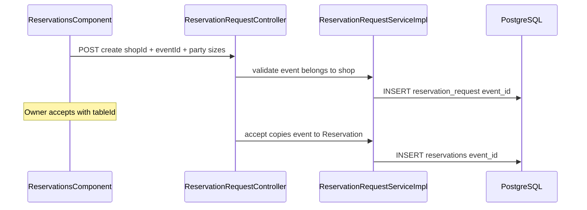

# Reservation event selection

## Current state

- **Reservation request** ([`ReservationRequest.java`](coffeeshop/src/main/java/com/coffeeshop/coffeeshop/model/ReservationRequest.java)): `user`, `shop`, party sizes, `status` — no event.
- **Reservation** ([`Reservation.java`](coffeeshop/src/main/java/com/coffeeshop/coffeeshop/model/Reservation.java)): created on accept in [`ReservationRequestServiceImpl.accept`](coffeeshop/src/main/java/com/coffeeshop/coffeeshop/service/impl/ReservationRequestServiceImpl.java) — copies user/shop/party sizes only.
- **Event** ([`Event.java`](coffeeshop/src/main/java/com/coffeeshop/coffeeshop/model/Event.java)): `String eventId` PK, `@ManyToOne` `shop_id`.
- **Schema**: no Flyway/Liquibase; Hibernate `ddl-auto` (`create-drop` in local/docker/tests) will add `event_id` columns once entities are mapped.
- **Frontend** ([`reservations.component.ts`](coffeeshop-frontend/src/app/features/reservations/reservations.component.ts)): form has `shopId`, `minPartySize`, `maxPartySize` only.

## Target behavior

**Rules (per your choice):**
- `eventId` is **required** on create.
- Event must exist and `event.shop.id` must equal `shopId`.
- On accept, copy the request’s event onto the new `Reservation` (no re-selection at accept time).

---

## Phase 1 — Backend (`java-agent`)

Follow conventions in [`.cursor/agents/java-agent.md`](.cursor/agents/java-agent.md) (4-space indent, `final` params, early returns, integration tests with Testcontainers).

### 1.1 Persistence layer

| File | Change |
|------|--------|
| [`ReservationRequest.java`](coffeeshop/src/main/java/com/coffeeshop/coffeeshop/model/ReservationRequest.java) | Add `@ManyToOne Event event` + `@JoinColumn(name = "event_id", nullable = false)` |
| [`Reservation.java`](coffeeshop/src/main/java/com/coffeeshop/coffeeshop/model/Reservation.java) | Same `event` mapping (`event_id`, nullable until accept for direct-create path — see below) |
| [`EventRepository.java`](coffeeshop/src/main/java/com/coffeeshop/coffeeshop/repository/EventRepository.java) | Add `List<Event> findByShopId(UUID shopId)` (or `findByShop_Id`) for validation and optional listing |

**Note:** `Event.eventId` is `String`; FK column type will be `varchar` — consistent with existing event APIs.

### 1.2 DTOs and mappers

| File | Change |
|------|--------|
| [`ReservationRequestCreateRequest.java`](coffeeshop/src/main/java/com/coffeeshop/coffeeshop/model/dto/request/ReservationRequestCreateRequest.java) | Add `String eventId` |
| [`ReservationRequestResponseDto.java`](coffeeshop/src/main/java/com/coffeeshop/coffeeshop/model/dto/response/ReservationRequestResponseDto.java) | Add `String eventId` and optionally `eventName` / `eventDate` (lightweight summary avoids extra GETs in UI) |
| [`ReservationResponseDto.java`](coffeeshop/src/main/java/com/coffeeshop/coffeeshop/model/dto/response/ReservationResponseDto.java) | Same event fields |
| [`ReservationRequestMapper.java`](coffeeshop/src/main/java/com/coffeeshop/coffeeshop/mapper/ReservationRequestMapper.java) | Map event id + summary from `request.getEvent()` |
| [`ReservationMapper.java`](coffeeshop/src/main/java/com/coffeeshop/coffeeshop/mapper/ReservationMapper.java) | Map event on reservations |

Reuse or add a small `EventSummaryDto` (`eventId`, `eventName`, `eventDate`) if not already present.

### 1.3 Service and controller

| File | Change |
|------|--------|
| [`ReservationRequestService.java`](coffeeshop/src/main/java/com/coffeeshop/coffeeshop/service/ReservationRequestService.java) | Extend `createRequest(..., String eventId)` |
| [`ReservationRequestServiceImpl.java`](coffeeshop/src/main/java/com/coffeeshop/coffeeshop/service/impl/ReservationRequestServiceImpl.java) | Inject `EventRepository`; in `createRequest`: require non-blank `eventId`, load event, assert `event.getShop().getId().equals(shopId)`, `request.setEvent(event)`; in `accept`: `reservation.setEvent(request.getEvent())` |
| [`ReservationRequestController.java`](coffeeshop/src/main/java/com/coffeeshop/coffeeshop/controller/ReservationRequestController.java) | Pass `request.getEventId()` into service |

**Direct reservation create** ([`ReservationServiceImpl`](coffeeshop/src/main/java/com/coffeeshop/coffeeshop/service/impl/ReservationServiceImpl.java)): out of the main guest flow but if `POST /api/v1/reservation` remains, either require `eventId` in `ReservationCreateRequest` or leave `event` null only for legacy/admin paths — prefer aligning DTO if that endpoint is kept.

### 1.4 Shop-scoped events API (recommended)

Today events are only listed globally (`GET /api/v1/event`) or embedded on `GET /api/v1/shop/{id}`.

Add optional query param on [`EventController`](coffeeshop/src/main/java/com/coffeeshop/coffeeshop/controller/EventController.java):

- `GET /api/v1/event?shopId={uuid}` → `eventService.findByShopId(shopId)`

Keeps the booking UI simple and avoids loading full shop graphs. Public read is consistent with existing `GET /api/v1/event`.

### 1.5 Tests

Extend [`ReservationRequestIntegrationTest.java`](coffeeshop/src/test/java/com/coffeeshop/coffeeshop/ReservationRequestIntegrationTest.java):

- Happy path: seed shop + event → create request with `eventId` → accept → assert response and DB row have matching `eventId` on both tables.
- Negative: missing `eventId` → 400; wrong shop for event → 400/404; nonexistent event → 404.

Run: `./mvnw -pl coffeeshop test` (or module-equivalent).

---

## Phase 2 — Frontend (`frontend-agent`)

Follow [`.cursor/agents/frontend-agent.md`](.cursor/agents/frontend-agent.md): signals, reactive forms, `@if`/`@for`, OnPush, `inject()`.

### 2.1 Models and API

| File | Change |
|------|--------|
| [`reservation.model.ts`](coffeeshop-frontend/src/app/models/reservation.model.ts) | Add `eventId` to `ReservationRequestCreateRequest`; add `eventId` + optional `eventName`/`eventDate` to response DTOs |
| [`event.service.ts`](coffeeshop-frontend/src/app/services/event.service.ts) | Add `getByShopId(shopId: string)` → `GET /api/v1/event?shopId=` (or filter client-side until backend ships) |
| [`reservation-request.service.ts`](coffeeshop-frontend/src/app/services/reservation-request.service.ts) | No URL change; body includes `eventId` |

### 2.2 Guest reservation form

[`reservations.component.ts`](coffeeshop-frontend/src/app/features/reservations/reservations.component.ts):

1. Add `eventId` to `requestForm` with `Validators.required`.
2. **Cascading select:** `effect` or `valueChanges` on `shopId` → load events for shop → `eventsForShop` signal; clear `eventId` when shop changes.
3. Disable event `<select>` until shop is chosen; show empty state if shop has no events (submit stays disabled — matches required backend rule).
4. Pass `eventId` in `onSubmitRequest()` → `ReservationRequestService.create`.
5. Add **Event** column in requests and confirmed tables.

### 2.3 Owner views

[`shop-details.component.ts`](coffeeshop-frontend/src/app/features/shop-details/shop-details.component.ts):

- Show event name/id on pending and confirmed reservation tables (same columns as global reservations page).
- Remove unused `EventService` import or use it if you load events dynamically.

### 2.4 Accessibility

- Label event select; associate errors if shop has no events (`aria-live` message: “No events available for this shop”).
- Keep keyboard order: Shop → Event → party sizes → submit.

---

## Implementation order

1. **Backend entities + repository + service validation + accept copy** (unblocks API contract).
2. **Backend DTOs/mappers/controller + `GET event?shopId`**.
3. **Backend integration tests**.
4. **Frontend models/services**.
5. **Frontend reservations + shop-details UI**.
6. Manual E2E: create request with event → owner accept → both lists show event.

---

## Agent delegation (execution)

| Area | Agent | Scope |
|------|--------|--------|
| Java/Spring | `java-agent` | Entities, repo, services, controllers, mappers, tests |
| Angular | `frontend-agent` | Models, services, `reservations.component`, `shop-details.component` |

Parent agent should land **backend first**, then frontend against the updated OpenAPI/contract.

---

## Out of scope (unless you ask later)

- Flyway migration scripts (not in repo today; Hibernate handles dev/test schema).
- Filtering events by date (“upcoming only”) — can use full shop event list initially.
- Changing event on accept/deny.
