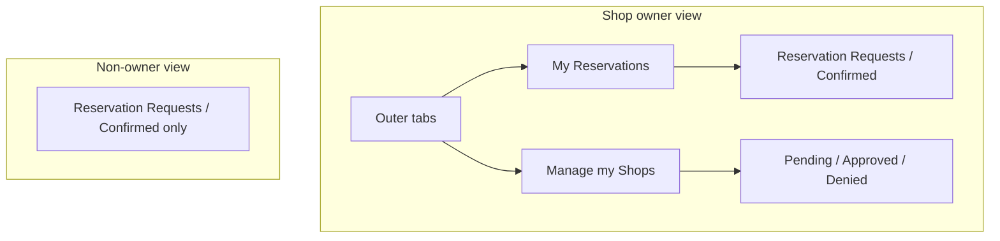

# Reservations nested outer tabs

## Current state

All logic lives in a single inline template in [`coffeeshop-frontend/src/app/features/reservations/reservations.component.ts`](coffeeshop-frontend/src/app/features/reservations/reservations.component.ts).

**Shop owners** see two stacked sections with `h2` headings (Manage first, My reservations second):

```115:264:coffeeshop-frontend/src/app/features/reservations/reservations.component.ts
      @if (isShopOwner()) {
        <h2 class="mb-2" style="font-size:1.125rem">Manage my shops</h2>
        <div class="tabs tabs--sub">
          <!-- Pending / Approved / Denied -->
        </div>
        ...
        <h2 class="mb-2 mt-4" style="font-size:1.125rem">My reservations</h2>
        <div class="tabs">
          <!-- Reservation Requests / Confirmed Reservations -->
        </div>
```

**Non-owners** see one tab row (`activeTab`: requests | confirmed) — **unchanged** per your choice.

Existing tab styling already supports nesting via `.tabs` (outer) and `.tabs--sub` (inner), used the same way in [`shop-details.component.ts`](coffeeshop-frontend/src/app/features/shop-details/shop-details.component.ts) for the reservations sub-tab.



## Target structure (shop owners only)

| Level | Tab | Sub-tabs | Existing signal |
|-------|-----|----------|-----------------|
| Outer | **My Reservations** (default) | Reservation Requests, Confirmed Reservations | `personalActiveTab` |
| Outer | **Manage my Shops** | Pending, Approved, Denied | `ownerSubTab` |

- Remove the two `h2` section headers; outer tab labels replace them.
- Reorder content so **My Reservations** is the first outer tab (matches your spec; opposite of current vertical order).
- Keep sub-tab labels and counts as-is (`Approved`, not “Approval”, to stay consistent with shop-details).

## Implementation (single file)

**File:** [`reservations.component.ts`](coffeeshop-frontend/src/app/features/reservations/reservations.component.ts)

### 1. Add outer tab state

```typescript
readonly ownerMainTab = signal<'personal' | 'manage'>('personal');
```

Default `'personal'` so owners land on My Reservations first.

### 2. Restructure template (`@if (isShopOwner())` block)

Replace the current two-section layout with:

```html
<div class="tabs">
  <button class="tab" [class.active]="ownerMainTab() === 'personal'" (click)="ownerMainTab.set('personal')">
    My Reservations
  </button>
  <button class="tab" [class.active]="ownerMainTab() === 'manage'" (click)="ownerMainTab.set('manage')">
    Manage my Shops
  </button>
</div>

@if (ownerMainTab() === 'personal') {
  <div class="tabs tabs--sub">...</div>
  <!-- existing personalActiveTab tables (lines 266–329) -->
}

@if (ownerMainTab() === 'manage') {
  <div class="tabs tabs--sub">...</div>
  <!-- existing ownerSubTab tables (lines 138–254) -->
}
```

- Move **no** table markup or computed properties — only wrap and reorder.
- Change the personal sub-tab row from `class="tabs"` to `class="tabs tabs--sub"` for visual hierarchy (manage sub-tabs already use `tabs--sub`).

### 3. Update post-submit tab focus (`onSubmitRequest`)

In the `next` handler (~line 779):

| Mode | Today | After |
|------|-------|-------|
| Guest request | `ownerSubTab` → pending | `ownerMainTab` → `'manage'`, `ownerSubTab` → `'pending'` |
| Owner self request | `personalActiveTab` → requests | `ownerMainTab` → `'personal'`, `personalActiveTab` → `'requests'` |

Non-owner branch (`activeTab.set('requests')`) unchanged.

### 4. No CSS or routing changes

- [`styles.css`](coffeeshop-frontend/src/styles.css) `.tabs` / `.tabs--sub` already sufficient.
- No new components; no API changes.
- No component tests exist for this feature.

## Verification

Manual checks as shop owner:

1. Outer tabs switch between My Reservations and Manage my Shops; only one section visible at a time.
2. Sub-tabs retain counts and correct tables (pending actions, approved/denied lists, personal requests/confirmed).
3. Submit guest request → lands on Manage my Shops → Pending.
4. Submit self request (as owner) → lands on My Reservations → Reservation Requests.

As non-owner: layout unchanged (single tab row, no outer bar).
