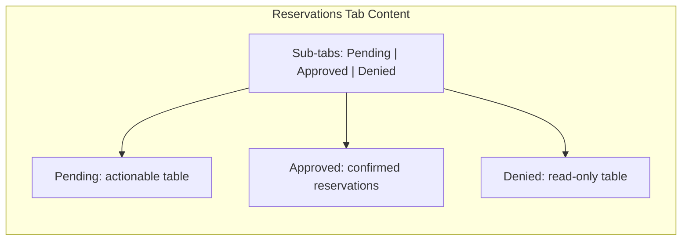

# Reservations Sub-Tabs Redesign

## Problem

The screenshot matches the **Reservations tab inside shop-details** ([shop-details.component.ts](coffeeshop-frontend/src/app/features/shop-details/shop-details.component.ts), lines 366–468). Current layout stacks:

1. Pending requests (full-width table with actions)
2. Processed requests (2-column split: Approved | Denied)

This causes several UX issues visible in your screenshot:

- **Dropdown clipping** — `.table-container` uses `overflow-x: auto`, which forces `overflow-y: auto` as well, clipping the absolutely-positioned `app-form-select` dropdown and leaving a stray "Select table" label below the table
- **Cramped actions** — table select + Accept + Deny are squeezed into one table cell
- **Split processed section** — Approved/Denied side-by-side columns are too narrow and feel broken on a single scrollable page

The global `/reservations` page ([reservations.component.ts](coffeeshop-frontend/src/app/features/reservations/reservations.component.ts)) has a related problem: owners see PENDING + ACCEPTED + DENIED mixed in one "Reservation Requests" table, while confirmed bookings live on a separate tab.

## Target UX



Each sub-tab gets **full page width** and shows one focused table (or empty state). No more vertical stacking or 2-column split.

---

## 1. Shop-details Reservations tab

**File:** [shop-details.component.ts](coffeeshop-frontend/src/app/features/shop-details/shop-details.component.ts)

**Add state:**

```typescript
type ReservationSubTab = 'pending' | 'approved' | 'denied';
readonly reservationSubTab = signal<ReservationSubTab>('pending');
```

Reuse existing computed signals (no API changes):

- `pendingRequests()` — Pending sub-tab
- `reservations()` — Approved sub-tab (confirmed bookings with table numbers)
- `deniedRequests()` — Denied sub-tab

**Replace** the current template block (lines 368–468) with:

- Sub-tab bar using existing `.tabs` / `.tab` classes (with a new `.tabs--sub` modifier for slightly smaller nested styling)
- Optional count labels on tabs, e.g. `Pending (2)`, `Approved (1)`, `Denied (0)`
- `@if` blocks per sub-tab, reusing the existing table markup from each section
- Remove "Processed requests" heading and `.processed-requests-split` layout entirely
- Replace inline `style="color:#fff;font-size:..."` headings with a shared CSS class

**Pending tab actions layout** — replace inline flex with a structured wrapper:

```html
<div class="reservation-actions">
  <app-form-select ... />
  <div class="reservation-actions__buttons">
    <button Accept />
    <button Deny />
  </div>
</div>
```

Wrap the pending table in `.table-container.table-container--dropdown-safe` to prevent dropdown clipping.

---

## 2. Global `/reservations` page (owners)

**File:** [reservations.component.ts](coffeeshop-frontend/src/app/features/reservations/reservations.component.ts)

**For shop owners**, replace the current 2 top-level tabs (`requests` | `confirmed`) with the same 3 sub-tabs:

| Sub-tab | Data source | Columns |
|---------|-------------|---------|
| Pending | `allRequests()` filtered to `PENDING` | Guest, Shop, Event, Party Size, Status, Actions |
| Approved | `myReservations()` (same as current "Confirmed" tab) | Guest, Shop, Event, Table, Party Size |
| Denied | `allRequests()` filtered to `DENIED` | Guest, Shop, Event, Party Size, Status |

**Add computed signals:**

```typescript
readonly pendingRequests = computed(() => this.allRequests().filter(r => r.status === 'PENDING'));
readonly deniedRequests = computed(() => this.allRequests().filter(r => r.status === 'DENIED'));
```

**For guests** (non-owners): keep the existing 2-tab layout unchanged (`Reservation Requests` + `Confirmed Reservations`) — guests don't manage accept/deny flows and the mixed request table is simpler for them.

**Owner tab bar:** replace lines 167–174 and the two `@if (activeTab() === ...)` blocks with the 3-sub-tab pattern when `isShopOwner()` is true.

---

## 3. CSS fixes

**File:** [styles.css](coffeeshop-frontend/src/styles.css)

Add:

```css
/* Nested sub-tabs inside a main tab */
.tabs--sub { margin-bottom: 1rem; }
.tabs--sub .tab { font-size: 0.8125rem; padding: 0.5rem 1rem; }

/* Prevent form-select dropdown clipping inside tables */
.table-container--dropdown-safe { overflow: visible; }

/* Pending row actions */
.reservation-actions {
  display: flex;
  flex-wrap: wrap;
  align-items: center;
  gap: 0.5rem;
  min-width: 260px;
}
.reservation-actions__buttons {
  display: flex;
  gap: 0.5rem;
  flex-shrink: 0;
}
.reservation-actions .form-select-trigger--compact {
  min-width: 160px;
}
```

The `.processed-requests-split` rules can remain (unused is fine) or be removed if nothing else references them.

---

## 4. What stays the same

- No backend/API changes
- Accept/deny logic unchanged (`onAcceptRequest`, `onDenyRequest`, `selectedTableForRequest`)
- Guest view on global page unchanged
- Existing badge classes (`badge-pending`, `badge-denied`) reused on status columns where relevant

---

## Verification

1. Open a shop as owner → **Reservations** tab → confirm 3 sub-tabs render with correct counts
2. Pending tab: open table dropdown — options should appear **above** the table border, not clipped
3. Accept a request → it moves from Pending to Approved sub-tab
4. Deny a request → it moves to Denied sub-tab
5. Global `/reservations` as owner → same 3 sub-tabs, no mixed-status table
6. Global `/reservations` as guest → original 2-tab layout still works
