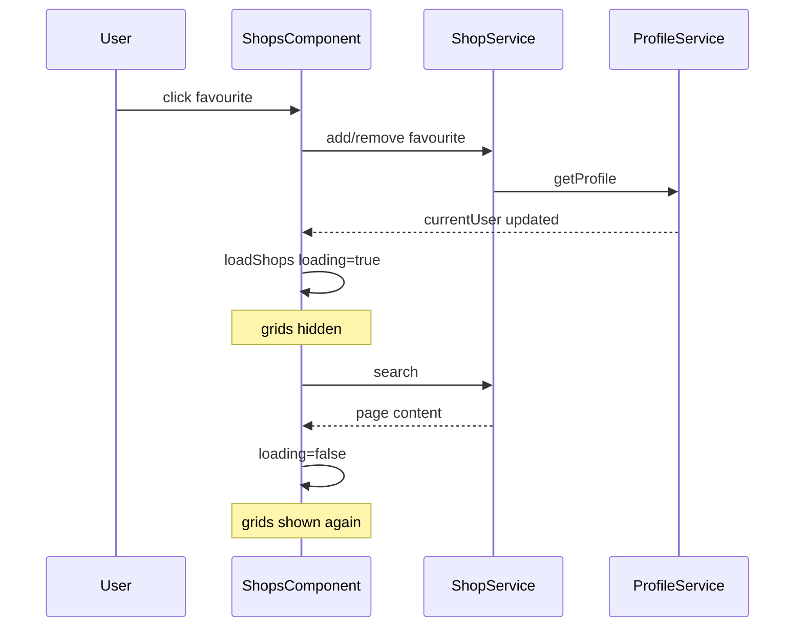

# Seamless favourite toggle on Shops page

## Root cause

In [`shops.component.ts`](coffeeshop-frontend/src/app/features/shops/shops.component.ts), a successful favourite toggle calls `loadShops()`, which always does `loading.set(true)`:

```429:431:coffeeshop-frontend/src/app/features/shops/shops.component.ts
  loadShops(): void {
    this.loading.set(true);
```

The template gates **both** "Your communities" and "All shops" behind `@if (loading())`, so the entire grid is replaced by "Loading shops..." until the search HTTP call finishes:

```86:90:coffeeshop-frontend/src/app/features/shops/shops.component.ts
      @if (loading()) {
        <div class="loading">Loading shops...</div>
      } @else if (totalElements() === 0) {
```

`ShopService.addFavourite` / `removeFavourite` already refresh the profile via `getProfile()` before the component’s `subscribe` runs ([`shop.service.ts`](coffeeshop-frontend/src/app/services/shop.service.ts)), so section split (`favouriteShopsList` / `otherShopsList`) is already correct without a reload. The flash is almost entirely from this global loading flag, not a route remount.



## Approach (matches your preference: silent background refresh)

### 1. Add silent refresh to `loadShops`

In [`shops.component.ts`](coffeeshop-frontend/src/app/features/shops/shops.component.ts):

- Change signature to `loadShops(options?: { silent?: boolean })`.
- Only call `this.loading.set(true)` when `!options?.silent`.
- On error during silent refresh: leave existing `shops` / pagination as-is; only clear `loading` if it was set (initial/search/page changes still use full loading).

Initial load (`ngOnInit`), search debounce, pagination, and page-size changes keep the current full-loading behavior.

### 2. Use silent refresh after favourite toggle

In `toggleFavourite` success handler:

- Replace `this.loadShops()` with `this.loadShops({ silent: true })`.
- Keep `togglingFavouriteId` clear on success/error (optional small polish: disable the heart button while `togglingFavouriteId() === shop.id`, matching [`shop-details.component.ts`](coffeeshop-frontend/src/app/features/shop-details/shop-details.component.ts)).

After the mutation, profile already has updated `favouriteShops`; the silent search refetch applies backend favourite-first ordering ([`ShopSpecifications.java`](coffeeshop/src/main/java/com/coffeeshop/coffeeshop/repository/ShopSpecifications.java)) without hiding the UI.

### 3. No template change required

`loading()` stays false during silent refresh, so sections remain visible. When `shops.set(page.content)` runs, `@for (...; track shop.id)` should reorder/move cards in place rather than unmounting the whole block.

Pagination footer already uses `@if (!loading())` — it stays visible during silent refresh (desired).

### 4. Manual verification

1. Open `/shops` with shops in both "Your communities" and "All shops".
2. Favourite a shop from "All shops" — grids must not disappear; card should move to "Your communities" (profile-driven), then order may adjust when silent search completes.
3. Unfavourite — same: no flash, card returns to "All shops", order updates quietly.
4. Confirm initial page load, search, and pagination still show "Loading shops..." as today.
5. Throttle network (DevTools) and confirm silent refresh does not blank the list on slow 3G.

## Out of scope (unless you want follow-up)

- FLIP/CSS animations when a card moves between sections (separate `@for` blocks still destroy/recreate the card DOM; usually subtle compared to the full loading flash).
- Request deduplication if the user spams favourite clicks (existing `togglingFavouriteId` guard is enough for normal use).

## Files to change

| File | Change |
|------|--------|
| [`coffeeshop-frontend/src/app/features/shops/shops.component.ts`](coffeeshop-frontend/src/app/features/shops/shops.component.ts) | `loadShops({ silent })`, `toggleFavourite` → silent refresh, optional heart `[disabled]` while toggling |

No backend or `ShopService` changes required.
