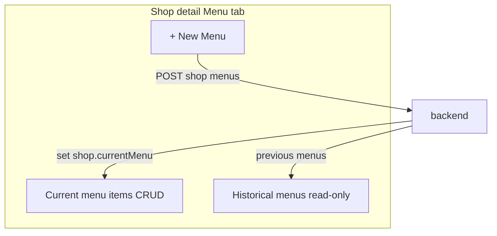

# Shop-scoped multi-menu with current/history

## Current state

| Area | Today |
|------|--------|
| DB / JPA | [`Shop`](coffeeshop/src/main/java/com/coffeeshop/coffeeshop/model/Shop.java) `@OneToOne` `menu` via unique `shop.menu_id`; [`Menu`](coffeeshop/src/main/java/com/coffeeshop/coffeeshop/model/Menu.java) has only `id` + `items` |
| Menu API | [`MenuServiceImpl`](coffeeshop/src/main/java/com/coffeeshop/coffeeshop/service/impl/MenuServiceImpl.java) — no ownership; `POST /api/v1/menu` creates orphan menus |
| Menu items | [`MenuItemServiceImpl`](coffeeshop/src/main/java/com/coffeeshop/coffeeshop/service/impl/MenuItemServiceImpl.java) — `assertOwned` via `shopRepository.findByMenu_Id` (works only while 1:1) |
| Frontend | Global [`/menu`](coffeeshop-frontend/src/app/app.routes.ts) in [`layout.component.ts`](coffeeshop-frontend/src/app/shared/layout/layout.component.ts); shop [`Menu` tab](coffeeshop-frontend/src/app/features/shop-details/shop-details.component.ts) assumes single `shop.menu` |

**Interpretation of “current”:** When the owner creates a new menu, it becomes **current** automatically (latest wins). Older menus remain **read-only history** in the shop Menu tab. No manual “set as current” picker in v1.



---

## Backend (java-agent)

### 1. Schema and entities

**`Menu`** — add ownership and ordering:

- `@ManyToOne` → `Shop shop` (`shop_id` FK, not null after create)
- `Instant createdAt` (`@CreationTimestamp` or set in service)
- Optional `String label` (e.g. `"Menu – May 2026"`) for history list; default generated if omitted

**`Shop`** — replace 1:1 menu link:

- Remove `@OneToOne Menu menu` / `shop.menu_id`
- Add `@ManyToOne @JoinColumn(name = "current_menu_id") Menu currentMenu` (nullable until first menu)
- Add `@OneToMany(mappedBy = "shop") List<Menu> menus` (inverse; lazy OK)

**Migration note:** Project uses Hibernate `ddl-auto: update`. Existing rows: for each shop with `menu_id`, backfill `menu.shop_id = shop.id` and `shop.current_menu_id = menu.id` (one-time data fix in service `@PostConstruct` or a small migration script if you prefer explicit SQL later).

### 2. Repository

[`MenuRepository`](coffeeshop/src/main/java/com/coffeeshop/coffeeshop/repository/MenuRepository.java):

- `List<Menu> findByShop_IdOrderByCreatedAtDesc(UUID shopId)`
- `Optional<Menu> findByIdAndShop_Id(UUID menuId, UUID shopId)`

Update [`ShopRepository`](coffeeshop/src/main/java/com/coffeeshop/coffeeshop/repository/ShopRepository.java): replace `findByMenu_Id` usage with `menu.getShop()` in services.

### 3. Shop-scoped menu API (preferred shape)

Add nested endpoints on shop (keeps menu creation tied to a shop in one call):

| Method | Path | Behavior |
|--------|------|----------|
| `POST` | `/api/v1/shop/{shopId}/menus` | Create menu for shop, set as `currentMenu`, demote previous (no delete) |
| `GET` | `/api/v1/shop/{shopId}/menus` | List menus for shop (newest first), each DTO includes `current: boolean`, `createdAt`, `label`, `items` |

Implement in [`ShopController`](coffeeshop/src/main/java/com/coffeeshop/coffeeshop/controller/ShopController.java) delegating to new `ShopMenuService` or extend [`MenuService`](coffeeshop/src/main/java/com/coffeeshop/coffeeshop/service/MenuService.java).

**Ownership on mutate** (mirror [`EventServiceImpl`](coffeeshop/src/main/java/com/coffeeshop/coffeeshop/service/impl/EventServiceImpl.java)):

```java
shopOwnershipService.assertShopOwnerOrAdmin(currentUser);
shopOwnershipService.assertOwned(shop, currentUser);
```

**`POST /api/v1/menu` (global):** Remove from public use — return **400/410** with message to use shop-scoped endpoint, or delete controller methods after FE migration.

**`ShopUpdateRequest.menuId`:** Remove or reject in [`ShopServiceImpl`](coffeeshop/src/main/java/com/coffeeshop/coffeeshop/service/impl/ShopServiceImpl.java) to prevent linking orphan menus.

### 4. Menu item rules

In [`MenuItemServiceImpl`](coffeeshop/src/main/java/com/coffeeshop/coffeeshop/service/impl/MenuItemServiceImpl.java):

- Resolve shop via `menu.getShop()` (not `findByMenu_Id`)
- On create/update/delete: require `menu.getId().equals(shop.getCurrentMenu().getId())` → **403** if targeting a historical menu
- Keep existing `assertOwned(shop, currentUser)`; add `assertShopOwnerOrAdmin` for consistency with events

### 5. DTOs and mapper

[`ShopResponseDto`](coffeeshop/src/main/java/com/coffeeshop/coffeeshop/model/dto/response/ShopResponseDto.java):

- `currentMenu: MenuResponseDto | null`
- `menuHistory: MenuSummaryDto[]` (id, label, createdAt, items) **or** single `menus[]` with `current` flag

[`MenuResponseDto`](coffeeshop/src/main/java/com/coffeeshop/coffeeshop/model/dto/response/MenuResponseDto.java): add `shopId`, `createdAt`, `label`, `current`.

[`ShopMapper`](coffeeshop/src/main/java/com/coffeeshop/coffeeshop/mapper/ShopMapper.java): map `currentMenu` + history from `shop.getMenus()` / `currentMenu`.

[`MenuCreateRequest`](coffeeshop/src/main/java/com/coffeeshop/coffeeshop/model/dto/request/MenuCreateRequest.java): optional `label`.

### 6. Tests

Extend [`ShopOwnershipIntegrationTest`](coffeeshop/src/test/java/com/coffeeshop/coffeeshop/ShopOwnershipIntegrationTest.java) (or add `MenuOwnershipIntegrationTest`):

| Case | Expect |
|------|--------|
| Owner `POST .../shop/{id}/menus` | 201; shop `currentMenu` updated |
| Second menu create | New menu current; first in history |
| Other owner / CUSTOMER create menu | 403 |
| `POST /menu-item` on current menu, own shop | 201 |
| `POST /menu-item` on historical menu id | 403 |
| Existing `createMenuItem_onOtherOwnersMenu_returnsForbidden` | Still passes |

---

## Frontend (frontend-agent)

### 1. Remove global Menu from navigation

- Delete nav item in [`layout.component.ts`](coffeeshop-frontend/src/app/shared/layout/layout.component.ts) (`/menu` entry)
- Remove route from [`app.routes.ts`](coffeeshop-frontend/src/app/app.routes.ts)
- Remove or leave unused [`menu.component.ts`](coffeeshop-frontend/src/app/features/menu/menu.component.ts) (delete preferred)

Dashboard [`dashboard.component.ts`](coffeeshop-frontend/src/app/features/dashboard/dashboard.component.ts) can keep counting via `GET /api/v1/menu-item` (unchanged).

### 2. Models and service

[`shop.model.ts`](coffeeshop-frontend/src/app/models/shop.model.ts): replace `menu` with `currentMenu` + `menuHistory` (or `menus[]` with `current`).

[`menu.service.ts`](coffeeshop-frontend/src/app/services/menu.service.ts):

```ts
createForShop(shopId: string, body?: { label?: string }): Observable<MenuResponseDto>
getMenusForShop(shopId: string): Observable<MenuResponseDto[]>
```

Remove global `create()` / `getAll()` usage.

### 3. Shop detail Menu tab ([`shop-details.component.ts`](coffeeshop-frontend/src/app/features/shop-details/shop-details.component.ts))

**Current menu block** (owner only, `canManageShop()`):

- If no `currentMenu`: empty state + **"+ New Menu"**
- If `currentMenu`: show items table + **"+ Add Item"** (use `currentMenu.id` as `menuId`)
- **"+ New Menu"** always available for owner → confirm dialog (“Creates a new menu; previous becomes history”) → `MenuService.createForShop(shopId)` → reload shop

**History block** (all users can view):

- Collapsible sections per past menu: label + date + read-only item table
- No edit/delete on historical items

**Gates:** Reuse existing `canManageShop()` (`createdBy` or admin). Optionally add `canCreateMenu()` = `SHOP_OWNER || admin` for the New Menu button only (matches events pattern); backend still enforces ownership.

**Fix silent failure:** Replace `if (!shop?.menu) return` with `if (!shop?.currentMenu) return` and surface error toast if user tries to add item without a menu.

### 4. No left-panel / global menu

Menu management exists only at: **Shops → shop card → Menu tab**.

---

## API flow (happy path)

```mermaid
sequenceDiagram
  participant Owner
  participant FE as ShopDetails
  participant API as Backend
  Owner->>FE: Open shop Menu tab
  FE->>API: GET /shop/{id}
  API-->>FE: currentMenu null, menuHistory []
  Owner->>FE: + New Menu
  FE->>API: POST /shop/{id}/menus
  API-->>FE: new currentMenu
  Owner->>FE: + Add Item
  FE->>API: POST /menu-item menuId=current
  Owner->>FE: + New Menu again
  FE->>API: POST /shop/{id}/menus
  Note over API: Promotes new menu; old in history
```

---

## Files to touch (summary)

| Backend | Frontend |
|---------|----------|
| `Menu.java`, `Shop.java` | `layout.component.ts`, `app.routes.ts` |
| `MenuRepository`, `ShopRepository` | `shop.model.ts`, `menu.model.ts` |
| `ShopMenuService` / `MenuServiceImpl`, `ShopController` | `menu.service.ts`, `shop-details.component.ts` |
| `MenuItemServiceImpl`, `ShopServiceImpl`, `ShopMapper` | Remove `menu.component.ts` |
| DTOs + `MenuCreateRequest` | |
| `ShopOwnershipIntegrationTest` (+ menu cases) | |

---

## Out of scope (v1)

- Manual “set as current” without creating a new menu
- Copying items from previous menu into a new menu
- Deep link `/shops/:id/menu` (tabs stay in-component)
- Flyway migrations (ddl-auto only unless you ask for explicit SQL)
