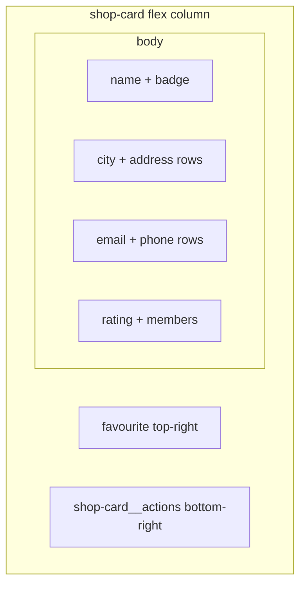

# Shop cards: fit all list information

## Problem

The compact redesign in [`shops.component.ts`](coffeeshop-frontend/src/app/features/shops/shops.component.ts) shows only **name**, **city · address**, and optional **rating / members**. **Email** and **phone** were removed, and `minmax(200px, 1fr)` plus `white-space: nowrap` on meta lines causes overflow on longer values.

List-relevant fields from [`ShopResponseDto`](coffeeshop-frontend/src/app/models/shop.model.ts) to surface on `/shops` (not menus, events, reviews arrays, etc.):

| Field | Show on card |
|-------|----------------|
| `name` | Yes (+ Joined badge) |
| `city`, `address` | Yes (readable, not one truncated blob) |
| `email`, `phoneNumber` | Yes (restore) |
| `reviewCount`, `averageRating` | Yes when `reviewCount > 0` |
| `memberCount` | Yes when `> 0` |

Pagination footer and `shop-card__actions` (Edit/Delete bottom-right) stay as implemented.

---

## Target card structure



**Template** (`#shopCard` in [`shops.component.ts`](coffeeshop-frontend/src/app/features/shops/shops.component.ts)):

```html
<div class="shop-card__body">
  <h3 class="shop-card__title">...</h3>
  <div class="shop-card__details">
    <p class="shop-card__row"><span class="shop-card__label">City</span> {{ shop.city }}</p>
    <p class="shop-card__row"><span class="shop-card__label">Address</span> {{ shop.address }}</p>
    <p class="shop-card__row"><span class="shop-card__label">Email</span> {{ shop.email || '—' }}</p>
    <p class="shop-card__row"><span class="shop-card__label">Phone</span> {{ shop.phoneNumber || '—' }}</p>
    @if (hasSecondaryMeta(shop)) {
      <p class="shop-card__row shop-card__row--stats">...</p>
    }
  </div>
</div>
```

Labels keep rows scannable in narrow cards; use short labels or icons (optional) — prefer **muted inline labels** (`City`, `Email`) to avoid a table-heavy look.

---

## CSS changes (component `styles` only)

| Rule | Change |
|------|--------|
| `.shop-card-grid` | `minmax(240px, 1fr)` (was 200px) — room for email/phone |
| `.shop-card` | Remove fixed `min-height: 7.5rem`; let height follow content |
| `.shop-card__title` | `-webkit-line-clamp: 2` for long names |
| `.shop-card__details` | `display: flex; flex-direction: column; gap: 0.2rem` |
| `.shop-card__row` | `font-size: 0.8125rem`; allow **2-line clamp** on value text (`line-clamp: 2`; `word-break: break-word` for email) |
| `.shop-card__label` | `color: #888`; `margin-right: 0.35rem` (inline, not block) |
| `.shop-card__row--stats` | Flex row for stars + member text (reuse existing rating styles) |

Drop global single-line `nowrap` on all meta lines — only apply ellipsis/clamp where needed (e.g. address 2 lines max).

---

## Logic

- Keep `hasSecondaryMeta(shop)` for the stats row.
- No new API or mapper changes; `ShopService.search` already returns full `ShopResponseDto`.
- No changes to pagination footer layout (`calc(100vh - 56px)` flex page).

---

## Verification

- `/shops`: each card shows city, address, email, phone, and stats when present without overlapping the favourite button or action buttons.
- Long email/address wraps or clamps inside the card, not outside the grid cell.
- Owner cards: Edit/Delete remain bottom-right; card click still navigates to detail.
- `npm run build` in `coffeeshop-frontend`
