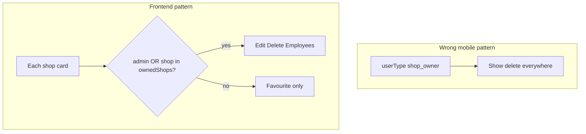

# Fix shop delete visibility for customers

## Problem

Customers should not see or use **Delete** (or Edit/Employees) on the Shops tab. The web app gates these per shop; mobile does not.

## Frontend reference ([`shops.component.ts`](coffeeshop-frontend/src/app/features/shops/shops.component.ts))

| Action | Customer | Shop owner (owns this shop) | Admin |
|--------|----------|----------------------------|-------|
| Search / browse shops | Yes | Yes | Yes |
| Favourite (join) heart on card | Yes, **only if NOT manager** | No (hidden when `canManage(shop)`) | No on shops they manage |
| **+ New Shop** | No | Yes (`userType === SHOP_OWNER`) | Yes |
| **Edit / Employees / Delete** on card | **No** | **Yes** (only owned shops) | **Yes** (all shops) |
| Tap card → shop detail | Yes | Yes | Yes |

**Ownership check (per shop, not global user type):**

```544:549:coffeeshop-frontend/src/app/features/shops/shops.component.ts
  canManage(shop: ShopResponseDto): boolean {
    const profile = this.profileService.currentUser();
    if (!profile) return false;
    return this.authService.isAdmin()
      || shop.createdBy?.id === profile.id;
  }
```

Delete is only rendered inside `@if (canManage(shop))` (lines 215-220). Backend [`DELETE /shop/{id}`](coffeeshop-go/internal/handler/shop.go) also calls `RequireShopOwnerOrAdmin` — defense in depth.

## Current mobile gaps

1. **[`shop_list_screen.dart`](coffeeshop-mobile/lib/features/shops/shop_list_screen.dart)** — No Edit/Delete/Employees on cards today, but **favourite heart is shown for every shop** (should be hidden when user manages that shop). If delete was added locally or is planned, it must use per-shop gating, not `userType == 'shop_owner'`.

2. **[`ShopResponseDto`](coffeeshop-mobile/lib/data/models/shop_response_dto.dart)** — Drops `createdBy` from API JSON (Go sends it on list responses via `fillShopOwners`). Mobile cannot mirror frontend’s `createdBy.id` check without parsing it or using `GET /shop/mine`.

3. **[`shop_manage_permission.dart`](coffeeshop-mobile/lib/features/shop_details/shop_manage_permission.dart)** — Already has correct per-shop logic via `canManageShopProvider` / `ownedShopsProvider` + admin. **Reuse this on the shop list**, not global `userType`.

4. **Related bug pattern** — [`event_detail_screen.dart`](coffeeshop-mobile/lib/features/events/event_detail_screen.dart) shows event delete when `userType == 'shop_owner' || 'admin'` globally, not per event’s shop. Same class of mistake to avoid on shops.



## Implementation plan

### 1. Shared list-level ownership helper

Add to [`shop_manage_permission.dart`](coffeeshop-mobile/lib/features/shop_details/shop_manage_permission.dart):

```dart
bool canManageShopInList(WidgetRef ref, String shopId) {
  final user = ref.read(authNotifierProvider).user;
  if (user == null) return false;
  if (user.userType == 'admin') return true;
  final owned = ref.read(ownedShopsProvider).valueOrNull ?? [];
  return owned.any((s) => s.id == shopId);
}
```

Watch `ownedShopsProvider` once in `ShopListScreen` (load on mount). Optionally add `createdBy` to `ShopResponseDto` as `Map<String, dynamic>?` for parity/debug (run `build_runner`).

### 2. Extend `ShopCard` with gated actions

Update [`shop_card.dart`](coffeeshop-mobile/lib/shared/widgets/shop_card.dart):

- `showFavourite` — true only when `!canManage` (match frontend line 150)
- Optional `onEdit`, `onDelete`, `onEmployees` callbacks — render action row only when `canManage`
- Wire favourite to actually call `addFavourite` / `removeFavourite` (currently [`shop_list_screen.dart`](coffeeshop-mobile/lib/features/shops/shop_list_screen.dart) line 146 only invalidates provider without API call)

### 3. Wire shop list screen

Update [`shop_list_screen.dart`](coffeeshop-mobile/lib/features/shops/shop_list_screen.dart):

| User | Per shop card |
|------|----------------|
| Customer | Tap → detail, favourite toggle only |
| Owner (this shop) or admin | Edit (navigate or inline), Employees → `/shops/:id`, Delete with [`ConfirmDialog`](coffeeshop-mobile/lib/shared/widgets/confirm_dialog.dart) → `shopApiService.delete` |
| Owner (other’s shop) | Same as customer |

- Keep FAB create gated by `canCreateShop` (owner/admin) — already correct
- After delete success: invalidate `shopListProvider` + `ownedShopsProvider`

### 4. Fix event delete gating (same permission model)

Update [`event_detail_screen.dart`](coffeeshop-mobile/lib/features/events/event_detail_screen.dart): replace global `userType` check with `canManageShopContentProvider(event.shopId)` or `canManageShopProvider` for delete-only (owners delete events at their shop; employees use content manage).

### 5. Optional: Users tab delete (same audit)

[`user_list_screen.dart`](coffeeshop-mobile/lib/features/users/user_list_screen.dart) shows Delete for all users; frontend restricts to **admin only** ([`users.component.ts`](coffeeshop-frontend/src/app/features/users/users.component.ts) line 94). Gate `PopupMenuButton` with `userType == 'admin'`.

## Files to change

| File | Change |
|------|--------|
| [`shop_manage_permission.dart`](coffeeshop-mobile/lib/features/shop_details/shop_manage_permission.dart) | `canManageShopInList` helper |
| [`shop_response_dto.dart`](coffeeshop-mobile/lib/data/models/shop_response_dto.dart) | Optional `createdBy` field + regen |
| [`shop_card.dart`](coffeeshop-mobile/lib/shared/widgets/shop_card.dart) | Gated favourite + owner action buttons |
| [`shop_list_screen.dart`](coffeeshop-mobile/lib/features/shops/shop_list_screen.dart) | Per-shop permissions, delete flow, fix favourite API |
| [`event_detail_screen.dart`](coffeeshop-mobile/lib/features/events/event_detail_screen.dart) | Per-shop delete gate |
| [`user_list_screen.dart`](coffeeshop-mobile/lib/features/users/user_list_screen.dart) | Admin-only delete (optional) |
| [`shop_card_test.dart`](coffeeshop-mobile/test/shared/widgets/shop_card_test.dart) | Cover action visibility |

## Test plan

1. **Customer** — Shops tab: no Edit/Delete/Employees on any card; favourite works; FAB hidden.
2. **Shop owner** — Own shop: management actions visible, no favourite heart; other shops: customer view only.
3. **Admin** — Management actions on all shops.
4. **Customer attempts DELETE via API** — Still 403 from backend (unchanged).
5. `dart analyze` + update widget tests.
