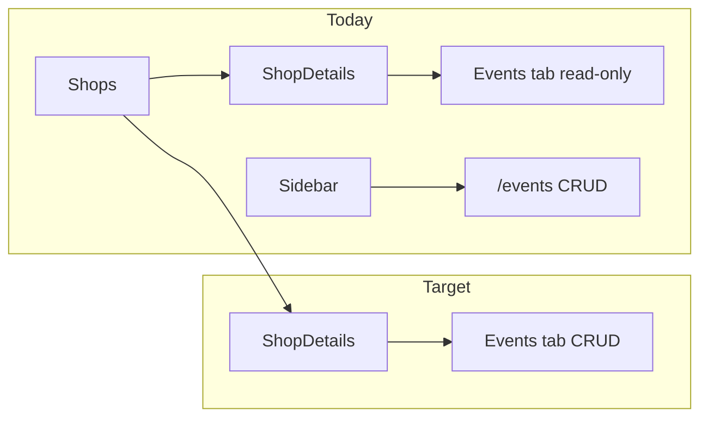

# Create events from shop Events tab

## Current behavior

- **Global Events** ([`coffeeshop-frontend/src/app/features/events/events.component.ts`](coffeeshop-frontend/src/app/features/events/events.component.ts)): shop owners/admins get `+ Add Event`, inline form (name, date/time, shop select, description), and row-level Edit/Delete via `EventService`.
- **Shop details → Events** ([`coffeeshop-frontend/src/app/features/shop-details/shop-details.component.ts`](coffeeshop-frontend/src/app/features/shop-details/shop-details.component.ts) ~533–591): lists `shop()!.events` from the shop DTO; **customers** get Reserve; **owners** see a read-only table and empty state with no create action.



No backend work is required: [`EventService`](coffeeshop-frontend/src/app/services/event.service.ts) already exposes `POST /api/v1/event`, `PUT`, `DELETE`, and [`loadShop()`](coffeeshop-frontend/src/app/features/shop-details/shop-details.component.ts) already refreshes nested `shop.events` after other mutations (menu, tables).

## Implementation (single file focus)

All changes in [`shop-details.component.ts`](coffeeshop-frontend/src/app/features/shop-details/shop-details.component.ts).

### 1. Wire dependencies and form state

- Inject `EventService`.
- Import `DateTimePickerComponent` and add it to `imports` (same as global Events page).
- Add signals mirroring the Tables tab:
  - `showEventForm`
  - `editingEventId`
- Add `eventForm` with `eventName`, `eventDate`, `description` (all required except description optional like global page).
- **Do not** add a shop dropdown — `shopId` is always `this.shopId` on create/update (owner is already on that shop’s page).

Reuse validation from the global Events page:

- `futureDateValidator()` on `eventDate` for **create** only.
- On **edit**, only `Validators.required` (same as [`applyDateValidatorsForMode`](coffeeshop-frontend/src/app/features/events/events.component.ts)).
- `todayIso` as `[minDate]` on the picker when not editing.
- Copy or extract the small `normalizeDateTimeLocal()` helper used when patching the form for edit.

Optional small refactor (recommended if touching both files): move `futureDateValidator` + `normalizeDateTimeLocal` to e.g. [`coffeeshop-frontend/src/app/utils/event-form.utils.ts`](coffeeshop-frontend/src/app/utils/event-form.utils.ts) and import from both `events.component.ts` and `shop-details.component.ts` to avoid duplication.

### 2. Template — Events tab (owner UX aligned with Tables tab)

Replace the Events tab block (~533–591) with:

| Owner (`canManageShop()`) | Customer (`isCustomer()`) |
|---------------------------|---------------------------|
| Toggle: `+ Add Event` / inline form / Cancel | Unchanged Reserve flow |
| Table Actions: Edit, Delete | Reserve button |
| Empty state: prompt to add first event | “No events.” |

Structure (parallel to Tables tab ~319–377):

```html
@if (canManageShop()) {
  @if (showEventForm()) {
    <!-- form: eventName, app-date-time-picker, description -->
  } @else {
    <button class="btn btn-primary mb-2" (click)="openAddEventForm()">+ Add Event</button>
  }
}
@if (shop()!.events.length === 0) { empty state }
@else { table with Actions column when isCustomer() || canManageShop() }
```

- Show `pastDate` error under the date picker when touched (same copy as global Events).
- Keep existing customer reservation panel (`selectedEventForRequest`, `eventRequestForm`) unchanged below the table.

### 3. Component methods

| Method | Behavior |
|--------|----------|
| `openAddEventForm()` | Clear `editingEventId`, reset form, apply create validators, `showEventForm.set(true)` |
| `onEditEvent(e)` | Set `editingEventId`, patch form with `normalizeDateTimeLocal(e.eventDate)`, edit validators, show form |
| `onEventSubmit()` | If invalid / past date on create, return; `create` or `update` with `{ ...form, shopId: this.shopId }`; on success: hide form, `loadShop()` |
| `onDeleteEvent(e)` | `DialogService.confirm` then `eventService.delete`; `loadShop()` |
| `cancelEventForm()` | Reset signals/form/validators |

### 4. Tab lifecycle

In `onTabChange`, when leaving `events`, also reset `showEventForm`, `editingEventId`, and cancel validators (in addition to existing `selectedEventForRequest` clear).

## Verification

Manual test as shop owner:

1. Shops → your shop → **Events** tab.
2. **+ Add Event** → fill name, future date/time, description → Create → event appears in table after reload.
3. Edit and Delete on a row work; list stays in sync with shop DTO.
4. Customer view on same tab: still only Reserve, no owner form.
5. Global `/events` page still works (regression if utils were extracted).

No new routes; owners who prefer the global list can still use sidebar **Events**.
