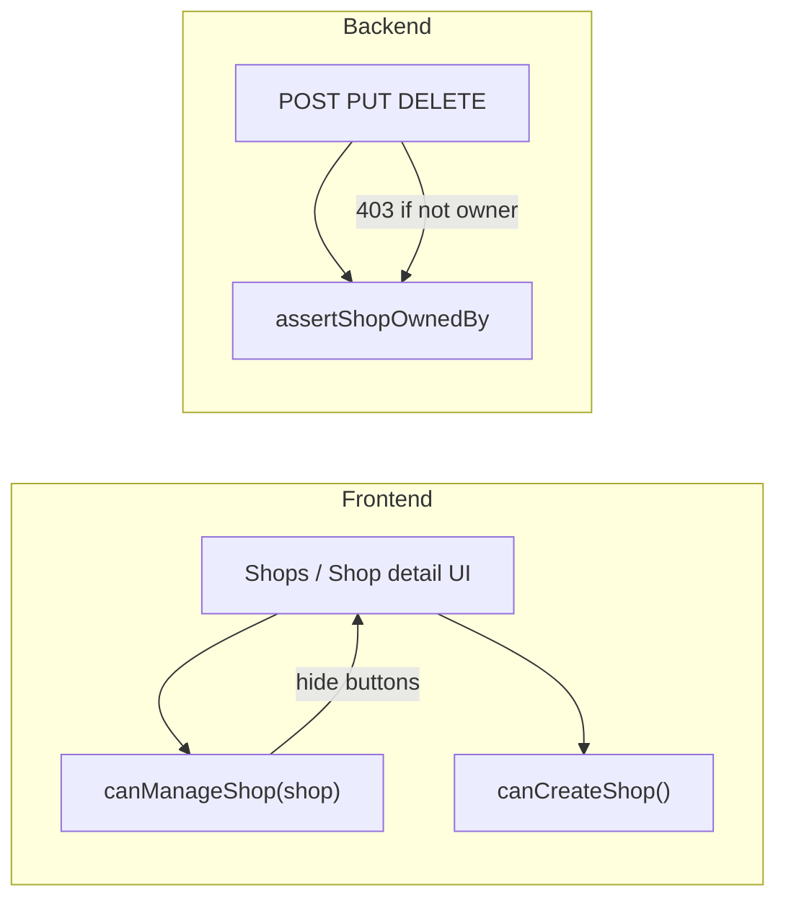

# Shop owner authorization (frontend + backend)

## Ownership model

A user is the **owner of a shop** when `shop.createdBy.id` equals the authenticated profile id (`UserResponseDto.id` / `User.id`). This matches [`EventServiceImpl.assertShopOwnedBy`](coffeeshop/src/main/java/com/coffeeshop/coffeeshop/service/impl/EventServiceImpl.java) and the existing reservation gate in [`shop-details.component.ts`](coffeeshop-frontend/src/app/features/shop-details/shop-details.component.ts).

**Admin bypass:** `authService.isAdmin()` on frontend; `UserType.ADMIN` or `ROLE_ADMIN` on backend (same as events).

**Create shop (list page):** Per your choice — show `+ New Shop` only when `profile.userType === 'SHOP_OWNER'` or admin (not for every authenticated user).



---

## Current gaps

| Area | Issue |
|------|--------|
| [`shops.component.ts`](coffeeshop-frontend/src/app/features/shops/shops.component.ts) | `canManage` treats **any** `SHOP_OWNER` user as manager on **all** shops (line 116). `+ New Shop` is always visible. |
| [`shop-details.component.ts`](coffeeshop-frontend/src/app/features/shop-details/shop-details.component.ts) | Menu/table add/edit/delete buttons have **no** owner gate; reservations already use `canManageReservations` (same logic needed). |
| [`ShopServiceImpl`](coffeeshop/src/main/java/com/coffeeshop/coffeeshop/service/impl/ShopServiceImpl.java) | `update` / `delete` have **no** ownership checks; `createdBy` can be changed by anyone authenticated. |
| [`MenuItemServiceImpl`](coffeeshop/src/main/java/com/coffeeshop/coffeeshop/service/impl/MenuItemServiceImpl.java), [`TableServiceImpl`](coffeeshop/src/main/java/com/coffeeshop/coffeeshop/service/impl/TableServiceImpl.java) | No ownership checks on mutations. |

Read paths (`GET /shop`, `GET /shop/{id}`) stay public — only mutating actions are restricted.

---

## Frontend changes (`coffeeshop-frontend`)

### 1. Shops list — [`shops.component.ts`](coffeeshop-frontend/src/app/features/shops/shops.component.ts)

- **Fix `canManage(shop)`** — remove `profile.userType === 'SHOP_OWNER'`; use only:
  - `authService.isAdmin()`, or
  - `shop.createdBy?.id === profile.id`
- **Add `canCreateShop()`** — `isAdmin() || profile.userType === 'SHOP_OWNER'`
- Wrap header `+ New Shop` button: `@if (canCreateShop())`
- Wrap create/edit form block: only when `showForm()` and (`canCreateShop()` for create, or `canManage(shop)` when editing)

Aligns with the events pattern in [`events.component.ts`](coffeeshop-frontend/src/app/features/events/events.component.ts) (`canManageEvent` uses owned shop id, not user type alone).

### 2. Shop detail — [`shop-details.component.ts`](coffeeshop-frontend/src/app/features/shop-details/shop-details.component.ts)

- Add **`canManageShop`** computed (same logic as existing `canManageReservations`):
  ```ts
  readonly canManageShop = computed(() => {
    const shop = this.shop();
    const profile = this.profileService.currentUser();
    if (!shop || !profile) return false;
    if (this.authService.isAdmin()) return true;
    return shop.createdBy?.id === profile.id;
  });
  ```
- Replace `canManageReservations` with `canManageShop` (or alias) to avoid duplication.
- Wrap **menu** tab: `+ Add Item`, form, Edit/Delete columns — `@if (canManageShop())`
- Wrap **tables** tab: `+ Add Table`, form, Edit/Delete — `@if (canManageShop())`
- **Reservations** tab: already gated; switch to `canManageShop()` for consistency.

No API changes required on the frontend; `shop.createdBy` is already on `ShopResponseDto`.

---

## Backend changes (`coffeeshop`)

### 3. Shared ownership helper

Extract duplicated logic from `EventServiceImpl` into a small reusable component, e.g. [`ShopOwnershipService`](coffeeshop/src/main/java/com/coffeeshop/coffeeshop/auth/ShopOwnershipService.java):

- `void assertOwned(Shop shop, User currentUser)` → 403 `"You do not own this shop"` unless admin
- `boolean isAdmin(User user)` — same rules as `EventServiceImpl.isAdmin`
- Refactor `EventServiceImpl` to delegate to this service (optional but keeps one source of truth)

### 4. Shop mutations — [`ShopServiceImpl`](coffeeshop/src/main/java/com/coffeeshop/coffeeshop/service/impl/ShopServiceImpl.java)

| Method | Change |
|--------|--------|
| `create` | Optionally assert `owner.getUserType() == SHOP_OWNER` or admin (matches frontend create gate). Keep existing `createdBy` from JWT. |
| `update` | `requireCurrentUser()` → `assertOwned(existing, user)` before applying fields; **ignore `createdBy` changes** unless admin |
| `delete` | `getById` → `assertOwned(shop, user)` → delete |

### 5. Menu item mutations — [`MenuItemServiceImpl`](coffeeshop/src/main/java/com/coffeeshop/coffeeshop/service/impl/MenuItemServiceImpl.java)

- Inject `ShopRepository` + `ShopOwnershipService` (+ `CurrentUserService`)
- Add `ShopRepository.findByMenu_Id(UUID menuId)` (or resolve shop from menu on each operation)
- On **create**: resolve menu → find shop by menu id → `assertOwned`
- On **update** / **delete**: load item → menu → shop → `assertOwned`

### 6. Table mutations — [`TableServiceImpl`](coffeeshop/src/main/java/com/coffeeshop/coffeeshop/service/impl/TableServiceImpl.java)

- Inject `ShopOwnershipService` + `CurrentUserService`
- On **create** / **update** (when shop changes) / **delete**: `assertOwned(table.getShop(), currentUser)` after resolving shop

Reservation accept/deny already validated in [`ReservationRequestServiceImpl`](coffeeshop/src/main/java/com/coffeeshop/coffeeshop/service/impl/ReservationRequestServiceImpl.java) — no change.

---

## Tests (Java)

Add [`ShopOwnershipIntegrationTest`](coffeeshop/src/test/java/com/coffeeshop/coffeeshop/ShopOwnershipIntegrationTest.java) mirroring [`EventOwnershipIntegrationTest`](coffeeshop/src/test/java/com/coffeeshop/coffeeshop/EventOwnershipIntegrationTest.java):

- Owner: `PUT` / `DELETE` `/api/v1/shop/{id}` → success
- Other `SHOP_OWNER`: same endpoints → **403**
- Admin: update/delete another owner's shop → success
- Non-owner: `POST` menu-item / table for another shop's menu/shop → **403**

Reuse test helpers: `createUser`, `linkKeycloakSubject`, `createShopWithOwner`, `BearerAuth(userId)`.

---

## Out of scope (unless you want them next)

- Events page: `+ Add Event` still visible to all users (only edit/delete gated) — separate from this request
- `ContactService` — no ownership checks today
- Changing `GET /shop` to filter by owner (list remains browse-all)

---

## Verification checklist

1. Log in as **customer** → Shops list: no create/edit/delete; shop detail: menu/tables read-only; reservations read-only pending list
2. Log in as **SHOP_OWNER** who owns shop A but not B → manage only A on list and detail
3. Log in as **SHOP_OWNER** with no shops → see `+ New Shop`, create works
4. Call `PUT /api/v1/shop/{otherShopId}` with another owner's token → **403**
5. Call menu-item/table mutations on another shop → **403**
