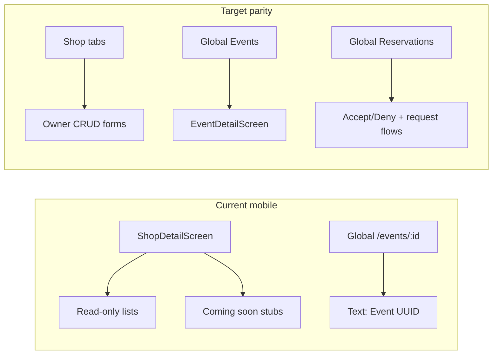
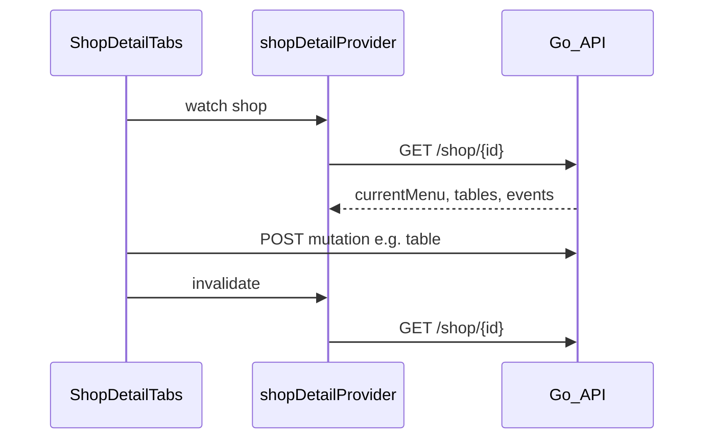

# Shop Owner Tab Parity (Flutter)

## Problem summary

The mobile app has API services for community, menu, tables, events, and reservations, but [`shop_detail_screen.dart`](coffeeshop-mobile/lib/features/shop_details/shop_detail_screen.dart) only renders read-only lists (or stubs). Compared to [`shop-details.component.ts`](coffeeshop-frontend/src/app/features/shop-details/shop-details.component.ts), owner actions are missing.



| Symptom | Root cause |
|---------|------------|
| 4 tables on new shop | `_TablesTab` calls `GET /api/v2/table` (all shops); ignores `shopId` |
| Can't create menu / posts / tables / events | No owner UI; `canManage` passed but unused |
| "Event d168cdde-..." on tap | [`app_router.dart`](coffeeshop-mobile/lib/core/routing/app_router.dart) lines 88-94 — stub route, not real detail |
| Shop Events tab empty (possible) | `_shopEventsProvider` only parses paginated `Map`; `?shopId=` returns flat `List` (unlike [`event_providers.dart`](coffeeshop-mobile/lib/features/events/event_providers.dart) which handles both) |
| Reservations coming soon | [`reservation_list_screen.dart`](coffeeshop-mobile/lib/features/reservations/reservation_list_screen.dart) and `_ReservationsTab` are hardcoded stubs |
| Menu item type shows "Other" | UI reads `item['type']`; API sends `itemType` |
| Accept reservation will fail | [`reservation_request_api_service.dart`](coffeeshop-mobile/lib/data/services/reservation_request_api_service.dart) sends `table_id`; Go expects `tableId` |

---

## Architecture approach

**Match frontend data pattern:** Menu, tables, and events on the shop page should come from `GET /api/v2/shop/{id}` nested fields (`currentMenu`, `tables`, `events`) via existing [`shopDetailProvider`](coffeeshop-mobile/lib/features/shops/shop_providers.dart). After mutations, `ref.invalidate(shopDetailProvider(shopId))`.

**Refactor for maintainability:** Split the 560-line monolith into:

```
coffeeshop-mobile/lib/features/shop_details/
  shop_detail_screen.dart          # shell + tab bar only
  shop_manage_permission.dart      # canManage helper (owner/admin + employee shops)
  tabs/
    community_tab.dart
    menu_tab.dart
    tables_tab.dart
    events_tab.dart
    reservations_tab.dart
    reviews_tab.dart               # move existing read-only tab
    employees_tab.dart             # move existing read-only tab
```

**Reuse existing patterns:**
- Forms: [`shop_create_screen.dart`](coffeeshop-mobile/lib/features/shops/shop_create_screen.dart) (`Form` + `Validators` + snackbar errors)
- Empty states: [`empty_state_view.dart`](coffeeshop-mobile/lib/shared/widgets/empty_state_view.dart) with `actionLabel` / `onAction`
- Dropdowns: [`form_select.dart`](coffeeshop-mobile/lib/shared/widgets/form_select.dart)

**Permission model:** Extend `_canManage` to match frontend `canManageShopContent()` — shop owner, admin, **or** employee of this shop (via `shopEmployeeApiService.getMyEmployeeShops()`).

---

## Phase 1 — Bug fixes (unblock correct data)

### 1.1 Tables tab — shop-scoped data
- Remove `_tablesProvider` global fetch.
- Pass `shop.tables` from `_ShopDetailContent` into `_TablesTab` (same pattern as `_MenuTab`).
- Empty state: "No tables." with "+ Add Table" for managers.

### 1.2 Events parsing
- Fix `_shopEventsProvider` to handle `List` responses (copy logic from `eventListProvider` lines 68-77), **or** prefer `shop.events` from shop detail and drop the separate provider.
- Add fallback display: `eventName.isNotEmpty ? eventName : eventId` (frontend `eventLabel()`).

### 1.3 Event detail screen (fixes UUID stub globally)
- Add [`event_detail_screen.dart`](coffeeshop-mobile/lib/features/events/event_detail_screen.dart) using existing [`eventDetailProvider`](coffeeshop-mobile/lib/features/events/event_providers.dart).
- Replace stub in [`app_router.dart`](coffeeshop-mobile/lib/core/routing/app_router.dart) `:id` route.
- Show name, date, description, shop link; owner gets edit/delete actions.

### 1.4 Menu display fix
- Read `item['itemType']` (with fallback to `item['type']`) in menu tab.

### 1.5 API fix
- Change `reservation_request_api_service.accept` body to `{'tableId': tableId}`.

---

## Phase 2 — Shop detail owner CRUD (reference: shop-details.component.ts)

### 2.1 Community tab
**Reference:** frontend lines 128-222, 1359-1467.

- When `canManage`: show announcement `TextField` + "Post" button at top.
- On submit: `communityApiService.createAnnouncement(shopId, {'body': text})`.
- Invalidate `_communityPostsProvider(shopId)`.
- Optional: delete post for owner or post author (confirm dialog).
- Keep existing post list; improve empty state with `EmptyStateView`.

### 2.2 Menu tab
**Reference:** frontend lines 224-338, 979-1051.

| State | Owner action |
|-------|-------------|
| No `currentMenu` | "+ New Menu" → `shopApiService.createMenu(shopId, {'label': optional})` → invalidate shop |
| Menu exists, no items | "+ Add Item" inline form |
| Items exist | Edit/delete per row |

**Create item fields:** name, description, price, priceCurrency (USD/EUR/GBP), itemType (FOOD/DRINK/DESSERT/OTHER), optional imageUrl.

**APIs:**
- `POST /api/v2/shop/{shopId}/menus` — create menu
- `POST /api/v2/menu-item` — `{name, description, price, priceCurrency, itemType, menuId}`
- `PUT/DELETE /api/v2/menu-item/{id}`

Use `FormSelect` for currency and itemType. Add type filter chips (All/Drink/Food/Dessert/Other) like frontend.

### 2.3 Tables tab
**Reference:** frontend lines 340-384, 1053-1096.

- "+ Add Table" inline form: number (int), capacity (int).
- Edit pre-fills form; delete with confirm.
- APIs: `POST /api/v2/table` `{number, capacity, shopId}`, `PUT/DELETE /api/v2/table/{id}`.
- After each mutation: `ref.invalidate(shopDetailProvider(shopId))`.

### 2.4 Events tab (shop detail)
**Reference:** frontend lines 495-566, 1179-1288.

- "+ Add Event" form: eventName, eventDate (use `showDatePicker` + `showTimePicker` or a simple `TextFormField` with ISO validation), description.
- Edit/delete for managers; customer reserve form deferred to reservations phase.
- APIs: `eventApiService.create/update/delete` with `shopId`.
- Invalidate shop detail after mutations.

### 2.5 Reservations tab (shop detail)
**Reference:** frontend lines 386-493, 1098-1177.

Sub-tabs: **Pending | Approved | Denied**.

| Sub-tab | Data source | Actions |
|---------|-------------|---------|
| Pending | `reservationRequestApiService.getAll(shopId:)` filtered `PENDING` | Table dropdown (`shop.tables` filtered by capacity >= partySize) + Accept / Deny |
| Approved | `reservationApiService.getAll(shopId:)` | Read-only list |
| Denied | requests filtered `DENIED` | Read-only list |

Accept flow: pick `tableId` → `accept(id, tableId:)` → invalidate providers.

---

## Phase 3 — Global Events screen

**Reference:** [`events.component.ts`](coffeeshop-frontend/src/app/features/events/events.component.ts)

### 3.1 Event create screen
- Replace `/events/new` stub with `EventCreateScreen` (shop picker for owners, name/date/description).
- FAB or app-bar action on [`event_list_screen.dart`](coffeeshop-mobile/lib/features/events/event_list_screen.dart) for owners.

### 3.2 Event list enhancements
- Owner: long-press or trailing menu for edit/delete.
- Tap navigates to real `EventDetailScreen` (Phase 1).

---

## Phase 4 — Global Reservations screen

**Reference:** [`reservations.component.ts`](coffeeshop-frontend/src/app/features/reservations/reservations.component.ts)

Restructure [`reservation_list_screen.dart`](coffeeshop-mobile/lib/features/reservations/reservation_list_screen.dart):

### Owner layout (match frontend two-level tabs)
- **My Reservations** — personal requests + confirmed reservations at other shops
- **Manage my Shops** — pending/approved/denied across owned shops (reuse shop reservations tab widgets)

### Customer layout
- **My Requests** — `reservationRequestApiService.getAll()` (no shopId)
- **My Reservations** — `reservationApiService.getAll()` filtered to current user

### Request creation
- "+ Request Reservation" form: shop picker → event picker (`GET /api/v2/event?shopId=`) → party size.
- Owner-only: "+ Request for guest" with user picker (can defer guest picker to a follow-up if user list API is heavy; minimum viable: self-request flow first).

Add [`reservation_providers.dart`](coffeeshop-mobile/lib/features/reservations/reservation_providers.dart) for shared data fetching (mirrors `event_providers.dart`).

---

## Data flow (after implementation)



Community and reservations use dedicated endpoints + their own providers, invalidated after mutation.

---

## Files to create / modify

| Action | File |
|--------|------|
| Refactor + wire | `lib/features/shop_details/` (split tabs) |
| New | `lib/features/events/event_detail_screen.dart` |
| New | `lib/features/events/event_create_screen.dart` |
| New | `lib/features/reservations/reservation_providers.dart` |
| Rewrite | `lib/features/reservations/reservation_list_screen.dart` |
| Fix | `lib/core/routing/app_router.dart` |
| Fix | `lib/data/services/reservation_request_api_service.dart` |
| Optional DTO | `lib/data/models/menu_item_response_dto.dart` (typed model vs raw Map) |

---

## Testing plan

1. **Tables:** New shop shows 0 tables; add table appears only for that shop.
2. **Community:** Owner posts announcement; appears in list with badge.
3. **Menu:** Create menu on empty shop; add/edit/delete items; `itemType` displays correctly.
4. **Events:** Shop tab lists events by name; tap opens detail (not UUID); owner can create/edit/delete.
5. **Reservations (shop):** Pending request → accept with table → moves to Approved.
6. **Global screens:** Events list + create; Reservations owner/customer tabs load real data.
7. Run `dart analyze` and targeted widget tests for permission gating and provider invalidation.

---

## Risk / scope notes

- **Large diff:** ~15-20 files. Splitting into Phase 1 (bugs) then Phase 2-4 (features) allows incremental review.
- **Employee permission:** Include employee check early so shop staff can manage content like the web app.
- **Guest reservation requests:** Frontend has guest-user picker; implement self-request first, guest flow as follow-up if time-constrained within Phase 4.
- **Reviews tab:** Out of scope (read-only is fine); same for Employees tab unless you want add/remove later.
