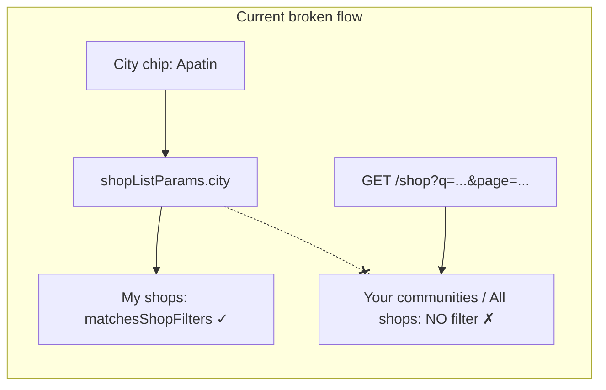
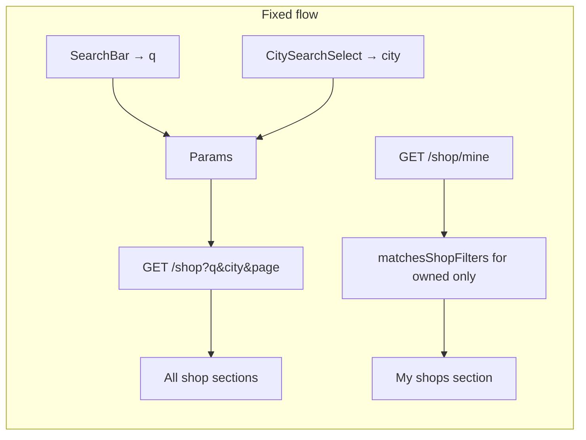

# Shop search fix and city picker redesign

## Root cause

The filter bug is **not** missing backend text search — `q` is already implemented and wired up. The problem is **city filtering**:



In [`shop_list_screen.dart`](coffeeshop-mobile/lib/features/shops/shop_list_screen.dart):
- `matchesShopFilters()` correctly checks both `query` and `city`
- It is only applied to **owned shops** (line 250), not to `otherShops` / favourites / remaining sections
- `city` is never sent to the API — [`shop_providers.dart`](coffeeshop-mobile/lib/features/shops/shop_providers.dart) only passes `q` and `page`

Backend [`paginatedSearch`](coffeeshop-go/internal/handler/shop.go) supports `q` (name/city LIKE) but has **no `city` param** for exact city filtering. Client-only city filtering would also break pagination totals.

## Backend changes

**File:** [`coffeeshop-go/internal/handler/shop.go`](coffeeshop-go/internal/handler/shop.go)

Add optional `city` query param to `paginatedSearch`:

```go
city := strings.TrimSpace(r.URL.Query().Get("city"))
if city != "" {
    query = query.Where("city = ?", city)
}
```

Apply after the existing `q` block so both filters combine with AND logic.

**Tests:** Add integration test in [`integration_test.go`](coffeeshop-go/cmd/api/integration_test.go) — create shops in two cities, call `GET /api/v2/shop?city=Apatin&page=0&size=10`, assert only Apatin shops returned and `totalElements` is correct. Also test `q` + `city` together.

## Mobile data layer

**File:** [`shop_api_service.dart`](coffeeshop-mobile/lib/data/services/shop_api_service.dart)

Add optional `city` to `getShops()` query params.

**File:** [`shop_providers.dart`](coffeeshop-mobile/lib/features/shops/shop_providers.dart)

Pass `params.city` to `apiService.getShops(...)`.

## Reusable city picker widget

Create [`coffeeshop-mobile/lib/shared/widgets/city_search_select.dart`](coffeeshop-mobile/lib/shared/widgets/city_search_select.dart) — a filter/form picker (not a free-text form validator like the web create form).

**UX (per your choice):** Tappable field styled like existing inputs (12px radius, filled, `Icons.location_city_outlined`) showing:
- `"All cities"` when no filter selected (Shops list mode)
- Selected city name when set
- Clear (×) button when a city is selected

**On tap:** `showModalBottomSheet` with:
- Drag handle + title ("Select city")
- Search `TextField` at top (debounced ~300ms, same as [`search_bar.dart`](coffeeshop-mobile/lib/shared/widgets/search_bar.dart))
- Scrollable list filtered via existing [`reference_api_service.dart`](coffeeshop-mobile/lib/data/services/reference_api_service.dart) `getCities(q: ...)` (backend already supports `q` with diacritic-normalized search)
- "All cities" row at top (only when `allowAll: true` for Shops filter)
- Selected row highlighted with `colorScheme.primaryContainer` / check icon
- `useSafeArea: true`, `isScrollControlled: true`, rounded top corners — matches dark coffee-brown theme from [`app_theme.dart`](coffeeshop-mobile/lib/core/config/theme/app_theme.dart)

**API:**

```dart
class CitySearchSelect extends StatelessWidget {
  const CitySearchSelect({
  required this.value,        // null = "All cities" in filter mode
  required this.onChanged,
  this.allowAll = false,
  this.label = 'City',
  this.hint = 'All cities',
});
```

## Shops list screen redesign

**File:** [`shop_list_screen.dart`](coffeeshop-mobile/lib/features/shops/shop_list_screen.dart)

1. **Remove** horizontal `ChoiceChip` `ListView` and `_selectedCityIndex` state
2. **Add** `CitySearchSelect` below the search bar (`allowAll: true`), wired to `shopListParamsProvider.city` with `page: 0` reset on change
3. **Fix filtering:**
   - Main list: rely on backend (`q` + `city` via provider) — remove need to filter `otherShops` client-side for city/query
   - Owned shops (`/shop/mine`): keep client-side `matchesShopFilters` since that endpoint has no search params
4. Optionally remove `matchesShopFilters` query branch for API results (backend handles it); keep city/query filter for owned shops only

Layout:

```
[ Search shops...          ]
[ 📍 All cities          ▼ ]
[ shop cards...            ]
```

## Reuse on Shop Create/Edit

**File:** [`shop_create_screen.dart`](coffeeshop-mobile/lib/features/shops/shop_create_screen.dart)

Replace `FormSelect<String>` city dropdown with `CitySearchSelect(allowAll: false, ...)`. Keep existing `_cityError` validation ("City is required") — show error if submit attempted with no selection.

## What already works (no changes needed)

| Feature | Status |
|---------|--------|
| Text search (`q`) backend | Already in Go handler |
| Text search mobile wiring | Already in `shopListProvider` |
| City list API with search | Already in `GET /reference/serbia-cities?q=` |
| Search debounce | Already in `SearchBar` widget |

## Verification

- Select **Apatin** → only Apatin shops in all sections; pagination totals match
- Select **All cities** → full list returns
- Type in shop search + pick a city → both filters apply (AND)
- Owned shop in wrong city hidden when city filter active
- Bottom sheet: type "beo" → finds Beograd; select → sheet closes, field updates
- Shop create: city picker requires valid selection before submit


