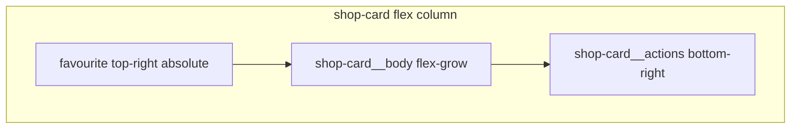

# Shops tab card redesign

## Problem

[`shops.component.ts`](coffeeshop-frontend/src/app/features/shops/shops.component.ts) renders large cards via global [`.card-grid`](coffeeshop-frontend/src/styles.css) (`minmax(280px, 1fr)`, `padding: 1.5rem`) and stacks **six** text blocks (name, members, rating, city/address, email, phone). Edit/Delete sit in a row **below** the body with `margin-top: 1rem`, not anchored to the card corner.

```62:66:coffeeshop-frontend/src/styles.css
.card-grid {
  display: grid;
  grid-template-columns: repeat(auto-fill, minmax(280px, 1fr));
  gap: 1.5rem;
}
```

Card markup is duplicated in two `@for` blocks (favourites + all shops).

---

## Target layout



- **Top-right:** favourite heart (unchanged position; [`shop-card .btn-favourite`](coffeeshop-frontend/src/styles.css) already `absolute`).
- **Body:** name + optional Joined badge, one-line location, optional rating/member line.
- **Bottom-right:** Edit + Delete only when `canManage(shop)`; `stopPropagation` on footer so card click still navigates to detail.

---

## Implementation (frontend-agent)

### 1. Wrap page and deduplicate card markup

**File:** [`shops.component.ts`](coffeeshop-frontend/src/app/features/shops/shops.component.ts)

- Add root class `shops-page` on the outer `.page` div for scoped styling.
- Replace duplicated favourite/other card HTML with a single **`ng-template #shopCard`** (or inline `@let` pattern) used by both `@for` loops — one place to maintain structure.
- Restructure each card:

```html
<div class="card clickable shop-card" (click)="goToShop(shop.id)">
  <!-- favourite button (top-right) -->
  <div class="shop-card__body">
    <h3 class="shop-card__title">...</h3>
    <p class="shop-card__meta">{{ shop.city }} · {{ shop.address }}</p>
    @if (rating or members) { <p class="shop-card__meta">...</p> }
  </div>
  @if (canManage(shop)) {
    <div class="shop-card__actions" (click)="$event.stopPropagation()">
      <button class="btn btn-sm btn-secondary" (click)="onEdit(shop)">Edit</button>
      <button class="btn btn-sm btn-danger" (click)="onDelete(shop)">Delete</button>
    </div>
  }
</div>
```

- **Drop email and phone** from the list card (still on shop detail / edit form). Keeps cards short; user asked for smaller cards.
- Remove inline `style="..."` attributes; use CSS classes below.

Import `NgTemplateOutlet` from `@angular/common` if using `ng-template` + `*ngTemplateOutlet`.

### 2. Compact shop-specific CSS

**Preferred:** component `styles` in `shops.component.ts` (isolates redesign from dashboard / shop-details `.card-grid`).

| Rule | Change |
|------|--------|
| `.shops-page .shop-card-grid` | Replace generic `.card-grid` on shops lists: `grid-template-columns: repeat(auto-fill, minmax(200px, 1fr))`, `gap: 1rem` |
| `.shops-page .shop-card` | `display: flex; flex-direction: column; padding: 1rem; min-height: 7.5rem` (tune visually) |
| `.shop-card__body` | `flex: 1; padding-right: 2rem` (room for heart icon) |
| `.shop-card__title` | Smaller title: `font-size: 1rem`, tight margins |
| `.shop-card__meta` | `font-size: 0.8125rem`, muted color, single-line `overflow: hidden; text-overflow: ellipsis; white-space: nowrap` |
| `.shop-card__actions` | `display: flex; justify-content: flex-end; gap: 0.5rem; margin-top: auto; padding-top: 0.75rem` |

**Optional tweak in** [`styles.css`](coffeeshop-frontend/src/styles.css): reduce `.shop-card .btn-favourite` offset if padding shrinks (`top/right: 0.5rem`) — only if needed after visual check.

### 3. Behaviour (unchanged logic)

- Card click → `goToShop`.
- Favourite toggle / edit / delete handlers stay as-is.
- Pagination, search, page-size selector untouched.

---

## Out of scope

- Backend or API changes
- Shop detail page cards
- Icon-only Edit/Delete (text buttons unless you want icons later)

---

## Verification

- `/shops`: more cards per row on desktop; cards shorter without email/phone.
- Owner/admin: Edit/Delete aligned **bottom-right**; clicking them does not open shop detail.
- Customer: favourite heart top-right; no action footer.
- `npm run build` in `coffeeshop-frontend`
