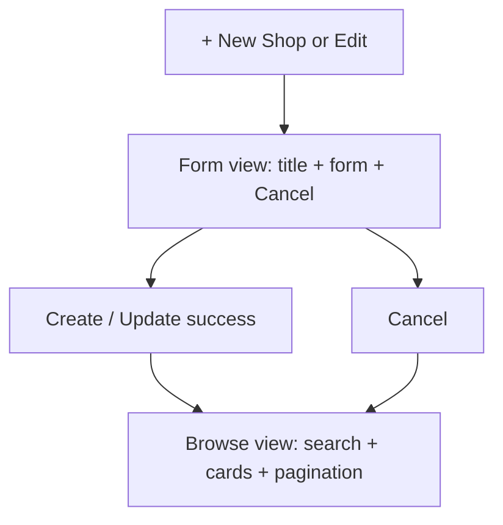

# Separate shop create/edit from shop browse

## Problem

[`shops.component.ts`](coffeeshop-frontend/src/app/features/shops/shops.component.ts) toggles the form with `showForm`, but search, shop cards, and pagination always render below it. Clicking **+ New Shop** (or **Edit** on a card) shows the form on top of a busy list.

## Approach

Use a **single component, two views** (no new route). When `showForm() && canShowForm()` is true, render only the form view; otherwise render the browse view. This matches the existing `showForm` / `editingId` / `cancelEdit()` flow and requires no routing or new files.

## Template changes in [`shops.component.ts`](coffeeshop-frontend/src/app/features/shops/shops.component.ts)

### 1. Form-only view (`@if (showForm() && canShowForm())`)

- **Header**
  - Title: `Create Shop` when `!editingId()`, else `Edit Shop`
  - Primary action: **Cancel** (calls existing `cancelEdit()`)
  - Remove the toggle-style `+ New Shop` / `Cancel` button from this view
- **Body**: keep the current centered form (`shops-form-wrapper` + fields + Create/Update + Cancel on edit)
- **Hide**: search toolbar, loading/empty/card grids, pagination footer

### 2. Browse view (`@else`)

- **Header**
  - Title: `Shops`
  - **+ New Shop** when `canCreateShop()` — sets `showForm.set(true)` (no toggle; browse view is not visible while form is open)
- **Body**: search input, shop sections, `shopCard` template, pagination bar
- **Remove** the create form block from this branch (it moves entirely into the form view)

### 3. Behavior (unchanged logic, wired to new layout)

| Action | Existing method | Result |
|--------|-----------------|--------|
| + New Shop | `showForm.set(true)`, `editingId` null | Form view |
| Edit on card | `onEdit(shop)` | Form view with email field |
| Cancel | `cancelEdit()` | Browse view, form reset |
| Submit success | `cancelEdit()` + `loadShops()` | Browse view, refreshed list |

`canShowForm()` guard stays on the form branch so unauthorized users never see the form.

## Optional polish (small, in same file)

- Add a **Back** secondary button in the form header (in addition to or instead of header Cancel) for clearer exit — reuse `cancelEdit()`.
- On form view, skip rendering `shops-page__footer` pagination (already excluded by `@else`).
- No change to [`app.routes.ts`](coffeeshop-frontend/src/app/app.routes.ts) — `/shops` remains the entry point.

## Files to change

| File | Change |
|------|--------|
| [`coffeeshop-frontend/src/app/features/shops/shops.component.ts`](coffeeshop-frontend/src/app/features/shops/shops.component.ts) | Restructure template into form vs browse `@if` / `@else`; adjust header copy and button handlers |

## Verification

1. Open **Shops** — search, cards, and pagination visible; no form.
2. Click **+ New Shop** — only create form and header; no search or shop cards.
3. **Cancel** — returns to browse view.
4. Submit valid create — returns to browse view; new shop appears in list.
5. Click **Edit** on an owned shop — edit form only (with email); no list behind.
6. Update or cancel edit — back to browse view.
7. Resize to mobile — form layout from prior redesign still works in isolated view.
