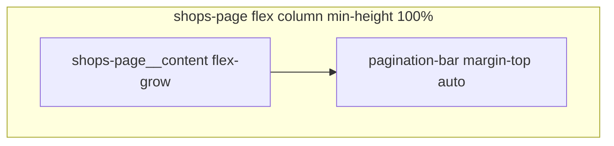

# Pin shops pagination to page bottom

## Context

After the card redesign, [`.pagination-bar`](coffeeshop-frontend/src/styles.css) still sits **immediately below** the shop grids inside the `@else` block in [`shops.component.ts`](coffeeshop-frontend/src/app/features/shops/shops.component.ts). With few cards, the bar floats mid-page instead of at the bottom of the scrollable content area.

The app shell already gives a full-height main column: [`layout.component.ts`](coffeeshop-frontend/src/app/shared/layout/layout.component.ts) uses `height: 100vh` and `.content { flex: 1; overflow-y: auto }`.

**Clarification:** This is the **page pagination footer** (Showing X–Y, Per page, Prev/Next), not the per-card Edit/Delete row — those stay bottom-right on each card via existing `shop-card__actions`.



---

## Implementation (frontend-agent)

**File:** [`coffeeshop-frontend/src/app/features/shops/shops.component.ts`](coffeeshop-frontend/src/app/features/shops/shops.component.ts)

### 1. Template structure

- Wrap main UI in `<div class="shops-page__content">` (header, form, search toolbar, loading / empty / grids).
- Move `<div class="pagination-bar">` **outside** the grids `@else` block so it is a direct child of `.shops-page`, after `__content`.
- Show the footer when `!loading()` so it appears for both empty and populated lists (controls stay usable; `rangeLabel()` already handles `total === 0`).

Rough structure:

```html
<div class="page shops-page">
  <div class="shops-page__content">...</div>
  @if (!loading()) {
    <div class="pagination-bar shops-page__footer">...</div>
  }
</div>
```

### 2. Component styles (extend existing `styles` array)

```css
:host {
  display: block;
  min-height: 100%;
}

.shops-page {
  display: flex;
  flex-direction: column;
  min-height: 100%;
}

.shops-page__content {
  flex: 1 1 auto;
}

.shops-page__footer {
  flex-shrink: 0;
  margin-top: auto;
}
```

Optional: add `background: #0f0f1a` (or match `.content` bg) on the footer so content does not show through when scrolling past cards — only if a visual seam appears during manual check.

### 3. No other changes

- Card compact layout and `shop-card__actions` unchanged.
- Global `.pagination-bar` in `styles.css` unchanged (shops-specific override via `.shops-page__footer` only).
- Layout component unchanged.

---

## Verification

- `/shops` with 1–2 cards: pagination row sits at the **bottom of the viewport** content area, not under the grid.
- `/shops` with many cards: content scrolls; footer remains at the bottom of the flex column (scrolls with page if content exceeds viewport — expected for non-sticky fill layout).
- Loading state: no footer until load completes.
- `npm run build` in `coffeeshop-frontend`
