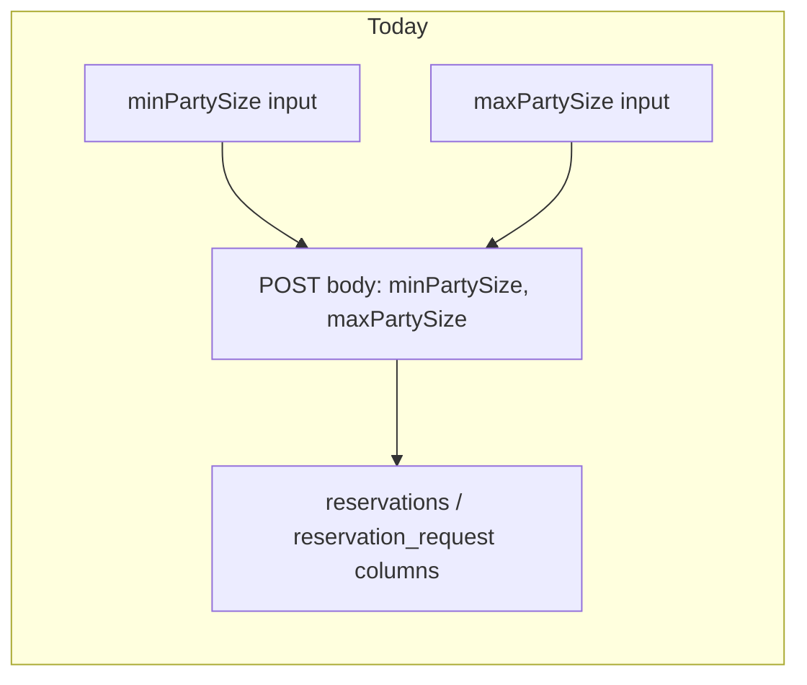
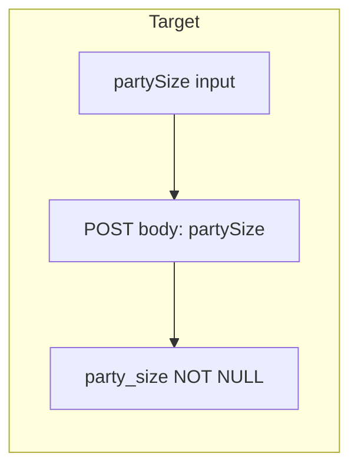

# Single `partySize` for reservations

## Current state

Reservations and reservation requests store a **range** (`minPartySize` required, `maxPartySize` optional). The UI exposes two number inputs; lists render `2 - 4` or `2` when max is null.



**Out of scope:** [`Table.capacity`](coffeeshop/src/main/java/com/coffeeshop/coffeeshop/model/Table.java) and table CRUD — that is seats at a physical table, still used to validate `partySize <= table.capacity` on create/accept.

## Target state

One required integer: **`partySize`** (≥ 1). Validation simplifies to:

- `partySize >= 1`
- On direct reservation create and request accept: `table.getCapacity() >= partySize`
- Remove min/max ordering checks and dual capacity checks



**Breaking API change:** JSON keys `minPartySize` / `maxPartySize` are removed. Frontend and integration tests must ship with the backend.

---

## Backend (Java) — [`coffeeshop/`](coffeeshop/)

### 1. Entities

| File | Change |
|------|--------|
| [`Reservation.java`](coffeeshop/src/main/java/com/coffeeshop/coffeeshop/model/Reservation.java) | Replace `minPartySize` + `maxPartySize` with `int partySize` (`@Column(nullable = false)`) |
| [`ReservationRequest.java`](coffeeshop/src/main/java/com/coffeeshop/coffeeshop/model/ReservationRequest.java) | Same |

Update getters/setters accordingly.

### 2. DTOs

| File | Change |
|------|--------|
| [`ReservationCreateRequest.java`](coffeeshop/src/main/java/com/coffeeshop/coffeeshop/model/dto/request/ReservationCreateRequest.java) | `int partySize` only |
| [`ReservationRequestCreateRequest.java`](coffeeshop/src/main/java/com/coffeeshop/coffeeshop/model/dto/request/ReservationRequestCreateRequest.java) | Same |
| [`ReservationResponseDto.java`](coffeeshop/src/main/java/com/coffeeshop/coffeeshop/model/dto/response/ReservationResponseDto.java) | Same |
| [`ReservationRequestResponseDto.java`](coffeeshop/src/main/java/com/coffeeshop/coffeeshop/model/dto/response/ReservationRequestResponseDto.java) | Same |

### 3. Mappers

- [`ReservationMapper.java`](coffeeshop/src/main/java/com/coffeeshop/coffeeshop/mapper/ReservationMapper.java) — map `partySize` entity ↔ DTO ↔ create request
- [`ReservationRequestMapper.java`](coffeeshop/src/main/java/com/coffeeshop/coffeeshop/mapper/ReservationRequestMapper.java) — response mapping

### 4. Services

- [`ReservationRequestService.java`](coffeeshop/src/main/java/com/coffeeshop/coffeeshop/service/ReservationRequestService.java) — `createRequest(..., int partySize)` (drop `maxPartySize` param)
- [`ReservationRequestServiceImpl.java`](coffeeshop/src/main/java/com/coffeeshop/coffeeshop/service/impl/ReservationRequestServiceImpl.java):
  - `createRequest`: validate `partySize >= 1`; set `request.setPartySize(partySize)`
  - `accept`: single check `table.getCapacity() >= request.getPartySize()`; copy `partySize` to new `Reservation`
- [`ReservationServiceImpl.java`](coffeeshop/src/main/java/com/coffeeshop/coffeeshop/service/impl/ReservationServiceImpl.java) — same validation pattern in `create()`

### 5. Controller

- [`ReservationRequestController.java`](coffeeshop/src/main/java/com/coffeeshop/coffeeshop/controller/ReservationRequestController.java) — pass `request.getPartySize()` into service

### 6. Database / existing data

Project uses **Hibernate `ddl-auto: update`** (no Flyway). Plan:

1. Deploy code with new `party_size` column (Hibernate adds it).
2. **One-time SQL** on any DB that already has rows (local/docker/prod):

```sql
UPDATE reservations SET party_size = COALESCE(max_party_size, min_party_size) WHERE party_size IS NULL;
UPDATE reservation_request SET party_size = COALESCE(max_party_size, min_party_size) WHERE party_size IS NULL;
```

(`COALESCE` treats “2–4” as **4** — exact headcount when a max was set; min-only rows keep min.)

3. After backfill, make `party_size` NOT NULL if Hibernate did not, then optionally drop `min_party_size` / `max_party_size` manually (Hibernate may leave old columns; safe to drop once verified).

### 7. Tests

Update JSON bodies and assertions in:

- [`ReservationRequestIntegrationTest.java`](coffeeshop/src/test/java/com/coffeeshop/coffeeshop/ReservationRequestIntegrationTest.java)
- [`ReservationEventCreateIntegrationTest.java`](coffeeshop/src/test/java/com/coffeeshop/coffeeshop/ReservationEventCreateIntegrationTest.java)

Replace `"minPartySize": N` (and any `"maxPartySize"`) with `"partySize": N`. Add one test that `partySize > table.capacity` returns 4xx/validation error (optional but valuable).

Run: `./gradlew test` in `coffeeshop/`.

---

## Frontend (Angular) — [`coffeeshop-frontend/`](coffeeshop-frontend/)

### 1. Types — [`reservation.model.ts`](coffeeshop-frontend/src/app/models/reservation.model.ts)

On `ReservationResponseDto`, `ReservationRequestResponseDto`, `ReservationCreateRequest`, `ReservationRequestCreateRequest`:

- Remove `minPartySize`, `maxPartySize`
- Add `partySize: number` (required on create; optional `?` only if API ever omits it on read — match backend DTO)

### 2. Forms and submit — [`reservations.component.ts`](coffeeshop-frontend/src/app/features/reservations/reservations.component.ts)

| Area | Change |
|------|--------|
| Template (request + direct forms) | Replace min/max row with one field: label **“Party size”** or **“Number of people”**, `formControlName="partySize"`, `min="1"` |
| `requestForm` / `directForm` | `partySize: [1, [Validators.required, Validators.min(1)]]` — remove `maxPartySize` control |
| `reset()` / `closeOwnerForms()` | Default `partySize: 1` only |
| `onSubmitRequest()` / `onSubmitDirectReservation()` | Send `partySize: val.partySize` |
| List tables | `{{ req.partySize }}` / `{{ r.partySize }}` instead of min–max range |

Optional UX (not required for MVP): when `tableId` is selected on direct form, `Validators.max(selectedTable.capacity)` on `partySize`.

### 3. Display — [`shop-details.component.ts`](coffeeshop-frontend/src/app/features/shop-details/shop-details.component.ts)

Replace four range expressions (`min - max`) with `{{ req.partySize }}` / `{{ r.partySize }}`.

### 4. Services

[`reservation-request.service.ts`](coffeeshop-frontend/src/app/services/reservation-request.service.ts) and [`reservation.service.ts`](coffeeshop-frontend/src/app/services/reservation.service.ts) — no logic changes; types drive the payload.

### 5. Docs (optional, if you maintain them)

- [`frontend.md`](coffeeshop-frontend/frontend.md) and [`api-docs.json`](coffeeshop-frontend/api-docs.json) — update field names when convenient (not runtime-critical).

Verify: create request, create direct reservation, accept request, lists on Reservations and Shop Details.

---

## Implementation order

1. **Backend** entities → DTOs → mappers → services → controller → tests → run Gradle tests
2. **SQL backfill** on dev DB if tables already exist
3. **Frontend** models → component forms/display → manual E2E
4. Deploy backend and frontend together (breaking JSON contract)

## Risk notes

- **No API versioning** — clients sending old fields will fail deserialization or ignore unknown fields depending on Jackson config; coordinate deploy.
- **`ReservationUpdateRequest`** still has no party field — unchanged; party size cannot be edited after create unless you add that later.
