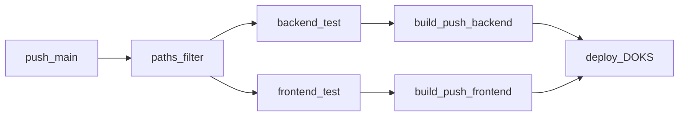

# Option A: Unified CD on push to main

## Goal

Automate: **push to `main` → test (when relevant) → build both images → deploy to `coffeeshop-staging`**.

Avoid the split-workflow bug where only one image is tagged for a commit SHA while deploy expects both.



## Strategy

| Branch / event | Workflow | Behavior |
|----------------|----------|----------|
| PR | [backend-ci.yml](.github/workflows/backend-ci.yml), [frontend-ci.yml](.github/workflows/frontend-ci.yml) | Test (+ docker build **without push**, as today on PR) |
| `push` → `main` | **New** [ci-cd-staging.yml](.github/workflows/ci-cd-staging.yml) | Path-filtered tests + **always** build/push both images + deploy |
| Manual | [deploy-staging.yml](.github/workflows/deploy-staging.yml) | Emergency deploy with custom `image_tag` (no rebuild) |

**PR CI unchanged in spirit** — only remove `push: branches: [main]` from both existing workflows so `main` is owned by one pipeline.

---

## 1. New workflow: `ci-cd-staging.yml`

**Trigger**

```yaml
on:
  push:
    branches: [main]
    paths:
      - 'coffeeshop/**'
      - 'coffeeshop-frontend/**'
      - 'deploy/**'
      - '.github/workflows/**'
```

**Concurrency**

```yaml
concurrency:
  group: ci-cd-staging
  cancel-in-progress: true   # latest main wins; deploy group stays serial below
```

**Job graph**

| Job | Runs when | Notes |
|-----|-----------|--------|
| `changes` | Always | `dorny/paths-filter@v3`: `backend`, `frontend`, `deploy` filters |
| `backend-test` | `backend` or `deploy` workflow paths changed | Reuse steps from [backend-ci.yml](.github/workflows/backend-ci.yml) (`./gradlew build`) |
| `frontend-test` | `frontend` or deploy workflow paths changed | Reuse steps from [frontend-ci.yml](.github/workflows/frontend-ci.yml) (`npm ci`, `npm run build:docker`) |
| `build-backend` | Always on this workflow | **Always** push `ghcr.io/mastilovic/coffeeshop-backend:sha-<7>` + `:latest` |
| `build-frontend` | Always on this workflow | **Always** push frontend image with same SHA tag |
| `deploy` | After both build jobs succeed | Reuse logic from [deploy-staging.yml](.github/workflows/deploy-staging.yml) |

**Test gating** (allow skipped jobs when only the other app changed):

```yaml
build-backend:
  needs: [changes, backend-test]
  if: always() && (needs.backend-test.result == 'success' || needs.backend-test.result == 'skipped')

build-frontend:
  needs: [changes, frontend-test]
  if: always() && (needs.frontend-test.result == 'success' || needs.frontend-test.result == 'skipped')
```

**Shared image tag** — one `meta` job or step at workflow start:

```yaml
image_tag: sha-${{ steps.sha.outputs.short }}   # cut -c1-7, matches existing CI tags
```

**Deploy job** — copy existing steps from [deploy-staging.yml](.github/workflows/deploy-staging.yml) lines 24–75:

- Write `config.env` / `secrets.env` from `vars.*` / `secrets.*`
- `kustomize edit set image` with `${{ needs.meta.outputs.image_tag }}` (not `inputs.image_tag`)
- `kubectl apply -k deploy/k8s/overlays/staging`
- `kubectl rollout status` for `backend`, `frontend`, `keycloak`

**Deploy concurrency** (queue deploys, do not cancel mid-rollout):

```yaml
deploy:
  concurrency:
    group: deploy-staging
    cancel-in-progress: false
```

**Permissions**

- `build-*` jobs: `contents: read`, `packages: write` (GHCR push via `GITHUB_TOKEN`)
- `deploy` job: `contents: read` only

---

## 2. Trim existing PR workflows

### [backend-ci.yml](.github/workflows/backend-ci.yml)

- **Remove** entire `push:` block (lines 8–12).
- Keep `pull_request` + path filters.
- Docker job: `push: false` always (already conditional today; simplify to never push on PR).

### [frontend-ci.yml](.github/workflows/frontend-ci.yml)

- Same: remove `push: main`, keep PR-only.

Update path filters to reference new workflow file where relevant:

```yaml
paths:
  - 'coffeeshop/**'
  - '.github/workflows/backend-ci.yml'
  - '.github/workflows/ci-cd-staging.yml'   # backend tests also run from unified workflow
```

(Include `ci-cd-staging.yml` so edits to the unified pipeline re-run backend tests on PRs when backend paths change — optional but avoids blind spots.)

---

## 3. Keep manual deploy: refactor `deploy-staging.yml`

Retain [deploy-staging.yml](.github/workflows/deploy-staging.yml) for **rollback / hotfix deploy** without rebuild:

- Trigger: `workflow_dispatch` only (unchanged).
- `image_tag` input stays for pinning an older SHA or using `latest`.
- No `push` trigger here (avoids duplicate deploys).

Optional improvement (low cost): extract deploy steps into a **reusable workflow** `.github/workflows/deploy-staging-reusable.yml` with `workflow_call` input `image_tag`, called from both `ci-cd-staging` and `deploy-staging`. If scope should stay minimal, **duplicate deploy steps once** in `ci-cd-staging.yml` and add a comment linking both files — acceptable for v1.

**Recommendation for v1:** reusable workflow to avoid drift.

```yaml
# deploy-staging-reusable.yml
on:
  workflow_call:
    inputs:
      image_tag:
        required: true
        type: string
```

---

## 4. Update documentation

Update [deploy/README.md](deploy/README.md) section **GitHub Actions deploy**:

- Primary path: push to `main` → **CI/CD Staging** workflow runs automatically.
- Manual path: **Deploy Staging (DOKS)** with explicit `image_tag`.
- Note: both images are always rebuilt on `main` even for single-app commits.
- List required secrets/vars (unchanged).

---

## 5. Prerequisites (no code changes)

Confirm in GitHub **before first auto-deploy**:

| Type | Names |
|------|--------|
| Variables | `STAGING_APP_HOST`, `STAGING_AUTH_HOST` |
| Secrets | `KUBE_CONFIG`, `STAGING_POSTGRES_PASSWORD`, `STAGING_KEYCLOAK_POSTGRES_PASSWORD`, `STAGING_KEYCLOAK_ADMIN`, `STAGING_KEYCLOAK_ADMIN_PASSWORD`, `STAGING_KEYCLOAK_BACKEND_CLIENT_SECRET` |

Cluster: NGINX Ingress, GHCR pull secret if packages are private.

---

## 6. Verification after implementation

1. Open PR touching only `coffeeshop/` → only Backend CI runs; no deploy.
2. Merge to `main` → `ci-cd-staging` runs: both images pushed as `sha-<7>`, deploy succeeds.
3. Merge PR touching only `coffeeshop-frontend/` → both images still built; frontend updated, backend image re-tagged for same SHA (cache makes this fast).
4. Merge commit changing only `deploy/**` → tests skipped or minimal; both images built; manifest applied.
5. Manual **Deploy Staging** with older `image_tag` still works.

---

## Files to create or modify

| Action | File |
|--------|------|
| **Create** | [.github/workflows/ci-cd-staging.yml](.github/workflows/ci-cd-staging.yml) |
| **Create** (optional, recommended) | [.github/workflows/deploy-staging-reusable.yml](.github/workflows/deploy-staging-reusable.yml) |
| **Modify** | [.github/workflows/backend-ci.yml](.github/workflows/backend-ci.yml) — PR only |
| **Modify** | [.github/workflows/frontend-ci.yml](.github/workflows/frontend-ci.yml) — PR only |
| **Modify** | [.github/workflows/deploy-staging.yml](.github/workflows/deploy-staging.yml) — call reusable workflow |
| **Modify** | [deploy/README.md](deploy/README.md) — document auto-deploy on `main` |

No changes to Kustomize manifests or application code.

---

## Out of scope

- Production environment or approval gates (GitHub Environments).
- Auto-deploy on tags/releases.
- Building only one image per commit (intentionally avoided).
- Removing `workflow_dispatch` manual deploy.
