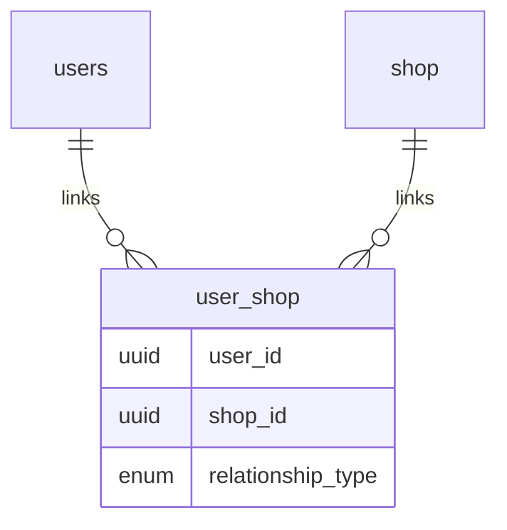
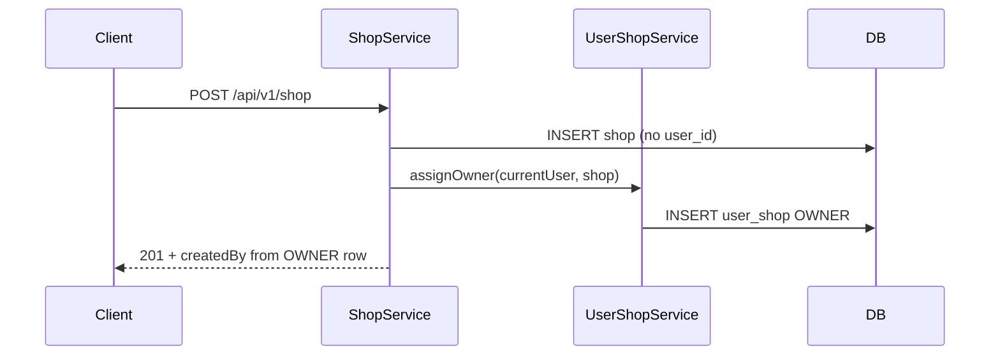

# Unified `user_shop` join table for user–shop relationships

## Problem (root cause)

Creating a second shop fails with `shop_user_id_key` ([`coffeeshop/error.md`](coffeeshop/error.md)) because ownership is modeled as `@OneToOne` on [`Shop.createdBy`](coffeeshop/src/main/java/com/coffeeshop/coffeeshop/model/Shop.java), which forces a **unique** FK on `shop.user_id`.

This is **not** caused by `user_shop_favourite` — that table is already a many-to-many for favourites only.



After the change, **all** user–shop links (owner + favourite) live in `user_shop`; `shop` has no `user_id` column.

---

## Target model

| `relationship_type` | Meaning | Replaces |
|---------------------|---------|----------|
| `OWNER` | User owns / manages the shop | `Shop.createdBy` + `shop.user_id` |
| `FAVOURITE` | User bookmarked the shop | `user_shop_favourite` rows |

**Constraints**

- Unique `(user_id, shop_id)` — one link per pair; type is a single column (an owner who “favourites” their own shop is just `OWNER`).
- At most **one** `OWNER` per `shop_id` (enforce in `ShopServiceImpl` on create/update; optional DB partial unique index later if you add Flyway).

**API (unchanged for clients)**

- `ShopResponseDto.createdBy` — resolved from the `OWNER` row for that shop.
- `ShopResponseDto.users` — users linked with `FAVOURITE` only (same semantics as today’s inverse M2M).
- `UserResponseDto.favouriteShops` / `favouriteShopIds` on update — `FAVOURITE` rows only.

No frontend changes required unless you want to rename fields later.

---

## Implementation steps

### 1. New enum and entity

Add [`UserShopRelationshipType`](coffeeshop/src/main/java/com/coffeeshop/coffeeshop/model/enums/UserShopRelationshipType.java): `OWNER`, `FAVOURITE`.

Add [`UserShop`](coffeeshop/src/main/java/com/coffeeshop/coffeeshop/model/UserShop.java):

```java
@Entity
@Table(name = "user_shop", uniqueConstraints = @UniqueConstraint(columnNames = {"user_id", "shop_id"}))
public class UserShop {
    @Id @GeneratedValue(strategy = GenerationType.UUID)
    private UUID id;
    @ManyToOne(optional = false) @JoinColumn(name = "user_id") private User user;
    @ManyToOne(optional = false) @JoinColumn(name = "shop_id") private Shop shop;
    @Enumerated(EnumType.STRING) @Column(name = "relationship_type", nullable = false)
    private UserShopRelationshipType relationshipType;
}
```

Add [`UserShopRepository`](coffeeshop/src/main/java/com/coffeeshop/coffeeshop/repository/UserShopRepository.java) with queries such as:

- `boolean existsByUser_IdAndRelationshipType(UUID userId, UserShopRelationshipType type)` — replaces `existsByCreatedById`
- `boolean existsByUser_IdAndShop_IdAndRelationshipType(...)` — ownership checks
- `List<Shop> findShopsByUser_IdAndRelationshipType(...)` — replaces `findByCreatedById`
- `Optional<User> findUserByShop_IdAndRelationshipType(UUID shopId, OWNER)` — for `createdBy` in mapper
- `List<User> findUsersByShop_IdAndRelationshipType(UUID shopId, FAVOURITE)` — for `ShopResponseDto.users`
- `List<Shop> findShopsByUser_IdAndRelationshipType(UUID userId, FAVOURITE)` — for user favourites
- `void deleteByShop_IdAndRelationshipType(...)` — admin owner reassignment
- `long countByShop_IdAndRelationshipType(UUID shopId, OWNER)` — enforce single owner

### 2. Trim [`Shop`](coffeeshop/src/main/java/com/coffeeshop/coffeeshop/model/Shop.java) and [`User`](coffeeshop/src/main/java/com/coffeeshop/coffeeshop/model/User.java)

**Remove from `Shop`:**

- `createdBy` (`@OneToOne` + `user_id` FK) — fixes multi-shop creation.
- `users` (`@ManyToMany mappedBy = "shops"`).

**Add to `Shop`:**

- `@OneToMany(mappedBy = "shop", cascade = CascadeType.ALL, orphanRemoval = true) List<UserShop> userShops`

**Remove from `User`:**

- `@ManyToMany` + `@JoinTable(name = "user_shop_favourite")` on `shops`.

**Add to `User`:**

- `@OneToMany(mappedBy = "user", cascade = CascadeType.ALL, orphanRemoval = true) List<UserShop> userShops`

### 3. [`UserShopService`](coffeeshop/src/main/java/com/coffeeshop/coffeeshop/service/UserShopService.java) (small facade)

Centralize:

- `void assignOwner(User user, Shop shop)`
- `void replaceOwner(Shop shop, User newOwner)` (admin update)
- `void setFavouriteShops(User user, List<Shop> shops)` — replace current M2M list sync in `UserServiceImpl`
- `boolean isOwner(User user, Shop shop)`
- `boolean ownsAnyShop(UUID userId)`
- `User resolveOwner(Shop shop)` / `List<Shop> findOwnedShops(UUID userId)`

Keeps ownership logic out of scattered `getCreatedBy()` calls.

### 4. Service and auth updates

| File | Change |
|------|--------|
| [`ShopServiceImpl`](coffeeshop/src/main/java/com/coffeeshop/coffeeshop/service/impl/ShopServiceImpl.java) | On `create`: save shop, then `assignOwner(owner, shop)`; stop calling `setCreatedBy`. `findByCurrentUser` → `userShopService.findOwnedShops`. Admin `update` owner change → `replaceOwner`. Remove `reject` on `users` if field removed (or keep rejecting unknown collections). |
| [`ShopOwnershipService`](coffeeshop/src/main/java/com/coffeeshop/coffeeshop/auth/ShopOwnershipService.java) | `assertOwned` → `userShopService.isOwner` |
| [`ShopRepository`](coffeeshop/src/main/java/com/coffeeshop/coffeeshop/repository/ShopRepository.java) | Remove `existsByCreatedById` / `findByCreatedById` |
| [`UserServiceImpl`](coffeeshop/src/main/java/com/coffeeshop/coffeeshop/service/impl/UserServiceImpl.java) | Favourite sync via `userShopService.setFavouriteShops` instead of `entity.setShops(resolveShops(...))` |
| [`ReviewServiceImpl`](coffeeshop/src/main/java/com/coffeeshop/coffeeshop/service/impl/ReviewServiceImpl.java) | Owner check via `userShopService.isOwner` |
| [`ReservationRequestServiceImpl`](coffeeshop/src/main/java/com/coffeeshop/coffeeshop/service/impl/ReservationRequestServiceImpl.java) | `existsByCreatedById` → `ownsAnyShop`; shop-owner checks via `isOwner` |
| [`ReservationServiceImpl`](coffeeshop/src/main/java/com/coffeeshop/coffeeshop/service/impl/ReservationServiceImpl.java) | Same ownership helper |

### 5. Mappers

| File | Change |
|------|--------|
| [`ShopMapper`](coffeeshop/src/main/java/com/coffeeshop/coffeeshop/mapper/ShopMapper.java) | `createdBy` from `userShopService.resolveOwner(shop)`; `users` from favourite links. Remove `setCreatedBy` in `toShop(ShopUpdateRequest)` — handle owner ID in service layer. |
| [`UserMapper`](coffeeshop/src/main/java/com/coffeeshop/coffeeshop/mapper/UserMapper.java) | `favouriteShops` from `userShopService.findFavouriteShops(user)`; update path still uses `favouriteShopIds` stubs but service persists `FAVOURITE` rows. |
| [`ShopMapper.toShop(ShopCreateRequest)`](coffeeshop/src/main/java/com/coffeeshop/coffeeshop/mapper/ShopMapper.java) | `createdByUserId` handled in `ShopServiceImpl` (not on entity). |

Inject `UserShopService` into mappers (or pass resolved owner/favourites from services before mapping — prefer service returning DTO-ready data if mapper cycles become awkward).

### 6. Tests

- **New:** `ShopMultiOwnerIntegrationTest` — same `SHOP_OWNER` creates two shops via `POST /api/v1/shop`; both succeed; `GET /api/v1/shop/mine` returns 2.
- **Update:** [`ShopCreateIntegrationTest`](coffeeshop/src/test/java/com/coffeeshop/coffeeshop/ShopCreateIntegrationTest.java), [`ShopMineIntegrationTest`](coffeeshop/src/test/java/com/coffeeshop/coffeeshop/ShopMineIntegrationTest.java), [`ShopOwnershipIntegrationTest`](coffeeshop/src/test/java/com/coffeeshop/coffeeshop/ShopOwnershipIntegrationTest.java), [`UserCreateIntegrationTest`](coffeeshop/src/test/java/com/coffeeshop/coffeeshop/UserCreateIntegrationTest.java) — favourites still work via `user_shop` with `FAVOURITE`.
- Run full integration suite under `coffeeshop/src/test/java`.

### 7. Database / Docker

Project uses `spring.jpa.hibernate.ddl-auto: create-drop` in [`application-docker.yaml`](coffeeshop/src/main/resources/application-docker.yaml). **Restarting Docker** recreates schema (drops `shop.user_id`, creates `user_shop`). No Flyway script needed for dev.

If you have a **persistent** Postgres volume with old schema, either wipe the volume or run one-off SQL:

```sql
-- Example manual migration (adjust if table names differ)
INSERT INTO user_shop (id, user_id, shop_id, relationship_type)
SELECT gen_random_uuid(), user_id, id, 'OWNER' FROM shop WHERE user_id IS NOT NULL;
-- Then drop FK/unique on shop.user_id and column user_id
```

---

## Data flow after change



---

## Out of scope (optional follow-ups)

- Flyway migrations for non–`create-drop` environments
- Multiple co-owners per shop (would relax “one OWNER per shop” rule)
- Renaming API fields `favouriteShops` → `linkedShops` (breaking change)
