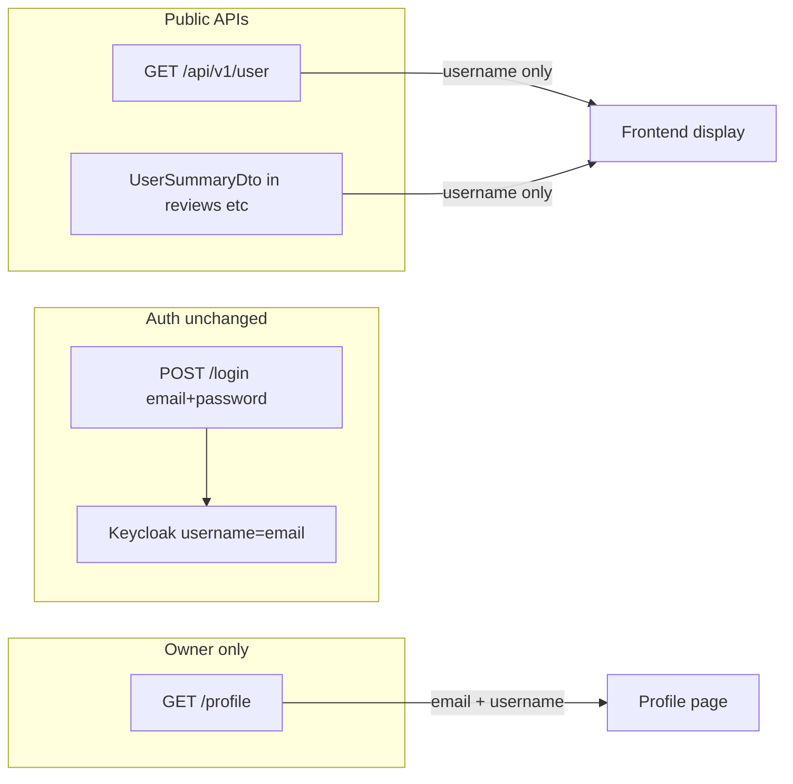

# Introduce username and privatize email

## Goals

- **Login/register**: still use **email** + password (Keycloak continues to use email as Keycloak `username`; no auth contract change).
- **Public identity**: **`username`** shown everywhere users are listed or labeled.
- **Private email**: returned only from **`GET /profile`** (and accepted on profile update); removed from list/summary/admin user responses and nested `UserSummaryDto` payloads.

## Architecture

---

## Backend ([coffeeshop/](coffeeshop/))

### 1. Entity and persistence

- Add `username` to [`User.java`](coffeeshop/src/main/java/com/coffeeshop/coffeeshop/model/User.java):
  - `@Column(nullable = false, unique = true)` (after backfill)
  - Case-insensitive uniqueness in app via repository methods (mirror email pattern).
- [`UserRepository.java`](coffeeshop/src/main/java/com/coffeeshop/coffeeshop/repository/UserRepository.java): `existsByUsernameIgnoreCase`, `findByUsernameIgnoreCase`.
- **Existing users**: one-time backfill on startup (or test `@Sql`) — derive from email local-part, append numeric suffix on collision. Hibernate `ddl-auto: update` adds the column in local/docker; document that production should use an explicit migration later.

### 2. DTOs and mapping

| DTO | `username` | `email` |
|-----|------------|---------|
| `UserSummaryDto` | add | **remove** |
| `UserListItemDto` | add | **remove** |
| `UserResponseDto` (admin CRUD, register response) | add | **remove** |
| New `UserProfileResponseDto` (or profile-only mapper) | add | **keep** |

Files: [`UserSummaryDto.java`](coffeeshop/src/main/java/com/coffeeshop/coffeeshop/model/dto/response/UserSummaryDto.java), [`UserListItemDto.java`](coffeeshop/src/main/java/com/coffeeshop/coffeeshop/model/dto/response/UserListItemDto.java), [`UserResponseDto.java`](coffeeshop/src/main/java/com/coffeeshop/coffeeshop/model/dto/response/UserResponseDto.java), new profile DTO.

- [`UserMapper.java`](coffeeshop/src/main/java/com/coffeeshop/coffeeshop/mapper/UserMapper.java):
  - `toUserSummary` / `toUserListItem` / `toUserResponse` → set `username`, omit `email`.
  - `toUserProfileResponse` → `username` + `email` (+ existing nested fields).
  - `applyCreate` / `applyUpdate` → map `username` from requests; email only where appropriate.

### 3. Requests and validation

- [`UserCreateRequest.java`](coffeeshop/src/main/java/com/coffeeshop/coffeeshop/model/dto/request/UserCreateRequest.java): add required `username`; keep `email` (needed for Keycloak account).
- [`UserUpdateRequest.java`](coffeeshop/src/main/java/com/coffeeshop/coffeeshop/model/dto/request/UserUpdateRequest.java): add `username` (optional on update with uniqueness check).
- [`RegisterRequest.java`](coffeeshop/src/main/java/com/coffeeshop/coffeeshop/auth/RegisterRequest.java): add required `username` (`@NotBlank`, pattern e.g. `^[a-zA-Z0-9_]{3,30}$`).
- **Unchanged**: [`LoginRequest.java`](coffeeshop/src/main/java/com/coffeeshop/coffeeshop/auth/LoginRequest.java) — still `email`.

### 4. Services

- [`RegistrationService.java`](coffeeshop/src/main/java/com/coffeeshop/coffeeshop/auth/RegistrationService.java): duplicate check for username + email; persist username; Keycloak still `username=email`.
- [`UserServiceImpl.java`](coffeeshop/src/main/java/com/coffeeshop/coffeeshop/service/impl/UserServiceImpl.java): validate username on create/update; search by name/username only.
- [`UserSpecifications.java`](coffeeshop/src/main/java/com/coffeeshop/coffeeshop/repository/UserSpecifications.java) and [`UserShopSpecifications.java`](coffeeshop/src/main/java/com/coffeeshop/coffeeshop/repository/UserShopSpecifications.java): replace `email` predicate with `username`.

### 5. Controllers

- [`ProfileController.java`](coffeeshop/src/main/java/com/coffeeshop/coffeeshop/auth/ProfileController.java): return `UserProfileResponseDto` (email visible here only).
- [`UserController.java`](coffeeshop/src/main/java/com/coffeeshop/coffeeshop/controller/UserController.java): continue using `UserResponseDto` without email.
- [`AuthController.java`](coffeeshop/src/main/java/com/coffeeshop/coffeeshop/auth/AuthController.java) register: return public DTO (username, no email).

### 6. Small auth cleanup (recommended)

- [`ShopServiceImpl.java`](coffeeshop/src/main/java/com/coffeeshop/coffeeshop/service/impl/ShopServiceImpl.java): resolve current user via `CurrentUserService` / `keycloakSubject` instead of JWT `email` → `getByEmail`, so display identity can diverge from login email safely.

### 7. Tests

Update integration tests that assert or search by `email` in user list JSON (e.g. [`UserPaginationIntegrationTest.java`](coffeeshop/src/test/java/com/coffeeshop/coffeeshop/UserPaginationIntegrationTest.java), [`AuthIntegrationTest.java`](coffeeshop/src/test/java/com/coffeeshop/coffeeshop/AuthIntegrationTest.java)) and shared `createUser` helpers to send `username`.

---

## Frontend ([coffeeshop-frontend/](coffeeshop-frontend/))

### 1. Models — [`user.model.ts`](coffeeshop-frontend/src/app/models/user.model.ts)

- Add `username` to `UserListItemDto`, `UserSummaryDto`, `UserResponseDto`, `UserCreateRequest`, `UserUpdateRequest`, `RegisterRequest`.
- Remove `email` from `UserListItemDto`, `UserSummaryDto`, and public `UserResponseDto` (or type as optional only on profile).
- Add `UserProfileResponseDto` (or extend profile typing) with `email` + `username`.
- Keep `LoginRequest.email` unchanged.

### 2. Display: email → username

| File | Change |
|------|--------|
| [`layout.component.ts`](coffeeshop-frontend/src/app/shared/layout/layout.component.ts) | Header: `profileService.currentUser()?.username` instead of `authService.currentUserEmail()` |
| [`auth.service.ts`](coffeeshop-frontend/src/app/services/auth.service.ts) | Remove or deprecate `currentUserEmail` (JWT email is login-only) |
| [`profile.service.ts`](coffeeshop-frontend/src/app/services/profile.service.ts) | Type `currentUser` as profile DTO with email |
| [`users.component.ts`](coffeeshop-frontend/src/app/features/users/users.component.ts) | Table/search/form: username column; keep email only in create payload if admin API still requires it (field not shown in table) |
| [`shop-details.component.ts`](coffeeshop-frontend/src/app/features/shop-details/shop-details.component.ts) | Members table + search: username (do **not** change `shop.email` contact line) |
| [`reservations.component.ts`](coffeeshop-frontend/src/app/features/reservations/reservations.component.ts) | Guest label: `` `${u.name} (${u.username})` `` |

### 3. Unchanged (per requirements)

- [`login.component.ts`](coffeeshop-frontend/src/app/features/auth/login.component.ts) — email login
- [`register.component.ts`](coffeeshop-frontend/src/app/features/auth/register.component.ts) — add **required username** field; keep email
- [`profile.component.ts`](coffeeshop-frontend/src/app/features/profile/profile.component.ts) — email view/edit stays; add username display (and optional edit if backend allows)

### 4. Regenerate API docs

- Update [`api-docs.json`](coffeeshop-frontend/api-docs.json) after backend OpenAPI changes (if the project keeps this file in sync).

---

## Implementation order

1. Backend entity + repository + backfill + register/create validation  
2. DTOs + mapper split (public vs profile) + controllers  
3. Search/specs + ShopServiceImpl fix + tests  
4. Frontend models + register + display components + profile typing  
5. Manual smoke: register with username → login with email → header shows username → profile shows email → admin users list shows username only

## Out of scope

- Changing Keycloak login identifier away from email  
- Shop `email` (business contact) — unrelated to user identity  
- Flyway migration (optional follow-up for production; dev relies on `ddl-auto: update`)
