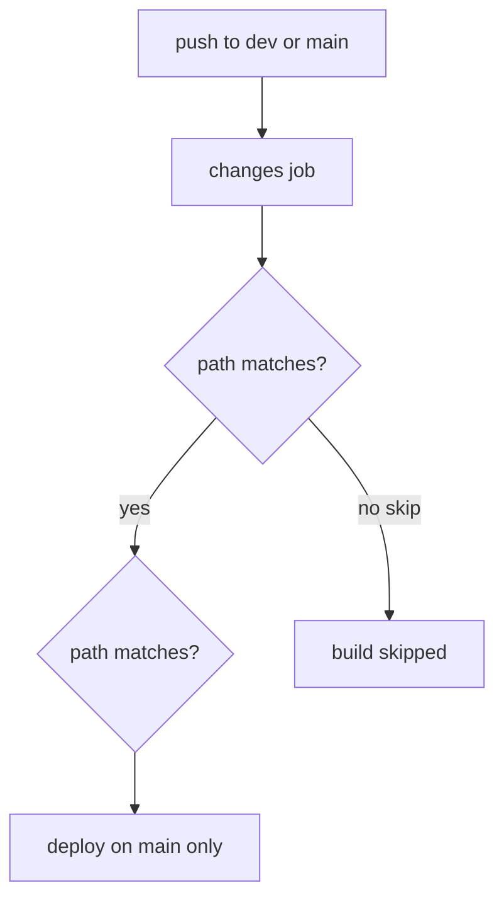

# YAML-only fix for GitHub Actions pipelines

Scope: **only** [`.github/workflows/ci-cd-staging.yml`](.github/workflows/ci-cd-staging.yml). No `gh` CLI changes, no repo settings steps in this plan.

**Note:** If the Actions tab shows **no runs at all** for commits on `main`, that is usually **Settings → Actions** (disabled) or billing — YAML cannot fix that. This plan fixes workflow behavior and gives a **manual Run workflow** button on GitHub.com when push triggers work.

---

## Current state

Push trigger is already correct (no top-level `paths`):

```3:5:.github/workflows/ci-cd-staging.yml
on:
  push:
    branches: [dev, main]
```

Commit `9c2d220` removed `workflow_dispatch` that existed in `5247550`. That is the main YAML regression for “I can’t start a pipeline without pushing.”

---

## Change 1: Restore `workflow_dispatch`

Add under `on:` (same as commit `5247550`):

```yaml
  workflow_dispatch:
    inputs:
      skip_tests:
        description: 'Skip unit tests (emergency deploy only)'
        type: boolean
        default: false
```

**Why:** Lets you start **CI/CD Staging** from **Actions → CI/CD Staging → Run workflow** on `main` or `dev` without using `gh`.

---

## Change 2: Wire `skip_tests` into test jobs

Restore test `if:` conditions removed in `9c2d220`:

```yaml
  backend-test:
    if: |
      (needs.changes.outputs.backend == 'true' || needs.changes.outputs.deploy == 'true') &&
      !(github.event_name == 'workflow_dispatch' && inputs.skip_tests == true)

  frontend-test:
    if: |
      (needs.changes.outputs.frontend == 'true' || needs.changes.outputs.deploy == 'true') &&
      !(github.event_name == 'workflow_dispatch' && inputs.skip_tests == true)
```

**Why:** Manual runs can skip tests for emergency deploys; normal pushes still run tests when paths match.

---

## Change 3: Gate `build-backend` and `build-frontend` on `changes`

**Bug today:** Build jobs use only test outcome:

```109:109:.github/workflows/ci-cd-staging.yml
    if: always() && (needs.backend-test.result == 'success' || needs.backend-test.result == 'skipped')
```

When `backend-test` is **skipped** (no relevant paths on `dev`), `build-backend` still **runs** and pushes images. Same for frontend.

**Fix:** Require path outputs (unchanged on `main` — `changes` already forces all `true` there):

```yaml
  build-backend:
    if: |
      always() &&
      (needs.backend-test.result == 'success' || needs.backend-test.result == 'skipped') &&
      (needs.changes.outputs.backend == 'true' || needs.changes.outputs.deploy == 'true')

  build-frontend:
    if: |
      always() &&
      (needs.frontend-test.result == 'success' || needs.frontend-test.result == 'skipped') &&
      (needs.changes.outputs.frontend == 'true' || needs.changes.outputs.deploy == 'true')
```



---

## Change 4 (optional): Workflow-level `permissions`

Add after `concurrency:` so `GITHUB_TOKEN` can push to GHCR without per-job duplication:

```yaml
permissions:
  contents: read
  packages: write
```

Keep existing `permissions` on build jobs or remove duplicates — either is fine.

**Why:** Does not create runs, but avoids failed builds from token scope on some repos.

---

## Files not changed

| File | Reason |
|------|--------|
| [`backend-ci.yml`](.github/workflows/backend-ci.yml) | PR-only by design; merge to `main` uses **CI/CD Staging** `push` |
| [`frontend-ci.yml`](.github/workflows/frontend-ci.yml) | Same |
| [`deploy-staging.yml`](.github/workflows/deploy-staging.yml) | Already has `workflow_dispatch` for rollback |
| [`deploy-staging-reusable.yml`](.github/workflows/deploy-staging-reusable.yml) | Called by CI/CD Staging; no trigger change |

---

## How to verify (GitHub UI only)

1. Merge/push the YAML change to **`main`** on github.com (logged in as repo owner).
2. **Actions → CI/CD Staging** — confirm a new run for that push.
3. **Actions → CI/CD Staging → Run workflow** — branch `main`, `skip_tests: false` — confirm a second run without a new commit.
4. On `main`, green **build-backend** + **build-frontend** → **deploy** should run (existing `if` at lines 186–189).
5. Push docs-only change to **`dev`** — run should appear; **build-*** jobs should be **skipped** (Change 3).

If step 2 still shows nothing, check **Settings → Actions → General** on the repo — that is outside YAML.
