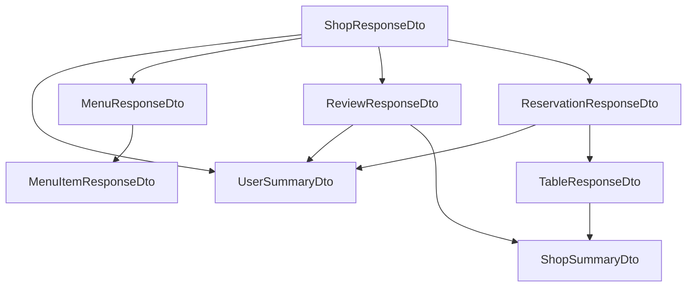

# DTO layer: acyclic shapes and rollout

## Problem

- Entities form cycles: `Shop` ↔ `User` (createdBy, many-to-many favourites), `Menu`/`LoyaltyPlan` ↔ `Shop`, `Review` ↔ `User`/`Shop`, `Reservation` ↔ `User`/`Table`/`Shop`, etc. Jackson `@JsonIgnoreProperties` on entities is a partial patch; the durable fix is **DTOs that omit or slim back-references**.
- [ShopResponseDto.java](src/main/java/com/coffeeshop/coffeeshop/model/dto/ShopResponseDto.java) is incomplete (no accessors, references `UserDto`, `MenuDto`, … that do not exist).
- All REST controllers currently return `@Entity` types (e.g. [ShopController.java](src/main/java/com/coffeeshop/coffeeshop/controller/ShopController.java)), which couples API to persistence and makes cycles easy to reintroduce.

## Design: two DTO “tiers”

Use **summary DTOs** anywhere a nested object would point “up” to a parent or sideways into a large graph. Use **full response DTOs** only at the root of a response.

| Entity | Response shape | Rule |
|--------|------------------|------|
| `Role` | `RoleResponseDto` | Flat: `id`, `name`, `type` — no collections. |
| `User` | `UserResponseDto` | Safe public fields only: **no `password`**. Nested: `List<RoleResponseDto>`, `List<ShopSummaryDto>` (favourites), `List<ReviewResponseDto>`, `List<ReservationResponseDto>`. |
| `Shop` | `ShopResponseDto` | Root aggregate: scalar fields + `UserSummaryDto createdBy` + `List<UserSummaryDto> users` **without** each user’s `shops` + nested aggregates below. |
| `Menu` | `MenuResponseDto` | `id` + `List<MenuItemResponseDto>` — **no `shop`**. |
| `MenuItem` | `MenuItemResponseDto` | Item fields + optional `UUID menuId` only — **no `Menu` object**. |
| `LoyaltyPlan` | `LoyaltyPlanResponseDto` | Plan fields only — **no `shop`**. |
| `Event` | `EventResponseDto` | Event fields + `UUID shopId` — **no nested `Shop`**. |
| `Table` | `TableResponseDto` | `id`, `number`, `capacity`, `UUID shopId` + `List<ReservationResponseDto>` if you need them on shop detail; reservations must not re-expand full `Shop`. |
| `Review` | `ReviewResponseDto` | Review fields + `UserSummaryDto` (no `shops`/`reviews`) + `ShopSummaryDto` (id, name, … scalars only — **no** `users`/`reviews`). |
| `Contact` | `ContactResponseDto` | Today [Contact.java](src/main/java/com/coffeeshop/coffeeshop/model/Contact.java) only has `id` + `shop`; expose `id` + `UUID shopId`. |
| `Reservation` | `ReservationResponseDto` | `id` + `UserSummaryDto` + **table summary**: `id`, `number`, `capacity`, `shopId` — **no** nested `ShopResponseDto`. |

**`UserSummaryDto`** (used inside shop): `id`, `name`, `email`, `userType`, `List<RoleResponseDto>` — **omit `shops`**, **omit** nested reviews/reservations unless you need them for a specific endpoint (prefer separate calls).

**`ShopSummaryDto`** (used inside user/review): `id`, `name`, `address` (optional), etc. — **omit `users`**, **`createdBy`**, and child collections.

This breaks every cycle by construction (no DTO field points back into a fully expanded parent).

## Request DTOs (writes)

For `create`/`update`, add **request** types that avoid binding lazy graphs:

- Prefer **IDs** for associations (`UUID shopId`, `UUID menuId`, …) plus scalars, or minimal nested objects where the API already sends full graphs.
- Examples: `ShopCreateRequest`, `ShopUpdateRequest`, `UserCreateRequest` (password allowed here only), `ReviewCreateRequest` (`userId`, `shopId`, …), `ReservationCreateRequest` (`userId`, `tableId`), etc.
- Services today accept entities in controllers; refactor to **map request DTO → entity** in service or a thin mapper (set foreign keys / load related entities by id).

## Implementation mechanics (no new dependencies required)

- Project has **no Lombok** ([build.gradle](build.gradle)); match entity style: **plain classes with getters/setters**, or **Java records** for immutable summaries (consistent pick one; records are fine for `*SummaryDto` if you prefer).
- Add a **`dto` + `mapper` package** (e.g. `com.coffeeshop.coffeeshop.mapper`):
  - Static `toXxxResponse(entity)` methods or small `*Mapper` classes.
  - Central rule: when mapping `Shop` → `ShopResponseDto`, map `users` with `UserSummaryDto.from(user)` that **does not** set shops; map `menu` without `shop`; map `reviews` with summaries only.
- **Null-safe** lists: `emptyList()` when entity list is null.

## Fix and complete `ShopResponseDto`

- Rename referenced types to match the plan (e.g. `UserSummaryDto` instead of generic `UserDto` if you want clarity).
- Add constructors/getters/setters (or accessors for records).
- Either remove the unused `import com.coffeeshop.coffeeshop.model.*` or keep only what is needed for mappers.

## Controller and service touchpoints

- Update each controller under [controller/](src/main/java/com/coffeeshop/coffeeshop/controller/) to return `ResponseEntity<…Dto>` and accept `@RequestBody …Request` where applicable.
- Services can stay `Entity`-centric: **map at the controller boundary** (thin) or **map inside service** (cleaner for reuse); pick one style and use it everywhere.

## Verification

- Hit representative endpoints (shop by id, user by id, review list) and confirm JSON has **no** nested `shop.users[].shops` or infinite structure.
- Run `./gradlew test` (and manual curl if no API tests yet).

## Optional later improvement

- **MapStruct** (add dependency + processor) if manual mappers grow large; not required for the first pass.
