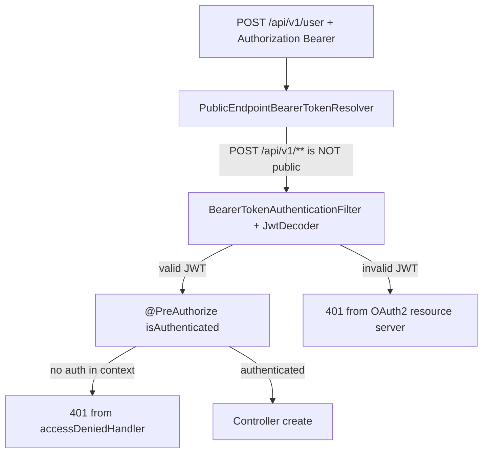

# Diagnose and fix 401 on POST with Bearer (docker-compose + Swagger)

## What is happening (not a controller bug)

Security is layered:



Relevant code:

- [`PublicEndpointBearerTokenResolver`](src/main/java/com/coffeeshop/coffeeshop/config/PublicEndpointBearerTokenResolver.java) — only **ignores** Bearer on `GET /api/v1/**` and auth POSTs (`/login`, `/register`, …). **All** `POST /api/v1/**` controller routes **always** validate the JWT.
- [`SecurityConfiguration`](src/main/java/com/coffeeshop/coffeeshop/config/SecurityConfiguration.java) — OAuth2 resource server + custom access-denied handler that returns **401** for anonymous callers.
- Controllers (e.g. [`UserController`](src/main/java/com/coffeeshop/coffeeshop/controller/UserController.java)) — `@PreAuthorize("isAuthenticated()")` on every POST/PUT/DELETE.

So a Bearer header on `POST /api/v1/user` is **required** and must be a **valid access token** for issuer [`KEYCLOAK_JWT_ISSUER_URI`](docker-compose.yaml) (`http://keycloak:8080/realms/coffeeshop` in compose).

**Important asymmetry:** `GET /api/v1/user` with the **same invalid** Bearer still returns **200**, because the resolver returns `null` and the filter never runs. That makes POST-only 401 look like “auth is broken” when the token was never valid.

Tests pass with any string because [`TestcontainersConfiguration`](src/test/java/com/coffeeshop/coffeeshop/TestcontainersConfiguration.java) provides a `@Primary` mock `JwtDecoder` — production/docker uses real Keycloak JWKS validation.

---

## Swagger + docker-compose: likely causes (in order)

### 1. Wrong value in Authorize (most common)

[`OpenApiConfig`](src/main/java/com/coffeeshop/coffeeshop/config/OpenApiConfig.java) applies **global** `bearer-jwt` to every operation. After you click Authorize once, Swagger sends that header on **all** “Try it out” calls, including ones that do not need it.

Typical mistakes:

| Mistake | Result |
|---------|--------|
| Paste `refresh_token` instead of `access_token` from `/login` | 401 (not a valid access JWT for resource server) |
| Expired `access_token` (Keycloak default ~300s) | 401 |
| Old token left in Authorize from a previous session | 401 |
| Paste full `Bearer eyJ...` when Swagger already adds `Bearer` | Sometimes malformed header → 401 |

**Correct Swagger flow**

1. **Logout / clear** Authorize (or use a fresh browser session).
2. `POST /login` or `POST /auth/login` **without** relying on a pre-set token (auth routes ignore Bearer per resolver).
3. Copy **`access_token`** only from the JSON body.
4. Authorize → paste token **without** the `Bearer ` prefix.
5. Call `POST /api/v1/...`.

### 2. JWT `iss` ≠ backend `issuer-uri` (docker issuer mismatch)

Backend in compose sets:

```yaml
KEYCLOAK_JWT_ISSUER_URI: http://keycloak:8080/realms/coffeeshop
```

Spring requires the JWT `iss` claim to **exactly** match that URI. Tokens minted when Keycloak thinks its public URL is `http://localhost:8080/...` will fail even if signature is valid.

**Verify (one minute):** decode the `access_token` from `/login` (jwt.io or `jq -R 'split(".")[1]'` + base64) and compare `iss` to `KEYCLOAK_JWT_ISSUER_URI`.

- If `iss` is `http://localhost:8080/realms/coffeeshop` but app expects `http://keycloak:8080/...` → **this is your 401**.
- Login via the **app** (`POST /login` through backend on port `18080`) usually yields `iss` matching `keycloak:8080` because [`KeycloakTokenClient`](src/main/java/com/coffeeshop/coffeeshop/auth/KeycloakTokenClient.java) calls `KEYCLOAK_BASE_URL=http://keycloak:8080`.
- Tokens obtained directly from Keycloak Admin/UI at `localhost:8080` often have `localhost` in `iss` → fail in backend container.

### 3. Missing Bearer (401 at method security)

No header → anonymous → `@PreAuthorize` fails → same **401** via [`SecurityConfiguration` lines 38–46](src/main/java/com/coffeeshop/coffeeshop/config/SecurityConfiguration.java). Covered by [`ApiSecurityIntegrationTest.postUser_withoutBearer_isUnauthorized`](src/test/java/com/coffeeshop/coffeeshop/ApiSecurityIntegrationTest.java).

---

## Recommended fixes (after confirming with one failing token)

### A. Immediate (no code) — try first

1. Clear Swagger Authorize.
2. `POST /login` via Swagger on `http://localhost:18080` (or your `BACKEND_PORT`).
3. Authorize with fresh `access_token`.
4. Retry `POST /api/v1/user` (or any controller POST).
5. If still 401, decode JWT `iss` and compare to compose env.

### B. Config fix — if `iss` is `localhost` but backend expects `keycloak`

Pick **one** consistent issuer for docker dev (team choice):

**Option B1 — align backend to token `iss` (simplest if tokens use localhost)**

- Set in [`docker-compose.yaml`](docker-compose.yaml) backend service:
  - `KEYCLOAK_JWT_ISSUER_URI: http://localhost:8080/realms/coffeeshop`
- Ensure backend container can reach JWKS at that host (may require `extra_hosts: ["host.docker.internal:host-gateway"]` on Linux/Mac so `localhost:8080` inside the container reaches Keycloak on the host port mapping).

**Option B2 — align Keycloak to emit `keycloak` issuer (preferred for all-internal docker)**

- Configure Keycloak hostname so tokens from the token endpoint use `http://keycloak:8080` as issuer (e.g. `KC_HOSTNAME: keycloak`, `KC_HOSTNAME_PORT: 8080` on the `keycloak` service).
- Keep `KEYCLOAK_JWT_ISSUER_URI` as `http://keycloak:8080/realms/coffeeshop`.
- Always obtain tokens via app `POST /login`, not directly from Keycloak UI.

Document the chosen pairing in [`docs/keycloak.md`](docs/keycloak.md) under a “Docker + Swagger” subsection.

### C. Code/docs improvement — reduce Swagger footguns

1. **Remove global security** from [`OpenApiConfig`](src/main/java/com/coffeeshop/coffeeshop/config/OpenApiConfig.java) (delete `.addSecurityItem(...)`).
2. Add `@SecurityRequirement(name = "bearer-jwt")` only on protected operations:
   - Controller POST/PUT/DELETE (class-level or method-level), and
   - `GET /profile` in `ProfileController` if present.
3. Leave `/login`, `/register`, and `GET /api/v1/**` **without** security requirement so Swagger does not imply a token is needed.

This mirrors the earlier register fix: public routes should not encourage sending a global stale Bearer ([prior plan](.cursor/plans/fix_register_with_bearer_f9af5a4a.plan.md)).

### D. Optional regression test (realistic docker iss)

Add a test or documented curl script that:

1. Mocks or uses Testcontainers Keycloak (heavier), **or**
2. Asserts `JwtDecoder` rejects wrong `iss` while accepting matching `iss` (unit test on config).

Lower priority than B/C for your current symptom.

---

## What we should **not** change

- Do **not** extend `PublicEndpointBearerTokenResolver` to ignore Bearer on `POST /api/v1/**` — those endpoints must stay authenticated.
- Do **not** remove `@PreAuthorize` from controllers without replacing with explicit `authorizeHttpRequests` rules.

---

## Verification checklist

| Step | Expected |
|------|----------|
| `POST /login` → copy `access_token` | 200 + tokens in body |
| Decode JWT `iss` | Equals `KEYCLOAK_JWT_ISSUER_URI` in running backend |
| `POST /api/v1/user` with that token | **201** |
| Same token on `GET /api/v1/user` | **200** (even with bad token, GET stays 200) |
| `./gradlew test` after OpenAPI change | All green |

Enable debug temporarily if needed: `logging.level.org.springframework.security=DEBUG` to see `invalid_token` vs `invalid_issuer` in logs.
