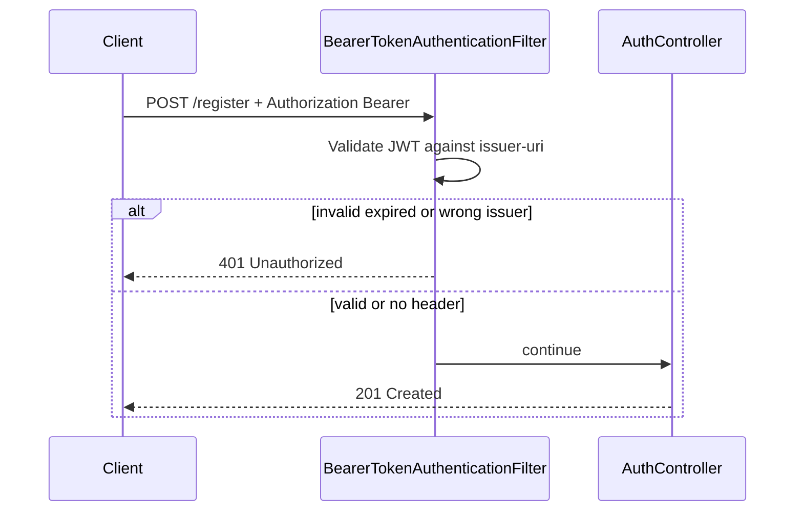

# Fix 401 on `POST /register` with Bearer token

## Root cause

[`AuthController.register`](src/main/java/com/coffeeshop/coffeeshop/auth/AuthController.java) has no `@PreAuthorize` and HTTP config uses `anyRequest().permitAll()` in [`SecurityConfiguration`](src/main/java/com/coffeeshop/coffeeshop/config/SecurityConfiguration.java). Registration logic in [`RegistrationService`](src/main/java/com/coffeeshop/coffeeshop/auth/RegistrationService.java) does not check authentication.

The 401 comes from the **OAuth2 resource server filter chain**, not from registration:



With `oauth2ResourceServer().jwt(...)`, any request that includes `Authorization: Bearer …` is authenticated **before** authorization. Invalid, expired, or wrong-issuer tokens fail at the filter and never reach the controller—even on public routes. This is [documented Spring Security behavior](https://github.com/spring-projects/spring-security/issues/12599), not a bug in `RegistrationService`.

**Common trigger:** [OpenApiConfig](src/main/java/com/coffeeshop/coffeeshop/config/OpenApiConfig.java) adds a **global** `bearer-jwt` security requirement, so Swagger UI sends a stored token on every “Try it out”, including `/register`. Frontends that attach the token to all requests hit the same issue.

## Recommended fix: path-aware `BearerTokenResolver`

Register a custom `BearerTokenResolver` that returns `null` on **public** endpoints so `BearerTokenAuthenticationFilter` skips JWT processing entirely (anonymous request proceeds to the controller).

Wire it in [`SecurityConfiguration`](src/main/java/com/coffeeshop/coffeeshop/config/SecurityConfiguration.java):

```java
.oauth2ResourceServer(oauth2 -> oauth2
    .jwt(jwt -> jwt.jwtAuthenticationConverter(jwtAuthenticationConverter))
    .bearerTokenResolver(bearerTokenResolver))
```

### New helper class

Add [`PublicEndpointBearerTokenResolver.java`](src/main/java/com/coffeeshop/coffeeshop/config/PublicEndpointBearerTokenResolver.java) (or package-private logic inside `SecurityConfiguration` if you prefer fewer files):

- Delegate to `DefaultBearerTokenResolver` when authentication may be needed.
- Return `null` when the request targets a **public** route:

| Rule | Paths / methods | Rationale |
|------|-----------------|-----------|
| Auth flows (no JWT needed) | `POST` `/register`, `/login`, `/auth/login`, `/auth/refresh`, `/auth/logout` | Self-registration and token exchange |
| Public reads | `GET` `/api/v1/**` | Matches current `@PreAuthorize` (GET controllers unannotated) |
| Default | All other requests | Resolve bearer for `@PreAuthorize` mutations and `GET /profile` |

Use `request.getServletPath()` (or `getRequestURI()` without query string) for matching; normalize trailing slashes if needed.

**Behavior after fix:**

| Request | Result |
|---------|--------|
| `POST /register` + invalid Bearer | **201** (token ignored) |
| `POST /register` + no Bearer | **201** (unchanged) |
| `POST /api/v1/user` + invalid Bearer | **401** (still validated) |
| `POST /api/v1/user` + no Bearer | **401** via `@PreAuthorize` + accessDeniedHandler |
| `GET /profile` + valid Bearer | **200** (token still resolved) |
| `GET /api/v1/user` + invalid Bearer | **200** (public read; token ignored) |

### Cleanup

Remove unused imports in `SecurityConfiguration` (`JwtAccessTokenClaims`, `UsernamePasswordAuthenticationFilter`) if still present.

## Test

Add to [`ApiSecurityIntegrationTest`](src/test/java/com/coffeeshop/coffeeshop/ApiSecurityIntegrationTest.java) (or a small dedicated test):

```java
@Test
void register_withInvalidBearer_isCreated() {
    // POST /register with Authorization: Bearer not-a-valid-jwt
    // assert 201 CREATED
}
```

Keep existing tests (`postUser_withoutBearer_isUnauthorized`, `postUser_withBearer_isCreated`) green.

## Optional follow-up (not required for the fix)

- **Swagger:** Remove the global `.addSecurityItem(...)` from [`OpenApiConfig`](src/main/java/com/coffeeshop/coffeeshop/config/OpenApiConfig.java) and document Bearer only on secured operations (`@SecurityRequirement` on controller classes with `@PreAuthorize`). Reduces client confusion but does not replace the server-side resolver.
- **Client guidance:** Document in [`docs/keycloak.md`](docs/keycloak.md) that public endpoints should omit `Authorization` (optional once resolver is in place).

## Out of scope

- Changing registration to require or reject authenticated callers (self-registration should stay public).
- Reintroducing URL-based `requestMatchers` in `SecurityConfiguration`.
