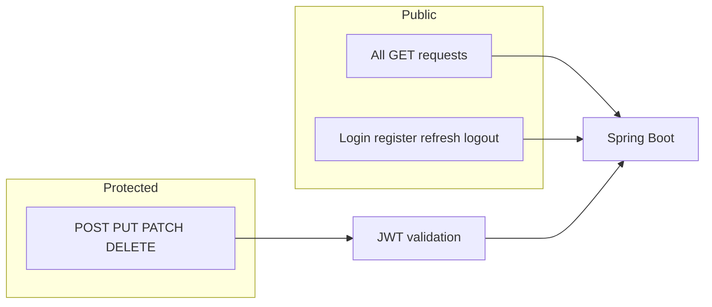

# Keycloak authorization and user linking

## Current state

- [SecurityConfiguration.java](src/main/java/com/coffeeshop/coffeeshop/config/SecurityConfiguration.java) uses `permitAll()` for all [`/api/**`](src/main/java/com/coffeeshop/coffeeshop/controller) routes and `authenticated()` for everything else. All REST controllers live under `/api/v1/...`, so **the API is effectively unsecured today**.
- [build.gradle](build.gradle) has `spring-boot-starter-security` only—**no OAuth2 resource server** and **no Keycloak Java integration**.
- [User.java](src/main/java/com/coffeeshop/coffeeshop/model/User.java) has `id`, `email`, `password`, roles, etc., but **no Keycloak identifier**.
- [docs/keycloak.md](docs/keycloak.md) describes REST login, refresh, logout, and bearer usage, but **those endpoints are not implemented** in `src/main/java`.
- **Realm vs Compose mismatch**: [docker/keycloak/realm-coffeeshop.json](docker/keycloak/realm-coffeeshop.json) defines client `coffeeshop-app`, while [docker-compose.yaml](docker-compose.yaml) passes `KEYCLOAK_BACKEND_CLIENT_ID` / `KEYCLOAK_BACKEND_CLIENT_SECRET`. The plan should **pick one naming scheme** and align JSON, `.env.example`, and Java properties so token exchange uses the same client as the imported realm.

## Target security model

- **Rule**: `HttpMethod.GET` on any path → `permitAll()`.
- **Rule**: Explicit whitelist for auth flows from [docs/keycloak.md](docs/keycloak.md) (at minimum): `POST /login`, `POST /auth/login`, `POST /auth/refresh`, `POST /auth/logout`, `POST /register`, and—if you add them—`GET /login`, `GET /register`, legacy `POST /logout` with cookie/CSRF as documented.
- **Rule**: All other methods (POST, PUT, PATCH, DELETE) → **authenticated** via **JWT bearer** (`Authorization: Bearer …`), validated as Keycloak realm tokens (signature + issuer).

**Note:** Making every GET public means **`GET /api/v1/user` (list users) is anonymous**—that matches your requirement; if you later want read protection for specific resources, that would be a separate policy.

## 1. Dependencies and configuration

- Add **`spring-boot-starter-oauth2-resource-server`** in [build.gradle](build.gradle).
- Add configuration (e.g. in [application.yaml](src/main/resources/application.yaml) / profile files) for JWT validation, preferably **issuer-based** so Spring discovers JWKS automatically:
  - `spring.security.oauth2.resourceserver.jwt.issuer-uri: ${KEYCLOAK_SERVER_URL}/realms/${KEYCLOAK_REALM}`  
  - Use the same base URL the **container** uses to reach Keycloak (e.g. `http://keycloak:8080` in Docker) to avoid issuer mismatch; document host vs internal URL for local dev.
- Add properties for **direct grant** (password/token exchange) used by login: realm URL, **client id + secret** aligned with the realm import, and optional admin credentials for user provisioning (see below).

## 2. Security filter chain

Update [SecurityConfiguration.java](src/main/java/com/coffeeshop/coffeeshop/config/SecurityConfiguration.java):

- Enable **OAuth2 resource server**: `http.oauth2ResourceServer(oauth2 -> oauth2.jwt(...))`.
- Replace the blanket `/api/**` permit with:
  - `requestMatchers(HttpMethod.GET, "/**").permitAll()`
  - `requestMatchers` for auth endpoints listed in docs
  - Keep **Swagger/OpenAPI** and **actuator** policy explicit (today: actuator/swagger are in the permit list for non-GET too—decide if you still want `GET /actuator/health` public for orchestration while other actuator endpoints stay restricted; your “all GET open” rule implies they become public unless you carve an exception).
- Optional: **JWT → `GrantedAuthority`** via a custom `JwtAuthenticationConverter` so Keycloak realm roles from the token (realm JSON maps roles into claims—see `realm_access.roles` in [realm-coffeeshop.json](docker/keycloak/realm-coffeeshop.json)) become `ROLE_CUSTOMER`, etc., for future `@PreAuthorize` work (not strictly required for “JWT required on mutating calls”).

## 3. Link Keycloak users to `User` rows

**Recommended link key:** Keycloak **`sub`** claim (stable per user in the realm). Email can still be used for lookups during migration or first login, but **`sub` should be the canonical FK in the app DB**.

- Add a nullable **unique** column on [`User`](src/main/java/com/coffeeshop/coffeeshop/model/User.java), e.g. `keycloakSubject` (String).
- Extend [`UserRepository`](src/main/java/com/coffeeshop/coffeeshop/repository/UserRepository.java) with `Optional<User> findByKeycloakSubject(String sub)` and `Optional<User> findByEmail(String email)` (if not present).
- Schema: project uses **`ddl-auto: update`** in [application-docker.yaml](src/main/resources/application-docker.yaml); adding the field is enough for dev—if you introduce Flyway later, add a migration then.

**Consistency rules:**

- On **registration**: create the Keycloak user and the JPA `User` in one business transaction flow; set `keycloakSubject` from the Keycloak user **id** returned by the Admin API (it matches token `sub` for that user).
- On **login** (token issued): optional **lazy link**—if `sub` is present but no row has it, find by verified email from the JWT and set `keycloakSubject` once (helps one-time migration; guard against email collisions).

## 4. Implement the auth API from docs/keycloak.md

New package (suggested: `...auth` or `...keycloak`) with small, testable components:

- **Token client**: HTTP calls to Keycloak’s token endpoint (`grant_type=password` for login, `refresh_token` for refresh, `logout`/`end-session` per Keycloak version). Map responses to the JSON shape documented in [docs/keycloak.md](docs/keycloak.md).
- **Controllers**: `POST /login`, `POST /auth/login` (delegate), `POST /auth/refresh`, `POST /auth/logout` as described.
- **Registration**: `POST /register` enforcing the **customer / shop_owner** role policy and **rejecting admin** as in docs; implement by calling **Keycloak Admin REST API** (using `KEYCLOAK_ADMIN_USER` / `KEYCLOAK_ADMIN_PASSWORD`) to create users, set password, assign realm roles, then persist [`User`](src/main/java/com/coffeeshop/coffeeshop/model/User.java) with `keycloakSubject` and app-specific fields.
- **Profile example** in docs (`GET /profile` with bearer): implement if you need a concrete “who am I” that returns the **linked** `User` DTO by resolving JWT → `User` (see next section).

Use Spring **`RestClient`** or **`WebClient`** (Boot 4 test stack already includes rest client support) for Keycloak HTTP; keep secrets in configuration, not hard-coded.

## 5. Resolving the current app user in services

Add a small facade, e.g. `CurrentUserService`:

- Read `Jwt` from `SecurityContextHolder` (resource server).
- Extract `sub` (and optionally email).
- Load `User` via `keycloakSubject`; handle “authenticated in Keycloak but no local row” with a clear **401/403 or 409** policy (your choice; recommend **403** with a message to complete registration if you allow KC-only users).

Controllers that perform mutations can later use this to enforce ownership; the first milestone is **global method-level protection** + **stable ID link**.

## 6. Swagger / OpenAPI

- Configure **Bearer JWT** security scheme in Springdoc so “Try it out” on mutating endpoints documents the header requirement.

## 7. Docker / realm alignment

- Update [docker/keycloak/realm-coffeeshop.json](docker/keycloak/realm-coffeeshop.json) **or** [docker-compose.yaml](docker-compose.yaml) env so **one** backend client id/secret is the source of truth (`directAccessGrantsEnabled` must stay **true** for the password grant described in docs).
- Ensure redirect URIs / web origins in the realm match how you run the app (ports **8000 vs 8080** in docs vs [application.yaml](src/main/resources/application.yaml)).

## 8. Tests

- **Security tests**: `@SpringBootTest` + `MockMvc`—assert GET `/api/v1/...` succeeds without JWT; assert POST without JWT returns **401**; assert POST with **valid** JWT (use `JwtDecoder` mock or static builder) returns **200** where applicable.
- Optional: slice tests for `KeycloakTokenClient` using **`MockWebServer`** or WireMock.

## Implementation order (for java-agent)

1. Align Keycloak client naming between realm JSON and Compose/env.
2. Add dependency + JWT issuer config + resource server security chain (GET open, mutating JWT, auth paths public).
3. Add `keycloakSubject` + repository methods.
4. Implement token client + login/refresh/logout controllers.
5. Implement register + Admin API user create + link `keycloakSubject`.
6. Add `CurrentUserService` + optional `/profile`.
7. Springdoc bearer scheme + security tests.
