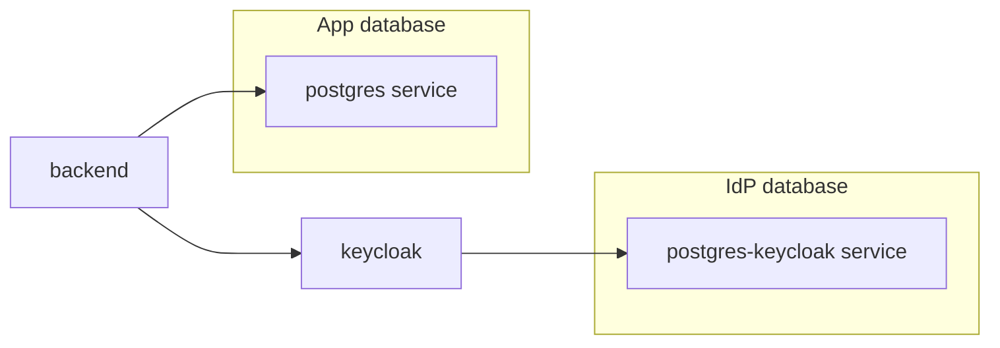

# Dedicated PostgreSQL for Keycloak

## Current state

- [`docker-compose.yaml`](docker-compose.yaml): One [`postgres`](docker-compose.yaml) service creates database `coffeeshop`. **Keycloak** uses the same host and same `POSTGRES_DB` via `KC_DB_URL: jdbc:postgresql://postgres:5432/${POSTGRES_DB:-coffeeshop}`, so Keycloak tables live alongside the app schema.
- **Backend** only needs the app DB; Keycloak is reached over HTTP (`KEYCLOAK_BASE_URL`). [`application-docker.yaml`](src/main/resources/application-docker.yaml) has no Keycloak DB settings—nothing in Java must change for this split.

## Target architecture

## Implementation

### 1. New Compose service: `postgres-keycloak`

- **Image**: `postgres:18-alpine` (match existing [`postgres`](docker-compose.yaml)).
- **Environment** (with defaults, parallel to app DB):
  - `POSTGRES_DB`: e.g. `${KEYCLOAK_POSTGRES_DB:-keycloak}`
  - `POSTGRES_USER`: e.g. `${KEYCLOAK_POSTGRES_USER:-keycloak}`
  - `POSTGRES_PASSWORD`: e.g. `${KEYCLOAK_POSTGRES_PASSWORD:-keycloak_dev_password}`
- **Volume**: new named volume, e.g. `postgres_keycloak_data`, so Keycloak data persists independently.
- **Healthcheck**: same pattern as `postgres`, using the Keycloak DB user/db names (`pg_isready -U … -d …`).
- **Ports** (optional but useful for local debugging / IDE): e.g. `${KEYCLOAK_POSTGRES_PORT:-25433}:5432` so it does not clash with `${POSTGRES_PORT:-25432}`.

### 2. Update `keycloak` service

- Set `KC_DB_URL` to `jdbc:postgresql://postgres-keycloak:5432/${KEYCLOAK_POSTGRES_DB:-keycloak}` (hostname = new service name).
- Set `KC_DB_USERNAME` / `KC_DB_PASSWORD` from `KEYCLOAK_POSTGRES_USER` / `KEYCLOAK_POSTGRES_PASSWORD` (same defaults as the new service).
- **`depends_on`**: depend on `postgres-keycloak` with `condition: service_healthy`; **remove** the dependency on `postgres` so Keycloak no longer waits on the app database.
- Leave other Keycloak env (`KC_HOSTNAME_STRICT`, realm import volume, admin user, etc.) unchanged.

### 3. Leave `backend` / `postgres` unchanged

- Backend keeps `SPRING_DATASOURCE_*` pointing at `postgres:5432` and `depends_on: postgres`.
- No updates required to [`application-docker.yaml`](src/main/resources/application-docker.yaml) unless you later want documented placeholders (optional).

### 4. Volumes section

- Append `postgres_keycloak_data:` under `volumes:`.

## Operational note (one-time for existing dev volumes)

Anyone who already ran Compose with Keycloak on `coffeeshop` will have Keycloak tables in the old DB; after this change, Keycloak uses an **empty** database. With `start-dev --import-realm` and the existing [`docker/keycloak/realm-coffeeshop.json`](docker/keycloak/realm-coffeeshop.json) mount, realms/clients are re-imported on startup. Old Keycloak rows in `coffeeshop` can be ignored or cleaned up manually; they are not migrated automatically.

## Alternative (not recommended unless you want one Postgres process)

You could use a **single** `postgres` container with **two logical databases** via an init script. That saves RAM but does not give process-level isolation; your request reads as a separate Compose database service, so the plan above uses a **second Postgres service**.
