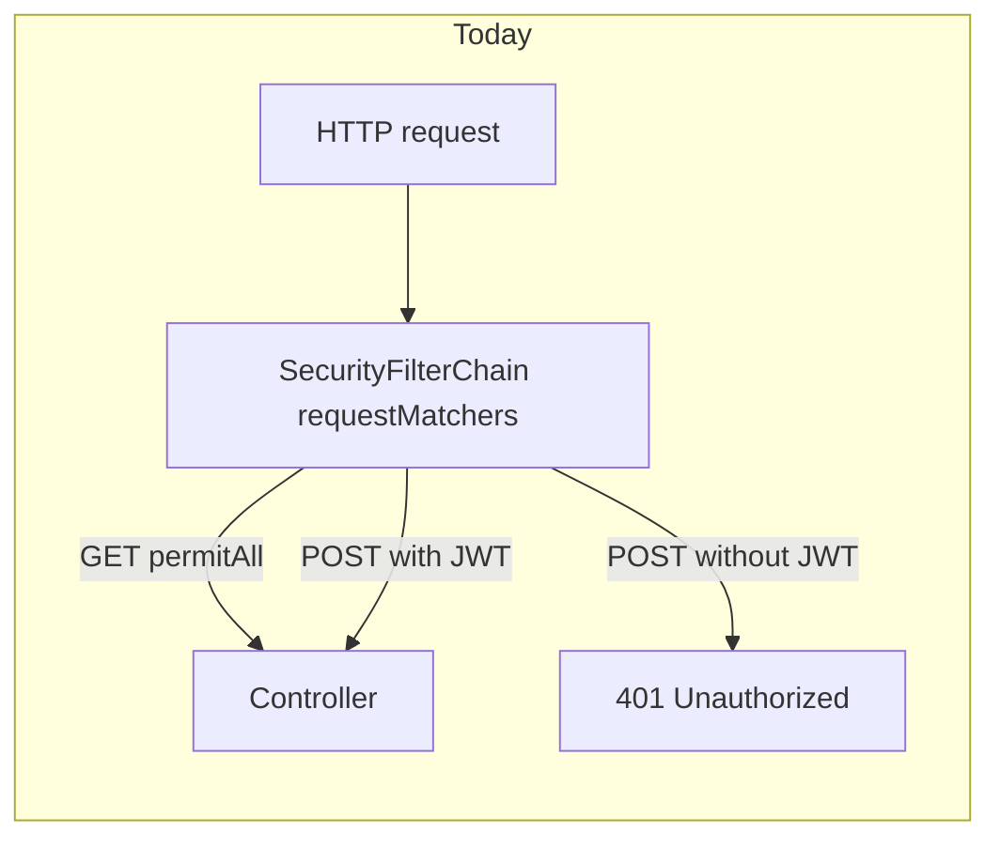
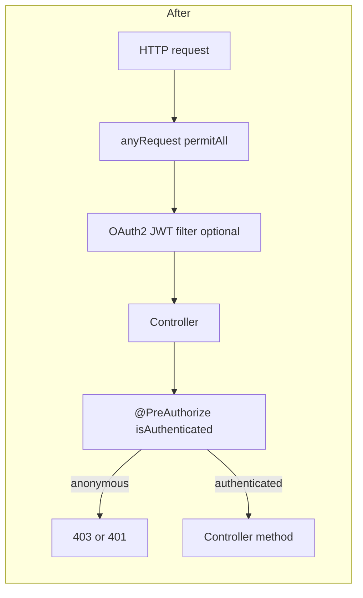

# Switch to `@PreAuthorize` method security

## Current behavior

[`SecurityConfiguration.java`](src/main/java/com/coffeeshop/coffeeshop/config/SecurityConfiguration.java) enforces auth at the HTTP filter layer:

- All `GET /**` → public
- Specific auth `POST` paths → public
- Everything else → `authenticated()`

That means **36 mutating endpoints** under `/api/v1/**` require a JWT, while **22 GET list/detail endpoints** are public. [`ProfileController`](src/main/java/com/coffeeshop/coffeeshop/auth/ProfileController.java) `GET /profile` is technically public today (covered by `GET /**`), though it calls `requireCurrentUser()` and would fail at runtime without a token.

Method security is **not** enabled yet (`@EnableMethodSecurity` is absent).



## Target behavior



- HTTP layer: allow all requests through; keep `oauth2ResourceServer` + existing `JwtAuthenticationConverter` so Bearer tokens still populate `SecurityContext`.
- Controller layer: annotate only endpoints that must be authenticated (per [java-agent](.cursor/agents/java-agent.md): `@PreAuthorize` at controller layer).

## 1. Update [`SecurityConfiguration.java`](src/main/java/com/coffeeshop/coffeeshop/config/SecurityConfiguration.java)

- Add `@EnableMethodSecurity` on the configuration class.
- Replace the `authorizeHttpRequests` block with a single rule:

```java
.authorizeHttpRequests(auth -> auth.anyRequest().permitAll())
```

- Remove unused imports (`HttpMethod` and path-specific matchers).
- **Keep unchanged:** `csrf` disable, `oauth2ResourceServer` + `jwtAuthenticationConverter` bean.

## 2. Add `@PreAuthorize("isAuthenticated()")` on secured controller methods

**Expression:** `@PreAuthorize("isAuthenticated()")` (no role checks yet; aligns with current “JWT required” rule).

**Do not annotate** (remain public):

| Location | Endpoints |
|----------|-----------|
| [`AuthController`](src/main/java/com/coffeeshop/coffeeshop/auth/AuthController.java) | `/login`, `/auth/login`, `/auth/refresh`, `/auth/logout`, `/register` |
| All 11 CRUD controllers under [`controller/`](src/main/java/com/coffeeshop/coffeeshop/controller/) | Every `@GetMapping` (list + by id) |

**Annotate** (37 methods total):

| Controller | Methods |
|------------|---------|
| `ContactController`, `EventController`, `LoyaltyPlanController`, `MenuController`, `MenuItemController`, `ReservationController`, `ReviewController`, `RoleController`, `ShopController`, `TableController`, `UserController` | `@PostMapping`, `@PutMapping`, `@DeleteMapping` (3 each × 11 = **33**) |
| [`ReservationRequestController`](src/main/java/com/coffeeshop/coffeeshop/controller/ReservationRequestController.java) | `createRequest`, `accept`, `deny` (**3**) — all stay authenticated per your choice |
| [`ProfileController`](src/main/java/com/coffeeshop/coffeeshop/auth/ProfileController.java) | `profile()` (**1**) — fixes the current GET-wide-open gap |

Add import on each touched class:

```java
import org.springframework.security.access.prepost.PreAuthorize;
```

Example on a mutating method (repeat pattern):

```java
@PostMapping
@PreAuthorize("isAuthenticated()")
public ResponseEntity<...> create(...) { ... }
```

## 3. Preserve 401 for missing Bearer (recommended)

With `permitAll()` + method security only, anonymous calls to `@PreAuthorize` methods typically return **403 Forbidden** instead of **401 Unauthorized**. [`ApiSecurityIntegrationTest`](src/test/java/com/coffeeshop/coffeeshop/ApiSecurityIntegrationTest.java) expects `UNAUTHORIZED` for `POST /api/v1/user` without Bearer.

**Recommended:** add an `accessDeniedHandler` in `SecurityConfiguration` that, when the principal is missing or anonymous, delegates to `BearerTokenAuthenticationEntryPoint` (401); otherwise return 403 for authenticated-but-denied cases. This keeps existing integration tests and client semantics without reintroducing path matchers.

**Alternative:** change the test to expect `FORBIDDEN` (simpler, but changes API contract).

## 4. Verification

Run:

```bash
./gradlew test
```

Key tests:

- [`ApiSecurityIntegrationTest`](src/test/java/com/coffeeshop/coffeeshop/ApiSecurityIntegrationTest.java) — GET public, POST without token rejected, POST with `test-token` succeeds
- [`ReservationRequestIntegrationTest`](src/test/java/com/coffeeshop/coffeeshop/ReservationRequestIntegrationTest.java), [`UserCreateIntegrationTest`](src/test/java/com/coffeeshop/coffeeshop/UserCreateIntegrationTest.java), [`ShopCreateIntegrationTest`](src/test/java/com/coffeeshop/coffeeshop/ShopCreateIntegrationTest.java) — all use Bearer auth on mutating calls; should remain green

Optional follow-up (out of scope): role-based `@PreAuthorize("hasRole('ADMIN')")` once business rules define which mutating operations are staff-only.
