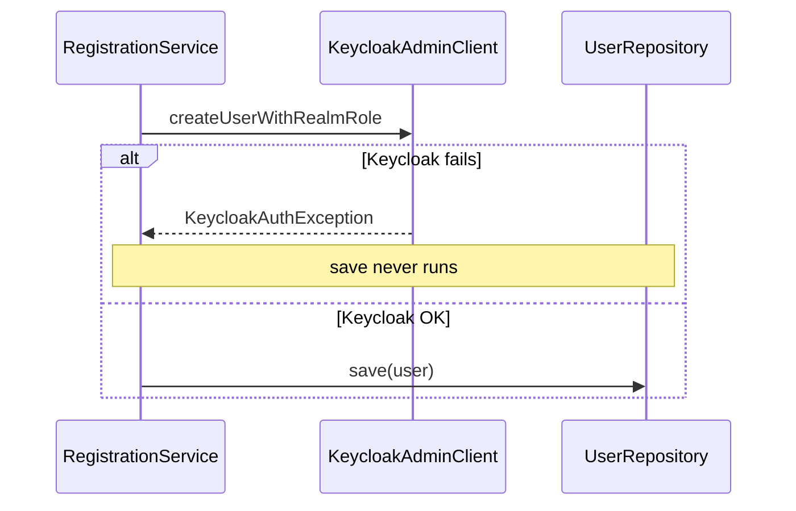

# Registration consistency: transactions vs Keycloak

## What the code does today

In [`RegistrationService.java`](file:///Users/amastilovic/Desktop/dev/coffeeshop/src/main/java/com/coffeeshop/coffeeshop/auth/RegistrationService.java), `register` is `@Transactional` and the order is:

1. Create user (and assign realm role) in Keycloak via [`KeycloakAdminClient.createUserWithRealmRole`](file:///Users/amastilovic/Desktop/dev/coffeeshop/src/main/java/com/coffeeshop/coffeeshop/auth/KeycloakAdminClient.java).
2. Only if that succeeds: build `User`, set `keycloakSubject`, then `userRepository.save(user)`.

So if Keycloak throws (wrapped as `ResponseStatusException`), the method exits before `save`, and **no coffeeshop user row is written**. Your exact scenario (Keycloak fails **and** user already saved) does **not** occur with the current ordering.

## Can “one transaction” roll back both sides?

No. Spring `@Transactional` coordinates **your datasource** (and optionally other JTA resources). Keycloak is an external HTTP API — it is **not** enlisted in that transaction. There is no automatic two-phase commit across Postgres (or H2) and Keycloak.

What **does** work cleanly:

- **DB-first inside the same `@Transactional` method**: persist the user, then call Keycloak. If Keycloak fails and you **propagate** a runtime exception (your `ResponseStatusException` counts), Spring rolls back the DB transaction so the insert is never committed — no manual delete needed, as long as nothing commits or flushes the persistence context early in a way that surprises you (your flow does not call `flush()` or run queries between save and Keycloak that would force an early flush).

## When you still need explicit compensation

| Failure | With current KC-first order | With DB-first + `@Transactional` |
|--------|-----------------------------|-----------------------------------|
| Keycloak fails before DB | No local row (already true) | DB rolls back on exception |
| DB fails **after** Keycloak succeeds | Possible **orphan user in Keycloak** | Same orphan risk |
| User created in KC but **realm role** step fails ([`KeycloakAdminClient`](file:///Users/amastilovic/Desktop/dev/coffeeshop/src/main/java/com/coffeeshop/coffeeshop/auth/KeycloakAdminClient.java) lines 61–76) | Partial orphan in Keycloak | N/A if KC is second |

So “delete coffeeshop user if Keycloak fails” is only necessary if you **change** to a pattern where the row might be committed before Keycloak (e.g. separate transactions, async steps, or catching swallowing exceptions). For a simple **DB-first + single failing-fast transaction**, prefer rollback over explicit delete.

To harden **KC-first** (current) ordering, the valuable addition is the **mirror**: on any failure **after** `createUserWithRealmRole` returns but **before** successful DB commit (or if `save` throws), call a new **`deleteUser(UUID id)`** (or similar) on `KeycloakAdminClient` in a `try/catch` so cleanup failures do not mask the original error.

To harden **partial Keycloak** failures, wrap `createUserWithRealmRole` so that if user creation succeeds but a later step fails, you **delete the just-created Keycloak user** before rethrowing.

## Recommended direction (concise)

1. **If your only concern is “KC failed, row stuck locally”**: either keep **KC-first** (already safe) or switch to **DB-first** with the same `@Transactional` method and ensure Keycloak failures still propagate — rollback removes the row without a manual delete.
2. **If you want symmetry / no Keycloak orphans**: add compensating **Keycloak user delete** for failures after successful KC create (including after `save` throws), and optionally inside `KeycloakAdminClient` for post-create failures (role mapping).

No change is strictly required for the scenario you described **unless** you reorder or split transactions; then use the pattern above instead of expecting JTA to cover Keycloak.
