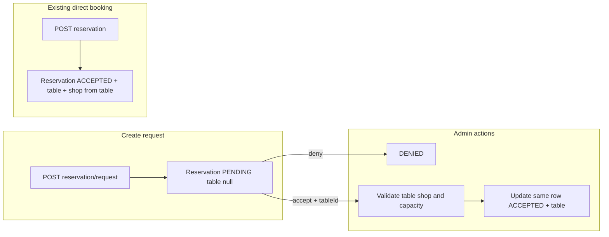

# Reservation request API (consolidated into Reservation stack)

## Context

- Today, [`Reservation`](src/main/java/com/coffeeshop/coffeeshop/model/Reservation.java) only has `user` and `table`; [`ReservationCreateRequest`](src/main/java/com/coffeeshop/coffeeshop/model/dto/request/ReservationCreateRequest.java) requires `userId` + `tableId`. [`Table`](src/main/java/com/coffeeshop/coffeeshop/model/Table.java) has `shop` and `capacity`.
- APIs use [`ReservationController`](src/main/java/com/coffeeshop/coffeeshop/controller/ReservationController.java) at `/api/v1/reservation`. Schema is JPA-driven (`ddl-auto` `update` in [application-docker.yaml](src/main/resources/application-docker.yaml)).

## Design change (per your feedback)

**Do not** add `ReservationRequestRepository`, `ReservationRequestService`, or `ReservationRequestController`. **Do** implement the request workflow inside [`ReservationRepository`](src/main/java/com/coffeeshop/coffeeshop/repository/ReservationRepository.java), [`ReservationService`](src/main/java/com/coffeeshop/coffeeshop/service/ReservationService.java) / [`ReservationServiceImpl`](src/main/java/com/coffeeshop/coffeeshop/service/impl/ReservationServiceImpl.java), and [`ReservationController`](src/main/java/com/coffeeshop/coffeeshop/controller/ReservationController.java).

Because Spring Data `JpaRepository` is bound to one entity type, the pending request is modeled as a **`Reservation` row** in lifecycle states—not a second aggregate/table.

### Extended `Reservation` entity (same table `restaurant_reservation`)

| Field | Purpose |
|--------|--------|
| `user` | existing — requester |
| `shop` | `@ManyToOne` — target shop (required for request flow) |
| `minPartySize` | `int` |
| `maxPartySize` | `Integer` nullable — `null` = “or above” / no upper cap |
| `status` | enum `PENDING`, `ACCEPTED`, `DENIED` |
| `table` | `@ManyToOne` — **nullable** while `PENDING` or `DENIED`; set on accept |

**Backward compatibility for existing direct booking (`POST /api/v1/reservation` with `ReservationCreateRequest`):** In `create`, resolve `user` + `table` as today; set `shop` from the resolved table’s shop; set `status = ACCEPTED`; party-size fields can be left unset or derived (e.g. set `minPartySize` from `table.capacity` or leave null only if you add nullable party fields for legacy rows—prefer non-null `minPartySize` with a sensible default from capacity to simplify validation).

**Validation (service layer):**

- **createRequest** (`userId`, `shopId`, `minPartySize`, optional `maxPartySize`): `minPartySize >= 1`; if `maxPartySize != null`, `maxPartySize >= minPartySize`; `status = PENDING`; `table = null`.
- **accept** (`id`, `tableId`): only if `status == PENDING`; load table; `table.shop` must match reservation’s `shop`; `table.capacity >= minPartySize` and, if `maxPartySize != null`, `table.capacity >= maxPartySize`; set `table`, `status = ACCEPTED`, save (single row updated—no second entity).
- **deny** (`id`): only if `PENDING`; set `status = DENIED`.

Invalid transitions → `IllegalArgumentException`; missing entities → `ResourceNotFoundException` (existing pattern).

## API surface (same controller, extended)

Under [`ReservationController`](src/main/java/com/coffeeshop/coffeeshop/controller/ReservationController.java) `/api/v1/reservation`:

- Keep existing CRUD as-is where possible.
- Add e.g. `POST /request` — body: `userId`, `shopId`, `minPartySize`, optional `maxPartySize` → `201` + enriched [`ReservationResponseDto`](src/main/java/com/coffeeshop/coffeeshop/model/dto/response/ReservationResponseDto.java) (see below).
- Add `POST /{id}/accept` — body: `tableId` → `200`.
- Add `POST /{id}/deny` — no body → `200`.

**Response DTO:** extend `ReservationResponseDto` with `shop` ([`ShopSummaryDto`](src/main/java/com/coffeeshop/coffeeshop/model/dto/response/ShopSummaryDto.java)), `minPartySize`, `maxPartySize`, `status`; `table` may be null for pending/denied. [`ReservationMapper`](src/main/java/com/coffeeshop/coffeeshop/mapper/ReservationMapper.java) gains [`ShopMapper`](src/main/java/com/coffeeshop/coffeeshop/mapper/ShopMapper.java) (use `@Lazy` if needed for cycles).

## Implementation notes

- **ReservationRepository:** no new interface; same `JpaRepository<Reservation, UUID>`.
- **ReservationService:** add `Reservation createRequest(...)` (or named DTO), `Reservation accept(UUID id, UUID tableId)`, `Reservation deny(UUID id)`.
- **ReservationServiceImpl:** inject `ShopRepository` for request creation; reuse `TableRepository` / `UserRepository` for resolves.
- **Mappers / JSON:** ensure [`TableMapper`](src/main/java/com/coffeeshop/coffeeshop/mapper/TableMapper.java) / entity `JsonIgnoreProperties` still behave when `table` is null on responses.

## Tests

- Integration test: create user + shop + table, `POST /api/v1/reservation/request`, `POST .../accept` with `tableId`, assert `status` and non-null `table`; optional deny test.

## Out of scope

- Reservation date/time.
- Securing accept/deny for admin only (`RoleType.ADMIN`) until auth is tightened beyond permit-all `/api/**`.

## Diagram

