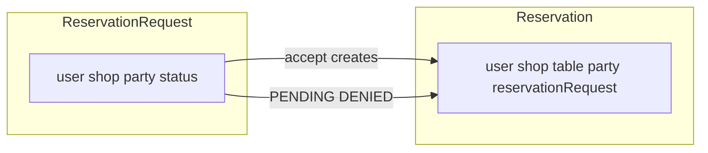

# Separate ReservationRequest layer

## Target model

- **[`ReservationRequest`](src/main/java/com/coffeeshop/coffeeshop/model/ReservationRequest.java)** (new table, e.g. `reservation_request`): `id`, `User user`, `Shop shop`, `minPartySize`, `maxPartySize`, `ReservationStatus status` (reuse existing enum in [`ReservationStatus.java`](src/main/java/com/coffeeshop/coffeeshop/model/enums/ReservationStatus.java) — it becomes request-lifecycle only), optional inverse `@OneToOne(mappedBy = "reservationRequest")` `Reservation reservation` (set when accepted).
- **[`Reservation`](src/main/java/com/coffeeshop/coffeeshop/model/Reservation.java)**: Remove `status`. Add optional `@OneToOne` / `@JoinColumn(name = "reservation_request_id", unique = true, nullable = true)` `ReservationRequest reservationRequest` (per your “reference reservation request in reservation”). Keep `user`, `shop`, `table`, `minPartySize`, `maxPartySize` as the booking snapshot. Direct `POST /api/v1/reservation` still sets `reservationRequest = null` and resolves shop/table as today.

## New stack (mirror existing patterns)

| Piece | Responsibility |
|--------|----------------|
| [`ReservationRequestRepository`](src/main/java/com/coffeeshop/coffeeshop/repository/ReservationRequestRepository.java) | `JpaRepository<ReservationRequest, UUID>` |
| [`ReservationRequestService`](src/main/java/com/coffeeshop/coffeeshop/service/ReservationRequestService.java) / [`ReservationRequestServiceImpl`](src/main/java/com/coffeeshop/coffeeshop/service/impl/ReservationRequestServiceImpl.java) | `createRequest`, `accept(id, tableId)`, `deny(id)`; same validation rules as current [`ReservationServiceImpl`](src/main/java/com/coffeeshop/coffeeshop/service/impl/ReservationServiceImpl.java) (party bounds, shop/table match, capacity vs min/max) |
| [`ReservationRequestController`](src/main/java/com/coffeeshop/coffeeshop/controller/ReservationRequestController.java) | Base path **`/api/v1/reservation-request`**: `POST /` (body: existing [`ReservationRequestCreateRequest`](src/main/java/com/coffeeshop/coffeeshop/model/dto/request/ReservationRequestCreateRequest.java)), `POST /{id}/accept` ([`ReservationAcceptRequest`](src/main/java/com/coffeeshop/coffeeshop/model/dto/request/ReservationAcceptRequest.java)), `POST /{id}/deny` |
| [`ReservationRequestMapper`](src/main/java/com/coffeeshop/coffeeshop/mapper/ReservationRequestMapper.java) + [`ReservationRequestResponseDto`](src/main/java/com/coffeeshop/coffeeshop/model/dto/response/ReservationRequestResponseDto.java) | Map entity to API; include `status`, shop/user summaries, party fields, optional nested `ReservationResponseDto` or `UUID reservationId` when `ACCEPTED` |

**Accept flow (transactional in `ReservationRequestServiceImpl`):** load request `PENDING` → validate `tableId` (same as today) → build and **persist** a new `Reservation` (user/shop/table/party from request, `reservationRequest` set) via **`ReservationRepository` injected alongside `ReservationRequestRepository`** (or a package-private/helper on `ReservationService` like `createFromAcceptedRequest` to centralize booking invariants — prefer injecting `ReservationService` only if you add a dedicated method to avoid duplicating `create` logic). Set request `status = ACCEPTED` and link `request.setReservation(savedReservation)` if you add the inverse side.

## Slim existing reservation layer

- **[`ReservationService`](src/main/java/com/coffeeshop/coffeeshop/service/ReservationService.java) / impl**: Remove `createRequest`, `accept`, `deny`. In `create`, stop setting `ReservationStatus`; remove `ShopRepository` if only used for request flow (direct booking still gets shop from table).
- **[`ReservationController`](src/main/java/com/coffeeshop/coffeeshop/controller/ReservationController.java)**: Remove `/request`, `/{id}/accept`, `/{id}/deny`.
- **[`ReservationMapper`](src/main/java/com/coffeeshop/coffeeshop/mapper/ReservationMapper.java) / [`ReservationResponseDto`](src/main/java/com/coffeeshop/coffeeshop/model/dto/response/ReservationResponseDto.java)**: Drop `status`. Add optional `UUID reservationRequestId` (and/or a small `ReservationRequestSummaryDto` if you want id + status for tracing) populated from `reservation.getReservationRequest()`.

## JsonIgnore / cycles

- On `Reservation.reservationRequest`, use `@JsonIgnoreProperties` consistent with [`Review`](src/main/java/com/coffeeshop/coffeeshop/model/Review.java) ↔ `Shop` (avoid serializing heavy graphs).
- On `ReservationRequest.reservation`, ignore back-references as needed for REST if entities leak to JSON anywhere.

## Tests and migration note

- Update [`ReservationRequestIntegrationTest`](src/test/java/com/coffeeshop/coffeeshop/ReservationRequestIntegrationTest.java) to call **`/api/v1/reservation-request`** (and `/api/v1/reservation-request/{id}/accept|deny`). Adjust assertions: after accept, either GET reservation by id from response or assert `reservationId` on request DTO; ensure **new `Reservation` row** exists with non-null `table` and optional `reservationRequestId` in `ReservationResponseDto` if exposed.
- **DB:** `ddl-auto=update` / `create-drop` in tests will add `reservation_request` and `reservation_request_id` on `restaurant_reservation`. **Production:** any existing `restaurant_reservation` rows with `PENDING`/`DENIED` would need a one-off migration into `reservation_request` (out of scope unless you want a Flyway script).

## Delegation note (`/java-agent`)

Implementation can be delegated to **java-agent in Agent mode** with this plan as spec; if the subagent runs in Ask mode again, apply changes in the main agent as before.
