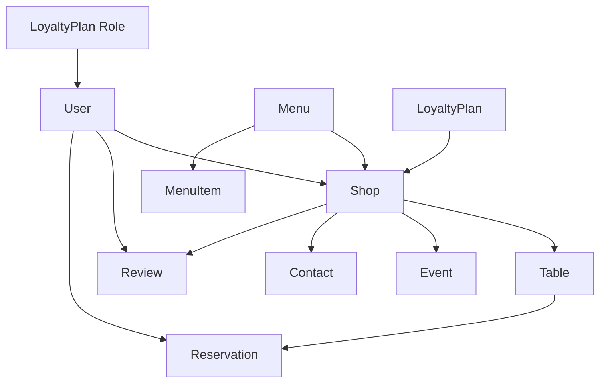

# Service-layer CRUD implementation plan

## Current state

- **Pattern**: [`ShopService`](file:///Users/amastilovic/Desktop/dev/coffeeshop/src/main/java/com/coffeeshop/coffeeshop/service/ShopService.java) + [`ShopServiceImpl`](file:///Users/amastilovic/Desktop/dev/coffeeshop/src/main/java/com/coffeeshop/coffeeshop/service/impl/ShopServiceImpl.java) with constructor injection and a single `getShopById(UUID)`.
- **Repositories** (all extend `JpaRepository` with no custom methods today): Shop, User, Role, Menu, MenuItem, LoyaltyPlan, Event (**`JpaRepository<Event, String>`** — PK is `eventId`), Table, Review, Contact, Reservation — under [`repository/`](file:///Users/amastilovic/Desktop/dev/coffeeshop/src/main/java/com/coffeeshop/coffeeshop/repository).
- **No REST controllers or `@ControllerAdvice`** yet; [`ShopMapper`](file:///Users/amastilovic/Desktop/dev/coffeeshop/src/main/java/com/coffeeshop/coffeeshop/mapper/ShopMapper.java) / [`ShopResponseDto`](file:///Users/amastilovic/Desktop/dev/coffeeshop/src/main/java/com/coffeeshop/coffeeshop/model/dto/ShopResponseDto.java) are stubs and not wired into services.
- **Conventions** ([`.cursor/agents/java-agent.md`](file:///Users/amastilovic/Desktop/dev/coffeeshop/.cursor/agents/java-agent.md)): 4-space indent, explicit types (no `var`), `final` parameters, constructor injection, **`@Transactional` on service implementation class**, avoid `Objects.isNull` for simple checks, prefer domain/runtime exceptions over checked exceptions.

## Target API shape (per service)

For each aggregate, mirror the same CRUD surface (names can be adjusted for readability, e.g. `getEventById(String eventId)` for Event):

| Operation | Typical signature | Behavior |
|-----------|-------------------|----------|
| List | `List<Entity> findAll()` | Delegate to `findAll()` |
| Read one | `Entity getById(ID id)` | Null id → illegal argument; missing → not found |
| Create | `Entity create(final Entity entity)` | For **insert**, treat `id == null` on UUID entities; validate required FKs (see below); `save` |
| Update | `Entity update(final ID id, final Entity entity)` | Load existing, copy scalar fields (and FK ids if provided), preserve PK; or merge policy documented in code |
| Delete | `void deleteById(final ID id)` | `deleteById` after existence check optional |

**ID types**: Use `UUID` everywhere except **Event**, which uses `String` (`eventId`).

## Foreign keys and creation order

Services should **validate associations by loading related rows** from the appropriate repository (avoid service-to-service cycles by depending on repositories only):

- **Shop**: On create/update, if `createdBy`, `menu`, or `loyaltyPlan` are non-null, resolve IDs via `UserRepository`, `MenuRepository`, `LoyaltyPlanRepository` (or accept fully detached entities with only ids set — team choice; recommend **resolve by id** for clarity). Be aware of **bidirectional links** ([`Shop`](file:///Users/amastilovic/Desktop/dev/coffeeshop/src/main/java/com/coffeeshop/coffeeshop/model/Shop.java) owns `Menu` / `LoyaltyPlan` via `@JoinColumn`; inverse sides use `mappedBy`).
- **MenuItem**: Require `menu` / `menu_id` present; load `Menu` via `MenuRepository`.
- **Table, Event, Contact, Review**: Require `shop` / `shop_id`; load `Shop` via `ShopRepository`.
- **Review**: Require `user` and `shop`.
- **Reservation**: Require `user` and `table`; load both.
- **User**: If `role` list is non-empty, optionally validate each `Role` id exists (or rely on JPA cascade — **prefer explicit validation** for predictable errors).

## Files to add (11 new service pairs)

Under `service/` and `service/impl/` respectively:

1. `UserService` / `UserServiceImpl` → `UserRepository`
2. `RoleService` / `RoleServiceImpl` → `RoleRepository`
3. `MenuService` / `MenuServiceImpl` → `MenuRepository`
4. `MenuItemService` / `MenuItemServiceImpl` → `MenuItemRepository` (+ `MenuRepository`)
5. `LoyaltyPlanService` / `LoyaltyPlanServiceImpl` → `LoyaltyPlanRepository`
6. `EventService` / `EventServiceImpl` → `EventRepository` (+ `ShopRepository`) — **String id**
7. `TableService` / `TableServiceImpl` → `TableRepository` (+ `ShopRepository`)
8. `ReviewService` / `ReviewServiceImpl` → `ReviewRepository` (+ `UserRepository`, `ShopRepository`)
9. `ContactService` / `ContactServiceImpl` → `ContactRepository` (+ `ShopRepository`)
10. `ReservationService` / `ReservationServiceImpl` → `ReservationRepository` (+ `UserRepository`, `TableRepository`)

## Extend existing Shop service

Update [`ShopService`](file:///Users/amastilovic/Desktop/dev/coffeeshop/src/main/java/com/coffeeshop/coffeeshop/service/ShopService.java) / [`ShopServiceImpl`](file:///Users/amastilovic/Desktop/dev/coffeeshop/src/main/java/com/coffeeshop/coffeeshop/service/impl/ShopServiceImpl.java):

- Add `findAll`, `create`, `update`, `deleteById` (keep `getShopById` or rename to `getById` for consistency — pick one naming scheme project-wide).
- Inject additional repositories only as needed for FK resolution (`UserRepository`, `MenuRepository`, `LoyaltyPlanRepository`).
- Add **`@Transactional`** at class level on `ShopServiceImpl` (and all other `*Impl` classes).

## Consistency and quality bar

- **Exceptions**: Either keep `IllegalArgumentException` for “not found” / validation (matches current `ShopServiceImpl`) **or** introduce a small `ResourceNotFoundException` / `NotFoundException` extending `RuntimeException` and use it in all `getById` paths (closer to java-agent; optional `@ControllerAdvice` can come with controllers later).
- **Align `ShopServiceImpl`** with java-agent: replace `Objects.isNull(shopId)` with `shopId == null` when touching that class.
- **Update semantics**: Prefer “load entity, apply non-null fields from payload” to avoid blind `save` overwriting associations with null. Document that list collections (`events`, `tables`, etc.) on `Shop` are **not** bulk-replaced by default CRUD unless you explicitly add methods for that.
- **User passwords**: `create`/`update` on `User` should not add security features unless requested; note that plaintext password persistence is a product risk when APIs are added later.

## Out of scope (unless you expand the request)

- REST controllers, DTOs, validation groups, pagination/sorting (`Pageable`), or moving [`ShopMapper`](file:///Users/amastilovic/Desktop/dev/coffeeshop/src/main/java/com/coffeeshop/coffeeshop/mapper/ShopMapper.java) to a **static** mapper per java-agent (the class is currently `@Service` and empty).
- Changing [`Event`](file:///Users/amastilovic/Desktop/dev/coffeeshop/src/main/java/com/coffeeshop/coffeeshop/model/Event.java) PK type from `String` to `UUID` (would be a schema/model migration).

## Suggested implementation order

1. Leaf/low-dependency: `Role`, `LoyaltyPlan`, `Menu` (document interaction with Shop’s one-to-one).
2. `User`, then expand **`Shop`** CRUD.
3. `MenuItem`, `Table`, `Contact`, `Event`.
4. `Review`, `Reservation` (most cross-entity validation).

## Verification

- Compile with `./gradlew compileJava` (or full `test` if you add tests later). No new tests are strictly required for this task unless you want service unit tests with mocked repositories per java-agent testing guidance.
