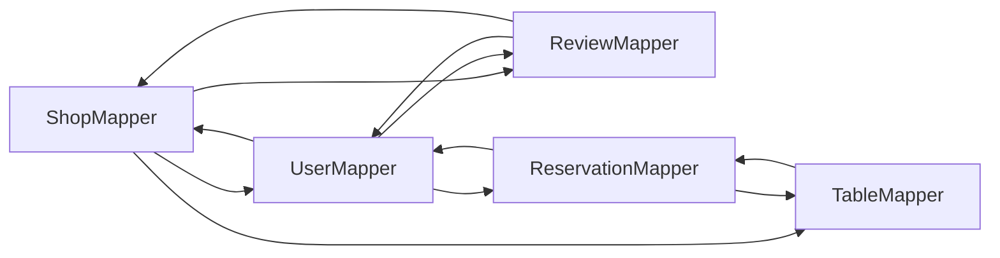

# Segregate `EntityDtoMapper` into per-model mappers

## Current state

- All mapping lives in [`EntityDtoMapper.java`](src/main/java/com/coffeeshop/coffeeshop/mapper/EntityDtoMapper.java) (~560 lines): response DTOs, request-to-entity, `mapList`, `stubRoles` / `stubShops`.
- Eleven controllers inject the single [`EntityDtoMapper`](src/main/java/com/coffeeshop/coffeeshop/mapper/EntityDtoMapper.java) (see grep results in repo).

## Target layout

Keep package [`com.coffeeshop.coffeeshop.mapper`](src/main/java/com/coffeeshop/coffeeshop/mapper). Add:

| Class | Responsibility |
|--------|----------------|
| `MappingUtils` | `static` `mapList(Collection, Function)` (and optionally empty-list handling) — **not** a Spring bean; avoids duplicating the same helper in every mapper. |
| `RoleMapper` | `toRoleResponse`, `toRole(RoleCreate/UpdateRequest)` |
| `MenuItemMapper` | `toMenuItemResponse`, `toMenuItem` (create/update requests) |
| `MenuMapper` | `toMenuResponse` (delegates items to `MenuItemMapper`), `newMenu()` |
| `LoyaltyPlanMapper` | `toLoyaltyPlanResponse`, `toLoyaltyPlan` (create/update) |
| `EventMapper` | `toEventResponse`, `toEvent` (create/update) |
| `ShopMapper` | `toShopSummary`, `toShopResponse`, `toShop` (create/update) |
| `TableMapper` | `toTableSummary`, `toTableResponse`, `toTable` (create / update with existing) |
| `ContactMapper` | `toContactResponse`, `toContact` (create/update) |
| `ReviewMapper` | `toReviewResponse`, `toReview` (create/update) |
| `ReservationMapper` | `toReservationResponse`, `toReservation` (create/update) |
| `UserMapper` | `toUserSummary`, `toUserResponse`, `toUser` (create/update), private `stubRoles` / `stubShops` |

Delete **`EntityDtoMapper`** after call sites are migrated.

## Dependency graph and `@Lazy` (required)

Cross-aggregate response mapping creates **constructor cycles** if every dependency is eager:

**Recommended `@Lazy` injection (minimal set):**

- **`ShopMapper`**: inject `@Lazy UserMapper`, `@Lazy ReviewMapper`, `@Lazy TableMapper` (Shop pulls users, reviews, tables-with-reservations; breaking these edges avoids cycles with User/Review/Table subgraphs).
- **`UserMapper`**: inject `RoleMapper`, `ShopMapper`, `@Lazy ReviewMapper`, `@Lazy ReservationMapper` (user aggregates reviews and reservations).
- **`ReviewMapper`**: inject `UserMapper`, `ShopMapper` (eager is fine once ShopMapper’s ReviewMapper is lazy).
- **`TableMapper`**: inject `@Lazy ReservationMapper`.
- **`ReservationMapper`**: inject `UserMapper`, `TableMapper` (eager; TableMapper’s dependency on ReservationMapper is lazy).

Use constructor injection: `public ShopMapper(..., @Lazy UserMapper userMapper, ...)` with `import org.springframework.context.annotation.Lazy`.

Alternative if you want fewer lazy beans: extract only **summary** builders into a tiny `SummaryMapper` with no back-references — but that re-centralizes “summary” logic; `@Lazy` is the standard Spring fix and keeps boundaries clean.

## Controller wiring

Replace `EntityDtoMapper dtoMapper` with the specific mapper(s):

| Controller | Inject |
|------------|--------|
| [`ShopController`](src/main/java/com/coffeeshop/coffeeshop/controller/ShopController.java) | `ShopMapper` |
| [`UserController`](src/main/java/com/coffeeshop/coffeeshop/controller/UserController.java) | `UserMapper` |
| [`RoleController`](src/main/java/com/coffeeshop/coffeeshop/controller/RoleController.java) | `RoleMapper` |
| [`MenuController`](src/main/java/com/coffeeshop/coffeeshop/controller/MenuController.java) | `MenuMapper` |
| [`MenuItemController`](src/main/java/com/coffeeshop/coffeeshop/controller/MenuItemController.java) | `MenuItemMapper` |
| [`LoyaltyPlanController`](src/main/java/com/coffeeshop/coffeeshop/controller/LoyaltyPlanController.java) | `LoyaltyPlanMapper` |
| [`EventController`](src/main/java/com/coffeeshop/coffeeshop/controller/EventController.java) | `EventMapper` |
| [`TableController`](src/main/java/com/coffeeshop/coffeeshop/controller/TableController.java) | `TableMapper` |
| [`ReviewController`](src/main/java/com/coffeeshop/coffeeshop/controller/ReviewController.java) | `ReviewMapper` |
| [`ContactController`](src/main/java/com/coffeeshop/coffeeshop/controller/ContactController.java) | `ContactMapper` |
| [`ReservationController`](src/main/java/com/coffeeshop/coffeeshop/controller/ReservationController.java) | `ReservationMapper` |

Method names can stay the same as today (`toShopResponse`, `toUser`, etc.) for a low-diff migration.

## Implementation order

1. Add `MappingUtils` and the smallest leaf mappers (`RoleMapper`, `MenuItemMapper`, `LoyaltyPlanMapper`, `EventMapper`, `ContactMapper`) with no cross-deps.
2. Add `MenuMapper` (depends on `MenuItemMapper`).
3. Add `TableMapper` + `ReservationMapper` with `@Lazy` as above; verify bean startup.
4. Add `ReviewMapper` (`UserMapper` + `ShopMapper` for summaries — `ShopMapper` must expose `toShopSummary` before `ReviewMapper` is complete; implement `ShopMapper.toShopSummary` without depending on `ReviewMapper`).
5. Add `ShopMapper` full response (depends on other mappers + `@Lazy` where needed).
6. Add `UserMapper` (depends on `RoleMapper`, `ShopMapper`, `@Lazy` review/reservation).
7. Update all controllers; remove `EntityDtoMapper`.
8. Run `./gradlew test`.

## Notes

- Keep **`@Service`** on each mapper (same stereotype as today’s `EntityDtoMapper`) so they are singletons and injectable.
- Do **not** duplicate acyclic rules: summaries stay summary-only; nested DTO shapes unchanged from current behavior.
- If startup still reports a cycle, add `@Lazy` to the dependency edge called out in the error message (usually the “aggregate root” side).
