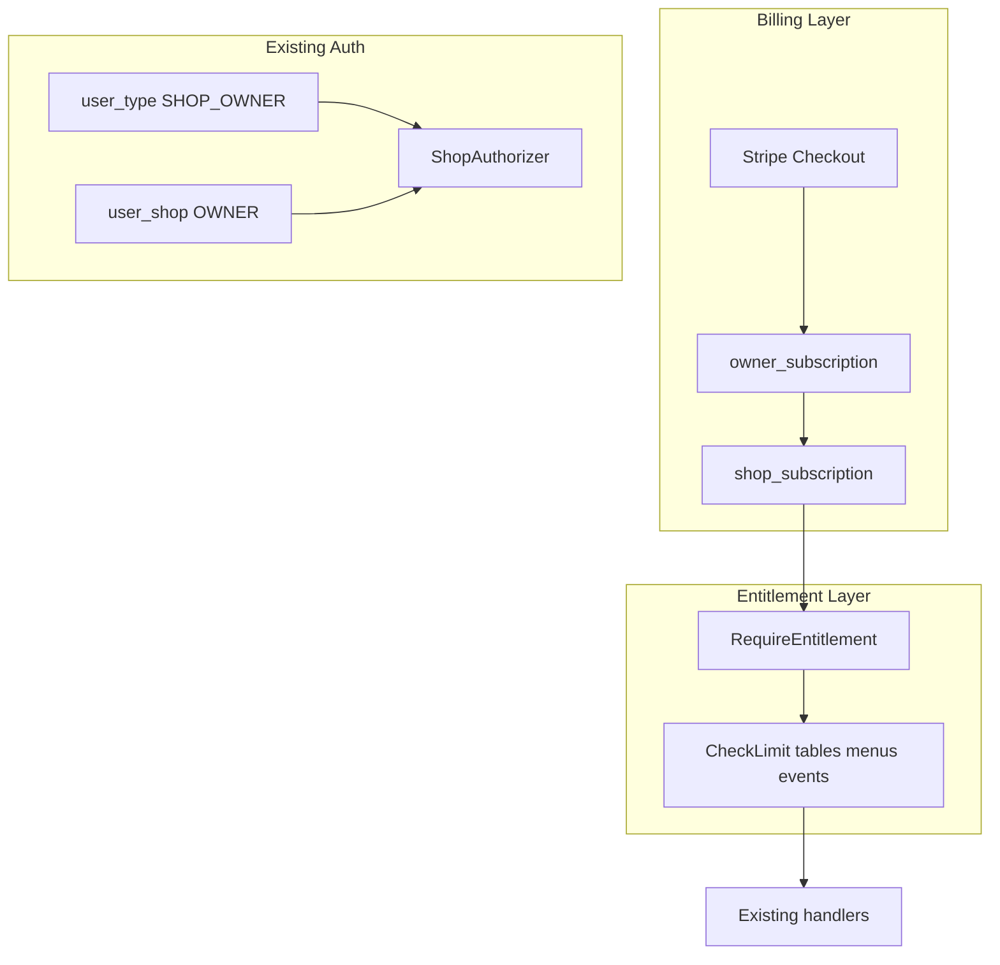

# Owner Subscription Plans — Product Spec

Planning document from product/design conversations (July 2026). Defines three subscription tiers for coffee shop owners, billing model, feature gates, and implementation approach across `coffeeshop-go`, `coffeeshop-frontend`, and `coffeeshop-mobile`.

---

## Background

### Current state

The platform has **no SaaS subscription or billing infrastructure**. Owner capabilities are gated only by:

- `user_type`: `CUSTOMER` | `SHOP_OWNER` | `ADMIN`
- Per-shop ownership via `user_shop.relationship_type = OWNER`
- Employee delegation via `EMPLOYEE` relationship

A separate **loyalty plan** API exists (`/api/v2/loyalty-plan`, types `BASIC` / `PREMIUM` / `VIP`) for **customer-facing** shop loyalty — not owner billing. The loyalty service has **no UI** on web or mobile today.

### Existing owner features (all ungated today)

| Feature area | Frontend | Mobile | Backend |
|---|---|---|---|
| Create/manage shops | Yes | Yes | `POST/PUT/DELETE /shop` |
| Menu CRUD | Yes | Yes | `/menu`, `/menu-item` |
| Tables | Yes | Yes | `/table` |
| Reservations (accept/deny, guest requests) | Yes | Yes | `/reservation-request`, `/reservation` |
| Events | Yes | Yes | `/event` |
| Employees | Yes | Yes | `/shop-employees` |
| Community announcements | Yes | Yes | `/shop/{id}/community/*` |
| Dashboard notifications | Yes | Yes | `/dashboard/activity` |
| Loyalty plans | API only | API only | `/loyalty-plan` |
| Reviews moderation | Yes | Yes | `/review` |

### Mobile vs frontend parity

Mobile recently consolidated role checks into `UserPermissions` (`lib/core/auth/user_permissions.dart`). Frontend uses scattered component-level checks (`userType`, `shop.createdBy`, `isAdmin`). Neither client has subscription gates yet.

---

## Billing model

**Hybrid:** base owner plan + add-on per extra shop.

```
Owner subscription = Base plan + (extra shops × add-on price)

Example (Growth):
  Base:        €29/mo  → includes 1 shop
  Extra shop:  €15/mo each
  Owner with 3 shops: €29 + 2×€15 = €59/mo
```

| Plan | Base/month | Extra shop | Annual discount |
|---|---|---|---|
| Starter | Free | N/A (max 1 shop) | — |
| Growth | €29 | €15/shop | 2 months free |
| Pro | €79 | €10/shop | 2 months free |

---

## Product decisions (locked in)

| Decision | Choice |
|---|---|
| Billing unit | Hybrid — base plan + per-shop add-on |
| Primary goal | Monetize advanced tools, cap free tier, loyalty/community as differentiator |
| Grandfathering | All existing `SHOP_OWNER` accounts migrate to **Growth** (test/sample accounts) |
| Employee seats | Count against **shop owner's** plan limits (employees don't pay) |
| Loyalty UI | **Priority** — clearest Pro differentiator; build on web + mobile |
| Launch | **Web + mobile together** — shared entitlement API |
| Admin override | Admins **bypass all gates** (support use; no audit trail for now) |
| Starter pricing | **Free** (recommended) — hard-capped features drive upgrades to Growth |
| Menu items | **No limit on items per menu** on any tier |
| Starter tables | **15 max** per shop |

---

## Tier specifications

### Starter (Free)

Target: solo owner, one small shop, getting started.

| Feature | Limit |
|---|---|
| Shops | 1 (no add-on) |
| Employees | 0 (owner-only management) |
| Menus | **1 menu**, unlimited items |
| Tables | **15 max** |
| Reservations | View pending only — **no accept/deny** |
| Events | Not available |
| Community | Read-only (see members, no announcements) |
| Loyalty program | Not available |
| Dashboard | Basic stats only (no owner notifications) |
| Reviews | Read only (no moderation) |

### Growth (€29/mo base + €15/extra shop)

Target: active shop owner running daily operations.

| Feature | Limit |
|---|---|
| Shops | 1 included + add-ons |
| Employees | 3 per shop |
| Menus | Unlimited menus, unlimited items |
| Tables | Unlimited |
| Reservations | Full workflow — accept/deny, table assignment, guest requests |
| Events | 5/month per shop |
| Community | Post announcements, manage members |
| Loyalty program | **BASIC** tier only |
| Dashboard | Full owner notifications (`pending_requests`, `new_reviews`) |
| Reviews | Moderate/delete on own shops |

### Pro (€79/mo base + €10/extra shop)

Target: multi-shop operators, franchises, retention-focused shops.

| Feature | Limit |
|---|---|
| Shops | 1 included + discounted add-ons |
| Employees | Unlimited per shop |
| Menus | Unlimited (+ future menu scheduling) |
| Tables | Unlimited |
| Reservations | Full + future waitlist/recurring |
| Events | Unlimited |
| Community | Full + future pinned posts/polls |
| Loyalty program | **PREMIUM / VIP** + custom rules |
| Dashboard | Full analytics (new endpoints) |
| Reviews | Moderation + future auto-reply templates |
| Extras | Priority support, data export (CSV), API access (future) |

---

## Feature matrix

| Capability | Starter | Growth | Pro |
|---|---|---|---|
| Shops (base) | 1 | 1 | 1 |
| Extra shop add-on | — | €15/mo | €10/mo |
| Employees/shop | 0 | 3 | Unlimited |
| Menus | 1 | Unlimited | Unlimited |
| Items per menu | Unlimited | Unlimited | Unlimited |
| Tables | 15 | Unlimited | Unlimited |
| Reservation management | View only | Full | Full + advanced |
| Events/month | 0 | 5 | Unlimited |
| Community posts | No | Yes | Yes + extras |
| Loyalty program | No | BASIC | PREMIUM/VIP |
| Dashboard analytics | Basic | Notifications | Full analytics |
| Review moderation | Read only | Yes | Yes + templates |

---

## Backend architecture

### New database tables

```sql
-- Owner-level billing
owner_subscription (
  user_id,              -- FK users (the paying owner)
  plan_tier,            -- STARTER | GROWTH | PRO
  stripe_customer_id,
  stripe_subscription_id,
  status,               -- active | trialing | past_due | canceled
  current_period_end
)

-- Per-shop linkage (for add-ons + limits)
shop_subscription (
  shop_id,
  owner_user_id,
  is_base_shop,         -- true for the 1 included shop
  addon_stripe_item_id  -- null for base, set for paid add-ons
)

-- Usage metering (monthly reset)
shop_usage (
  shop_id,
  period_start,         -- e.g. 2026-07-01
  events_created
  -- employees counted live from shop_employees
)
```

### Entitlement service

```go
type Feature string

const (
  FeatureReservationManage Feature = "reservation_manage"
  FeatureEventCreate       Feature = "event_create"
  FeatureEmployeeAssign    Feature = "employee_assign"
  FeatureCommunityPost     Feature = "community_post"
  FeatureLoyaltyBasic      Feature = "loyalty_basic"
  FeatureLoyaltyPremium    Feature = "loyalty_premium"
  FeatureAnalytics         Feature = "analytics"
)

func (e *EntitlementService) CanUse(ctx, ownerUserID, shopID, feature Feature) (bool, *UpgradeHint)
func (e *EntitlementService) CheckLimit(ctx, ownerUserID, shopID, limit LimitType) (used, max int, ok bool)
```

**Limit constants:**

```go
const (
  LimitTablesStarter = 15
  LimitMenusStarter  = 1
  // no LimitMenuItems — unlimited on all tiers
)
```

**Admin bypass:** `if auth.IsAdmin(claims) { return true }` before entitlement check.

### Handler gates (first wave)

| Endpoint | Gate |
|---|---|
| `PUT /reservation-request/{id}/accept` | `reservation_manage` |
| `PUT /reservation-request/{id}/deny` | `reservation_manage` |
| `POST /event` | `event_create` + monthly limit |
| `POST /shop-employees` | `employee_assign` + seat limit |
| `POST /shop/{id}/community/announcements` | `community_post` |
| `POST /loyalty-plan` | `loyalty_basic` or `loyalty_premium` by type |
| `POST /table` | table count ≤ 15 on Starter |
| `POST /menu` | menu count ≤ 1 on Starter |
| `GET /dashboard/analytics` (new) | `analytics` |

Return `402 Payment Required` with body:

```json
{
  "requiredPlan": "GROWTH",
  "limit": "tables",
  "used": 15,
  "max": 15
}
```

### Profile API extension

Add to `GET /api/v2/profile` for owners:

```json
{
  "subscription": {
    "plan": "GROWTH",
    "status": "active",
    "shopsIncluded": 1,
    "shopsUsed": 2,
    "periodEnd": "2026-08-01"
  },
  "entitlements": {
    "reservation_manage": true,
    "event_create": true,
    "loyalty_premium": false
  }
}
```

### Migration (existing SHOP_OWNER → Growth)

```sql
INSERT INTO owner_subscription (user_id, plan_tier, status)
SELECT id, 'GROWTH', 'active'
FROM users
WHERE user_type = 'SHOP_OWNER';

INSERT INTO shop_subscription (shop_id, owner_user_id, is_base_shop)
SELECT s.id, us.user_id,
       ROW_NUMBER() OVER (PARTITION BY us.user_id ORDER BY s.created_at) = 1
FROM shops s
JOIN user_shop us ON us.shop_id = s.id AND us.relationship_type = 'OWNER';
```

First shop per owner = `is_base_shop = true`. No Stripe charge until billing goes live.

---

## Client architecture (web + mobile)

### Shared pattern

```
Profile.subscription + entitlements
        ↓
Permissions layer (UserPermissions / Angular SubscriptionService)
        ↓
canUseFeature(SubscriptionFeature.x) → bool
        ↓
UI: show action OR disabled + "Upgrade to Growth" CTA
```

### Mobile — extend `UserPermissions`

```dart
enum SubscriptionFeature {
  reservationManage,
  eventCreate,
  employeeAssign,
  communityPost,
  loyaltyBasic,
  loyaltyPremium,
  analytics,
}

class UserPermissions {
  final SubscriptionInfo? subscription;
  final Set<SubscriptionFeature> entitlements;

  bool canUseFeature(SubscriptionFeature f) =>
    isAdmin || entitlements.contains(f);
}
```

**Gate examples:**

- `ReservationsTab` accept/deny → `canUseFeature(reservationManage)`
- `EmployeesTab` add button → `canUseFeature(employeeAssign)` + seat count
- `EventCreateScreen` → route guard + `canUseFeature(eventCreate)`
- New `LoyaltyTab` on shop detail → `loyaltyBasic` / `loyaltyPremium`
- `TablesTab` → show `12 / 15 tables` on Starter; disable add at cap

### Frontend — Angular `SubscriptionService`

Mirror mobile: extend profile model, add `canUseFeature()`, upgrade CTAs on gated actions. Add **Billing** section in profile (current plan, usage bars, Stripe Checkout link).

---

## Loyalty UI (priority)

Backend: `/api/v2/loyalty-plan` CRUD + `shop.loyaltyPlanId`.

**Growth owners:** Shop detail → Settings → Loyalty → enable BASIC plan.

**Pro owners:** Choose PREMIUM or VIP; custom rules (may need API extension).

**Customers:** Loyalty badge on shop card/detail from `shop.loyaltyPlan` in existing DTO.

Visual upsell: Starter = no badge; Growth = "Loyalty"; Pro = "Premium Loyalty".

---

## Implementation phases

| Phase | Scope | Notes |
|---|---|---|
| **1** | DB schema, `EntitlementService`, profile extension, migration | Backend only |
| **2** | Gate reservations, events, employees, community, tables, menus | `402` + upgrade hint |
| **3** | `UserPermissions` + Angular service, upgrade CTAs | Web + mobile gates |
| **4** | Loyalty management UI (web + mobile) | Pro differentiator |
| **5** | Stripe Checkout, webhooks, billing settings | Revenue |
| **6** | Analytics dashboard (Pro) | New endpoints + UI |

Phases 1–3 can ship **without Stripe** — migrated owners get Growth; new signups get Starter limits until billing enables in phase 5.

---

## Architecture diagram



---

## Related docs

- [Keycloak setup](./keycloak.md)
- Mobile role consolidation: `.cursor/plans/role-visibility-consolidation_f7aac4ff.plan.md`
